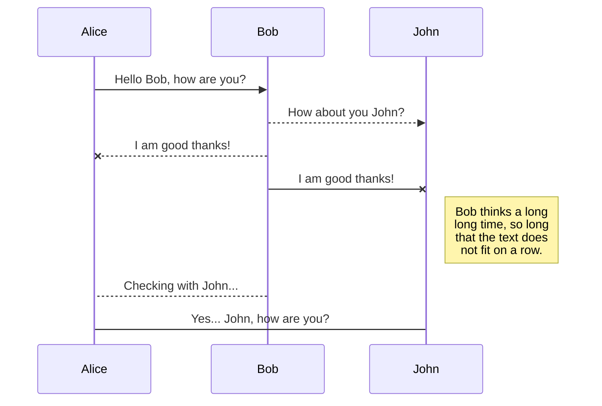

Le wikilibriste est propulsé grâce à [`wiki.js`](https://js.wiki/) un moteur de wiki libre et pour écrire les pages nous utilisons la syntaxe Markdown.

Pour découvrir les codes markdown qui permettent d'obtenir les présentations qui suivent, cliquez sur l'icône "Modifier la Page"  en bas à droite :

# Code source

## Code

```bash
[user@ordinateur:~ $] mkdir un-dossier
[user@ordinateur:~ $] sudo apt update
```


```java
function lorem (ipsum) {
    const dolor = 'consectetur adipiscing elit'
}
```

```css
.classe-css {
    color: white;
}
```

```html
<head>
  <div>
    <h1>Titre</h1>
  </div>
</head>
```

## Inline

Lorem `ipsum` dolor

# Citations

> Lorem ipsum dolor sit amet
> Consectetur adipiscing elit

> Lorem ipsum dolor sit amet
> Consectetur adipiscing elit
{.is-info}

> Lorem ipsum dolor sit amet
> Consectetur adipiscing elit
{.is-success}

> Lorem ipsum dolor sit amet
> Consectetur adipiscing elit
{.is-warning}

> Lorem ipsum dolor sit amet
> Consectetur adipiscing elit
{.is-danger}


# Combinaisons clavier

Lorem ipsum dolor <kbd>CTRL</kbd> + <kbd>C</kbd>


# Diagramme Mermaid



# Emojis

:apple:

Utilisation en :fire: inline :arrow_right: pour améliorer l'UX

**Visitez [`webfx.com`](https://www.webfx.com/tools/emoji-cheat-sheet/) afin de retrouver l'emoji qui vous intéresse.**

> Vous pouvez aussi utiliser des pitcogrammes listés sur [`pictogrammers.com`](https://pictogrammers.com/library/mdi/) et les utiliser comme suit :
> Par exemple, pour inclure l'icône menu <span class="mdi mdi-menu"></span>, ajoutez ce code `<span class="mdi mdi-menu"></span>`
{.is-info}

# Images


{.align-center}

{.align-right}

{.align-left}


Consectetur  elit

# Liens hypertextes

[Externe](https://wikilibriste.fr)

Lien [interne](/contact) au wiki

# Liste de tâches

- [x] Checked task item
- [x] Another checked task item
- [ ] Unchecked task item

# Listes ordonnées

- Grid Item 1
- Grid Item 2
- Grid Item 3

---

- Grid Item 1
- Grid Item 2
- Grid Item 3
{.grid-list}

---

- [Lorem ipsum dolor sit amet *Subtitle description here*](https://www.startpage.com)
- [Consectetur adipiscing elit *Another subtitle description here*](https://www.startpage.com)
- [Morbi vehicula aliquam *Third subtitle description here*](https://www.startpage.com)
{.links-list}

# Notes de bas de page

This sentence[^1] needs a few footnotes.[^2]

[^1]: A string of syntactic words.
[^2]: A useful example sentence.

# Séparateur

Lorem ipsum dolor

---

Consectetur adipiscing elit

# Tab

# Tabs {.tabset}
## First Tab

Any content here will go into the first tab...

## Second Tab

Any content here will go into the second tab...

## Third Tab

Any content here will go into the third tab...


# Titres

# Titre 1
## Titre 2
### Titre 3
#### Titre 4
##### Titre 5
###### Titre 6

# Tableaux

| Header 1 | Header 2 | Header 3 |
|----------|----------|----------|
| Foo      | Bar      | Xyz      |
| Abc      | Def      | 123      |


| Header 1 | Header 2 | Header 3 |
|----------|----------|----------|
| Foo      | Bardskfjh      | Xyz      |
| Abc      | Def      | 123      |
{.dense}


# Textes

## Gras

Lorem **ipsum** dolor

## Italique

Lorem *ipsum* dolor

## Souligné

Lorem _ipsum_ dolor

## Barré

Lorem ~~ipsum~~ dolor

## Exposant

Lorem ^ipsum^ dolor

## Indice

Lorem ~ipsum~ dolor


# Vidéos

Pour les vidéos, si une intégration iFrame est possible, vous devrez en passer par du HTML comme suit :

```html
<p>Cette vidéo est une présentation :</p>
<br>
<iframe class="frame-style" title="Ceci est un titre" src="https://videos.surunsite.fr/videos/embed/123452ee-1234-1234-1234-f64b810e74ad" allow="fullscreen; accelerometer; encrypted-media; gyroscope; picture-in-picture" sandbox="allow-same-origin allow-scripts allow-popups" frameborder="0"></iframe>
<br>
```

> Veuillez ne pas oublier la classe "frame-style"
{.is-warning}

> N'oubliez pas d'ajouter le paramètre `?autoplay=0` dans les URL Invidious à la fin du paramètre `src=` **afin de ne pas lancer la lecture automatique des vidéos**, comportement particulièrement génant pour la plupart des visiteurs !
> Par exemple : `src="https://yewtu.be/embed/iUTfvpYHFgM?autoplay=0"`
{.is-danger}

---

<p>Voici une vidéo pour vous familiariser avec et même apprendre rapidement le markdown :</p>

<iframe class="frame-style" title="Cours complet langage Markdown" src="https://yewtu.be/embed/iUTfvpYHFgM?autoplay=0" allow="fullscreen; accelerometer; encrypted-media; gyroscope; picture-in-picture" sandbox="allow-same-origin allow-scripts allow-popups" frameborder="1"></iframe>


---
{.align-right} <3 *L'équipe `WikiLibriste.fr`*
<br>