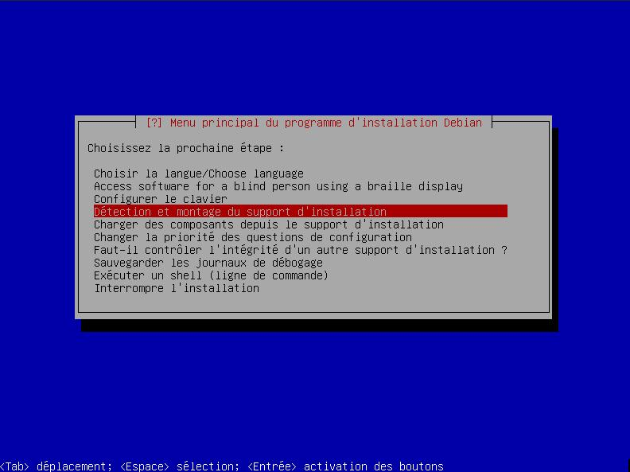
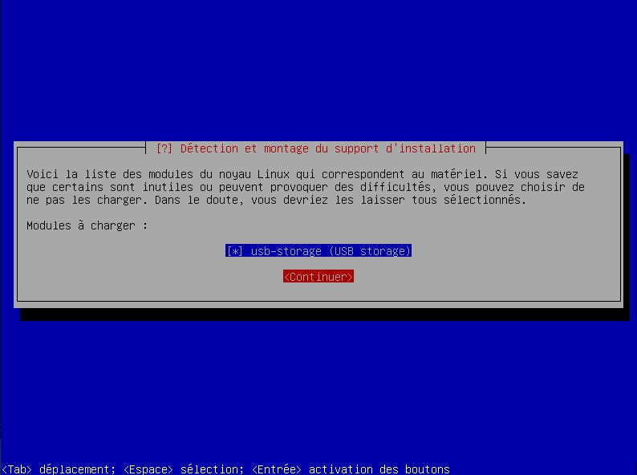
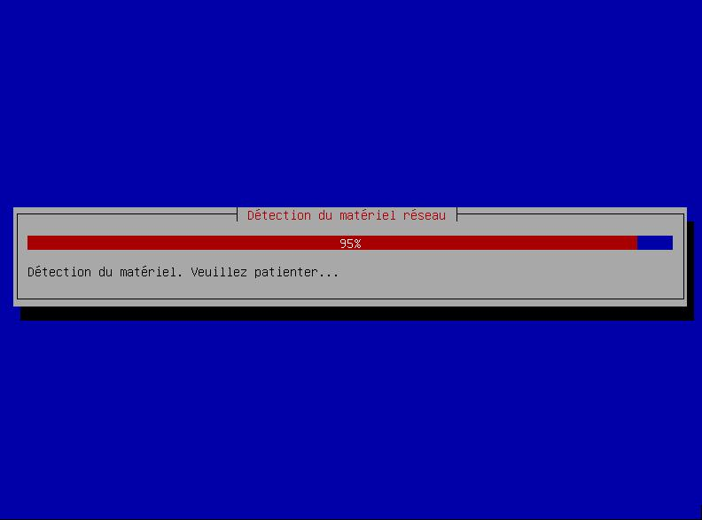
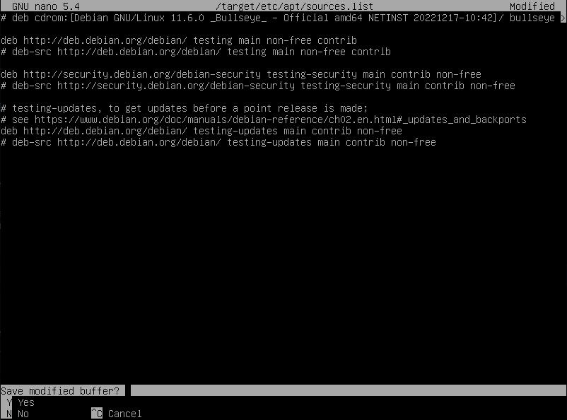
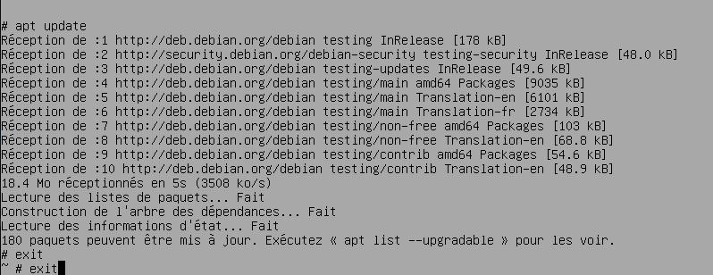
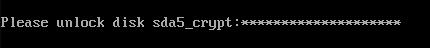

Dans l'article [Debian](./debian.md#) nous avons vu comment installer et configurer la version Debian *Stable* sur un PC.

Comme expliqué dans son chapitre [quelle branche choisir](./debian.md##quelle-branche-choisir) , il existe une variante de Debian nommée *Testing* qui a pour principal avantage de proposer des paquets plus récents des logiciels.

# Préparation
Avant de procéder à l'installation, il nous faut télécharger Debian, préparer une clef USB pour l'installation et configurer le BIOS.

> **Notez qu'aussi étrange que cela puisse paraître, l'installation de Debian Testing nécessite de passer par Debian Stable !**
> *Vous pourriez utiliser le fichier image `.iso` de Debian Testing mais _cela est déconseillé car l'installeur lui-même pourrait ne pas être totalement fonctionnel_*.
{.is-info}

## Source d'installation
Nous allons utiliser la version `netinstall` de Debian **Stable** afin d'installer Debian *Testing*.

> Quand vous utilisez `netinstall` (installation par le réseau), seul le système de base et l'installateur sont inclus, le reste sera téléchargé à la volée pendant l'installation suivant vos choix. Le fichier d'image `.iso` est donc plus léger.
{.is-info}

Téléchargez le fichier correspondant au processeur de votre PC :
- Branche Stable 64 bits avec non-free firmware : `firmware-11.6.0-amd64-netinst.iso` 
https://cdimage.debian.org/cdimage/unofficial/non-free/cd-including-firmware/current/amd64/iso-cd/
- Branche Stable 32 bits avec non-free firmware : `firmware-11.6.0-i386-netinst.iso`
https://cdimage.debian.org/cdimage/unofficial/non-free/cd-including-firmware/current/i386/iso-cd/
{.links-list}

> Téléchargez aussi, sur cette même page, le fichier `SHA256SUMS` correspondant afin vérifier l'intégrité du fichier téléchargé.
{.is-warning}

> Dans ce tutoriel, afin de vous éviter tout problème de compatibilité avec votre matériel, nous utiliserons la version **Stable amd64 _avec non-free firmwares_.**
> À partir de la prochaine version de Debian, les non-free firmwares seront inclus par défaut.
{.is-info}

## Création d'un média d'installation
Rendez vous sur l'article dédié pour [rendre une clé USB bootable](./usb-bootable.md#) et ainsi créer le média d'installation de Debian.

## Préparation du BIOS
Suivez les instructions sur la page [configurer le BIOS de votre PC](./bios-boot.md#) pour autoriser le démarrage sur clef USB et désactiver le SecureBoot.

## Démarrage sur clef USB
- Branchez la clef USB que vous avez préparée précédemment sur un port USB de votre PC.
- Redémarrez le PC.
- L'écran suivant devrait apparaître :

{.align-center}

> Si cet écran n'apparaît pas, vérifiez votre clef USB et/ou la configuration du BIOS !
{.is-danger}

# Installation Debian Testing

- Lancez l'installation en utilisant le fichier image `.iso` netinstall de **Debian Stable**

- Sélectionnez "Advanced Options" :

{.align-center}

- Depuis le menu avancé, sélectionnez "Expert Install" :

> Pas de panique, nous allons vous guider pas à pas :)
> Nous choisissons cette méthode pour la seule raison qu'elle va nous permettre de lancer la ligne de commande, plus tard, pendant le processus d'installation.
> Ainsi on va économiser du temps et de la bande passante et nous ferons l'installation en utilisant directement sur la branche Testing ;)
{.is-info}

{.align-center}

- Choisissez "Choose Language" :

{.align-center}

- Nous choisissons notre langue, "Français" :

{.align-center}

- Sélectionnez votre pays :

{.align-center}

- Sélectionnez votre paramètre régional, pour l'exemple, "France" :

{.align-center}

- Validez directement : en effet, nous avons déjà notre "locale" (fr_FR.UTF-8) et n'avons pas besoin d'en ajouter :

{.align-center}

- Nous allons maintenant configurer le clavier :

{.align-center}

- Sélectionnez le type de clavier que vous utilisez :

{.align-center}

- Lancez "Détection et montage du support d'installation" :

{.align-center}

- Votre média devrait être détecté, ici notre clef USB :

{.align-center}

- Détection réussie !

{.align-center}

- Sélectionnez "Charger les composants depuis le support d'installation" :

{.align-center}

- En général, vous n'aurez pas besoin de charger des composants additionnels : laissez par défaut et validez :

{.align-center}

- Les composants sont ensuite chargés :

{.align-center}

- Sélectionnez "Détecter le matériel réseau" : 

{.align-center}

- Debian va détecter vos cartes réseaux :

{.align-center}

- Lancez "Configurer le réseau" :

{.align-center}

- Choisissez "Oui" pour configurer le réseau automatiquement via DHCP :

{.align-center}

- Laissez le délai de 3 secondes par défaut et choisissez "Continuer" :

{.align-center}

- Votre PC a maintenant une adresse IP sur votre réseau local :
> Cette étape est très importante car nous aurons besoin du réseau pour installer certains composants et surtout mettre à jour Debian !
{.is-info}

{.align-center}

- Choisissez un nom pour votre PC (hostname) puis à l'aide de la touche <kbd>TAB</kbd> (tabulation), naviguez sur "Continue" :
> Petit conseil, n'utilisez pas de nom _explicite_ qui pourrait, sur le réseau, désigner votre PC ou le système d'exploitation installé ou toute autre information qui pourrait compromettre la sécurité de votre machine, y compris votre identité ;)
> Ici par exemple le nom du PC correspond à un fleuve ("volga") mais cela pourrait très bien être un monument, une célébrité, une planète... soyez créatif !
{.is-success}

{.align-center}

- Laissez ce champ vide puis validez :

{.align-center}

- Nous allons maintenant créer le compte utilisateur :

{.align-center}

- **Sélectionnez impérativement "Oui"** afin de protéger les mots de passe (fichier `/etc/shadow`) :

{.align-center}

- Répondez "Non", ainsi le compte `root` sera désactivé et c'est votre compte utilisateur qui sera capable, via `sudo`, de lancer des tâches d'administration :

{.align-center}

- Entrez le nom que vous souhaitez voir afficher sur l'écran de connexion pour votre compte utilisateur :

> Si vous ne souhaitez pas pouvoir être identifié, ne mettez pas d'informations personnelles ici.
{.is-warning}

> Vous pourrez facilement changer ce libellé plus tard.
{.is-info}

{.align-center}

- Entrez maintenant l'identifiant de cet utilisateur en minuscule et sans espace :

> Vous ne pourrez pas modifier l'identifiant plus tard, il est figé. Un répertoire portant son nom sera d'ailleurs créé sous le dossier `/home/`
> Choisissez un identifiant qui ne vous identifie pas explicitement sur le système, par exemple, utilisez plutôt un pseudo.
{.is-warning}

{.align-center}

- Les 2 écrans suivants vous demanderont de choisir un mot de passe pour votre compte utilisateur.

> Il est fortement recommandé :
> -- de le stocker dans un gestionnaire de mots de passe
> -- de choisir un mot de passe fort
> -- de choisir un mot de passe différent de vos autres comptes !
> **:arrow_right: Consultez l'article lié aux [mots de passe](./gestionnaire-mots-passe.md#) pour plus d'informations.**
{.is-warning}

{.align-center}

- Confirmez le mot de passe de votre compte utilisateur :

{.align-center}

- Placez-vous sur "Configurer l'horloge" et validez :

{.align-center}

- Sélectionnez "Oui" afin d'utiliser le protocole NTP pour régler l'heure automatiquement :

{.align-center}

- Laissez la valeur par défaut et "Continuer" :

{.align-center}

- En général, la valeur par défaut correspond à votre pays. Validez en choisissant "Continuer" :

{.align-center}

- Appuyez sur "Détecter les disques" :

{.align-center}

- Vous allez maintenant devoir partitionner le disque de votre machine.

> Le partitionnement est un sujet complexe et controversé.
> Le [Wiki de Arch Linux](https://wiki.archlinux.org/title/partitioning) explique très bien les différents cas d'usage.
{.is-warning}

> Dans notre exemple, nous partirons sur un partitionnement de type "assisté" avec une partition /home dédiée.
> C'est l'installeur guidé de Debian qui réalisera tout pour vous et va créer automatiquement dans notre cas, 4 partitions :
> ~ **/boot** : Qui contient tous les fichiers nécessaires à l'amorçage (noyau Linux, ...)
> ~ **SWAP**: Le "fichier" d'échange
> ~ **/home** : Dans ce dossier, vous retrouverez les profils utilisateurs. D'ailleurs votre compte sera un sous-répertoire de `/home/` et contiendra vos paramètres, votre Bureau, vos Documents, Photos, Vidéos, Téléchargements
> ~ **/** : Ce point de montage sera la racine du système de fichiers, et contiendra tout le reste. L'intérêt de le séparer, est que si `/home` venait à être saturé, cela n'impactera pas le système ;)
{.is-success}

- Sélectionnez "Partitionner les disques" :

{.align-center}

> Si vous installez un PC portable qui sera amené à être souvent déplacé ou que votre modèle de menaces est modéré ou élevé, nous vous conseillons de choisir "Assisté - utiliser tout un disque avec LVM chiffré".
> [En apprendre plus sur le chiffrement](./chiffrement.md##le-chiffrement).
{.is-warning}

> **Dans tous les autres cas** (PC fixe ou portable sans déplacement), **choisissez "Assisté - utiliser un disque entier"**, le disque dur ne sera pas chiffré.
> Notez que certains des écrans liés à LVM ou au chiffrement ne seront, dans ce cas, pas présentés par la suite.
{.is-success}

{.align-center}

- Sélectionnez le disque principal, généralement "**sda**":

{.align-center}

- Sélectionnez "Partition /home séparée" :

{.align-center}

- Placez-vous sur "Oui" à l'aide de la touche <kbd>TAB</kbd> et validez avec la touche <kbd>ENTRÉE</kbd> :

> **Assurez-vous d'avoir sauvegardé toutes vos données importantes sur disque externe avant de valider !**
> Attention, une fois cet écran validé, la table des partitions sera détruite et une nouvelle sera créée !
> Toutes les données seront effacées par la suite.
{.is-warning}

{.align-center}

- Avant de chiffrer votre disque, Debian est maintenant en train d'écrire des données aléatoires sur tout le contenu du disque :

> Cette étape va durer un certain temps, comptez environ 10 mins par tranche de 25 Go, tout dépend de la rapidité de votre disque ainsi que sa taille !
> Cette opération ne sera faite qu'une seule fois, ainsi soyez patient, cela vaut le coup !
{.is-info}

{.align-center}

- Choisissez maintenant un mot de passe pour déchiffrer votre disque :

> Il est fortement recommandé :
> -- de le stocker dans un gestionnaire de mots de passe
> -- de choisir un mot de passe fort
> -- de choisir un mot de passe différent de celui de votre compte utilisateur
> **:arrow_right: Consultez l'article lié aux [mots de passe](./gestionnaire-mots-passe.md#.md#) pour plus d'informations.**
{.is-warning}

{.align-center}

- Confirmez le mot de passe de déchiffrement de votre disque :

> Gardez à l'esprit que si vous perdez ce mot de passe, toutes les données stockées sur ce disque seront perdues car non déchiffrables !
{.is-danger}

{.align-center}

- Laissez la valeur par défaut et validez :

> Ce nom est lié à LVM, ce sera le nom de votre "volume group"
{.is-info}

{.align-center}

- Laissez la valeur par défaut et validez :

> Vous pouvez aussi saisir `max` mais normalement, par défaut, l'installeur calcule l'espace maximum pour vous.
{.is-info}

{.align-center}

- Relisez le récapitulatif et sélectionnez "Terminer ..." pour valider le schéma de partitionnement :

{.align-center}

- Sélectionnez "Oui" pour valider les changements :

{.align-center}

- Sélectionnez "Installer le système de base" :

{.align-center}

- Debian va maintenant installer le système minimal "de base", celui qui est disponible sur votre média d'installation :

{.align-center}

- Sélectionnez le noyau "linux-image-..." :

> -- linux-image-amd64 est un méta-paquet qui correspondra toujours à la dernière version du noyau disponible.
> -- tandis que la première option, si vous la sélectionnez, vous verrouillera sur la version 5.10 du noyau et seules les mises à jour de sécurité seront installées à l'avenir.
{.is-info}


{.align-center}

- Sélectionnez "image générique ..." :

> Vous pouvez choisir "Image ciblée" qui aura une empreinte mémoire moins lourde mais il est possible que certains pilotes matériels ne fonctionnent pas (ou à l'avenir si vous ajoutez ou modifiez un composant matériel de votre PC).
{.is-warning}

{.align-center}

- Sélectionnez "Configurer l'outil de gestion des paquets" :

{.align-center}

- Choisissez "Non" car nous n'avons pas d'autre média à charger :

{.align-center}

- Validez avec "Oui" pour utiliser un miroir sur le réseau :

> Pour stocker et distribuer les paquets logiciels, les distributions GNU/Linux utilisent des dépôts dupliqués et répliqués sur les serveurs de contributeurs à travers le monde, que l'on appelle "miroir".
{.is-info}

{.align-center}

- Sélectionnez "http" :

{.align-center}

- Sélectionnez votre pays :

{.align-center}

- Vous pouvez sélectionner un miroir proche de chez vous ou opter pour celui par défaut :

{.align-center}

- Dans la plupart des cas, on laisse ce champ vide (si toutefois vous avez un "proxy", renseignez les informations pour y accéder) :

{.align-center}

- Concernant les dépôts non libres :
  - Si vous n'utiliserez aucun logiciel non libre / propriétaire, sélectionnez "Non"
  - Sélectionnez "Oui" pour être en capacité d'installer des logiciels non libres, par exemple si vous utilisez pour le moment des logiciels ou pilotes propriétaires

{.align-center}

- En général, on n'active pas les dépôts sources, choisissez "Non" :

{.align-center}

- Laissez les options par défaut, nous allons de toute façon modifier cela juste après ;)

{.align-center}

- Nous allons maintenant modifier le fichier `sources.list` : pour cela, placez-vous sur "Exécuter un shell" :

{.align-center}

- Sélectionnez "Continuer" :

{.align-center}

- Une fois le shell à l'écran, entrez les commandes suivantes :

> Cette commande `df` (disk free) va nous afficher les partitions
{.is-info}

```bash
df -h
```

> Dans l'écran suivant, localisez le point de montage (mounted on) = `/target`
> Notez ensuite son chemin dans le système de fichiers (filesystem), ici : `/dev/mapper/volga--vg-root` 
{.is-info}

```brainfuck
Filesystem                  Size  Used  Available  Use%  Mounted on
...
/dev/mapper/volga--vg-root  10G   715M  8.8G       7%    /target
...
```

- Nous allons maintenant monter la partition afin d'y apporter des changements :

```bash
mount /dev/mapper/volga--vg-root /mnt/
```

> Avant de modifier quoi que ce soit, nous devons "chrooter" ce système, c'est-à-dire que nous allons changer de dossier racine (root) vers notre point de montage `/mnt` (qui est en fait la partition / de l'installation de Debian en cours)...
> **Vous suivez toujours ?**
{.is-warning}

- Entrez la commande suivante :

```bash
chroot /mnt
```

- Maintenant, nous pouvons éditer le fichier `sources.list` qui contient la configuration des dépôts :
```bash
nano /etc/apt/sources.list
```

{.align-center}

- Une fois dans l'éditeur de texte `nano`, vous devrez avoir un écran de ce genre :

> Le but est de passer de la branche actuelle (bullseye) à testing.
> Encadré en jaune c'est ce que nous devrons remplacer par `testing`.
{.is-info}

- Remplacez toutes les occurrences du nom de code de la version stable actuelle (dans notre cas `bullseye`) par `testing` :

{.align-center}

- Une fois les modifications effectuées, appuyez sur <kbd>CTRL</kbd> et <kbd>X</kbd> pour sauver et quitter. Appuyez sur <kbd>Y</kbd> pour confirmer :

{.align-center}

- Enfin validez avec <kbd>ENTER</kbd> :

{.align-center}

- De retour sur la ligne de commande, saisissez :
```bash
apt update
```

> Cela va dynamiquement, dans la session d'installation, charger les paquets avec ceux de la branche testing !
> Nous sommes maintenant prêts pour l'installation de Debian Testing :)
{.is-success}

- Sortez de la ligne de commande en lançant 2 fois cette commande :
```bash
exit
```

> Le premier `exit` sort du chroot
> Le deuxième `exit` sort du shell
{.is-info}

{.align-center}

- Nous sommes maintenant prêts pour "Choisir et installer les logiciels" :

{.align-center}

- Les logiciels commencent à être téléchargés et installés :

{.align-center}

- Puis configurés :

{.align-center}

- Choisissez "Installation automatique des mises à jour de sécurité" :
> L'une des principales mesures de sécurité est **d'installer régulièrement** les mises à jour de sécurité.
{.is-warning}

{.align-center}

- Vous devez maintenant choisir de participer ou non aux [statistiques d'utilisation des paquets Debian](https://popcon.debian.org/). Choisissez "Non" si vous ne souhaitez pas participer aux statistiques :

{.align-center}

- **Laissez cocher "Utilitaires usuels du système"** puis choisissez un environnement de bureau (DE) :

> GNOME : Consomme beaucoup de mémoire vive (RAM), basé sur GTK3
> Cinnamon: C'est le DE de Mint, fork de GNOME
> MATE: C'est le DE de Mint, fork de GNOME2
> GNOME Flashback: Comme MATE mais basé sur GTK3
> KDE Plasma: Consomme un peu moins de RAM que GNOME
> XFCE: Consomme peu de RAM
> LXQt: Consomme très peu de RAM, successeur de LXDE
> *LXDE: Nous déconseillons son utilisation, il est en fin de vie, préférez dans ce cas LXQt !*
{.is-info}

{.align-center}

- Sélectionnez "Installer le programme de démarrage GRUB" :

{.align-center}

- Validez par "Oui" pour installer GRUB :

{.align-center}

- Sélectionnez votre disque principal (généralement "sda") pour y placer GRUB :

{.align-center}

- Choisissez "Non" (valeur par défaut) :

{.align-center}

- Terminez l'installation :

{.align-center}

- Si vous n'avez qu'un système installé sur ce PC, choisissez "Oui"
- Si vous avez un système Mac OS ou Windows installé à côté, choisissez "Non"

{.align-center}

> L'installation est terminée, **vous devez maintenant éjecter votre média d'installation**.
{.is-success}

- Choisissez "Continuer" pour redémarrer votre PC :

{.align-center}

- Votre PC redémarre : si tout s'est bien passé, vous verrez brièvement pendant quelques secondes l'écran de sélection du noyau (kernel).

{.align-center}

> Debian va démarrer automatiquement au bout de quelques secondes.
> Si votre disque est chiffré, il vous faudra saisir le mot de passe de déchiffrement du disque.
{.is-info}

{.align-center}

> L'écran de connexion à votre bureau apparaît, vous pouvez vous connecter.
{.is-success}

{.align-center}

# Conclusion

Debian Testing est installé, bravo !

> Pour configurer Debian, explorez le [tutoriel Debian à partir du chapitre Logithèque](/tutoriels/debian#logith%C3%A8que) !
{.is-info}

---
{.align-right} *Contributeur(s): marmotte, DyanZan*
