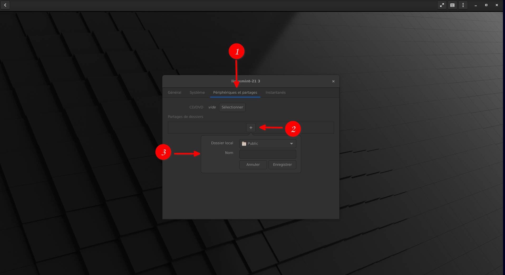

{.align-center}  

[**Gnome-Boxes**](https://apps.gnome.org/app/org.gnome.Boxes/) est un logiciel de **virtualisation** open-source développé par l'équipe de [**l'environnement de bureau Gnome (DE)**](https://www.gnome.org/). Il se veut simple, épuré avec une prise en main aisée sans connaissance technique particulière. Le paramétrage est minimum, ce qui n'est pas un handicap, au contraire, il en résulte une utilisation agréable. Pour tester rapidement une distribution, un paramétrage sans peur de casser son système, **Gnome-Boxes** est l'outil idéal pour les débutants mais également pour les plus chevronnés. C'est une des versions graphiques des systèmes de virtualisation Qemu-Kvm, libvirt-glib et spice-gtk.

Voyons donc son installation et son utilisation.

> *Pour plus de détails et explications sur le concept de la virtualisation, nous vous renvoyons vers l'article dédié à la [Virtualisation](./virtualisation.md#).*
{.is-info}

**Gnome-Boxes** n'est installable que sur des distributions **Linux** mais permet d'y installer la plupart des distributions y compris Windows et MacOS.

# Introduction
**Gnome-Boxes** se découpe en trois parties :
- Le package de base de **Gnome-Boxes** sous licence GNU LGPL-2+
- Les Additions Invité (**Guest Additions**) sous licence GNU GPL-3+
- Des paquets [**Spice**](https://www.spice-space.org/index.html) permettant le partage de fichiers d'un système à l'autre   

# Présentation
> Dans le présent article, nous parlerons de **"système hôte"** et de **"système invité"** ; le système hôte correspond au système principal, tandis que le système invité est le système d'exploitation installé dans **Gnome-Boxes**, virtualisé donc. 
{.is-info}

- Notre système hôte sera une distribution [**Debian 11**](./debian.md#), nom de code **Bullseye**
- Nous installerons **Gnomes-Boxes** par les dépôts officiels de **Debian**
- Nous installerons une distribution [**Linux Mint 21.1**](./mint.md#) avec [**MATE**](https://mate-desktop.org/fr/) comme environnement de bureau

# Pré-requis
- S'assurer que votre processeur supporte la virtualisation, ce qui est le cas sur les ordinateurs depuis environ 2010 mais cette fonction est peut-être désactivée dans votre **BIOS**. Il sera donc nécessaire de rentrer dans votre BIOS (n'hésitez pas à jeter un oeil à l'article [Configurer son BIOS](./bios-boot.md#) afin de vérifier que les paramètres de virtualisation sont activés. Pour cela :
> Recherchez dans le **BIOS** les termes "**VT-x**" pour **Intel** ; "**AMD-V**" ou "**SVM**" pour **AMD**. Si ces termes sont présents mais que leurs valeurs sont "**disabled**", activez-les en les passant à "**enabled"**.
>
> Une fois terminé, avant de quitter, n'oubliez pas de sauvegarder la configuration du BIOS (Dans le menu "Exit" ou "Save & Exit").
{.is-info}

- Avoir téléchargé préalablement l'ISO du système d'exploitation que vous voulez installer (système invité) dans votre VM, voir l'article sur [**Les distributions Linux**](./linux-distributions.md#) pour vous aider à faire votre choix :
> Il est à noter que **Gnome-Boxes** peut télécharger et installer certains systèmes d'exploitation automatiquement sans qu'il soit nécessaire de les télécharger préalablement.
>
> Ce qui facilite grandement la prise en main de l'outil.
{.is-info}

# Installation de Gnome-Boxes
- L'installation nécessite l'utilisation du **Terminal**. Rassurez-vous, c'est très simple, il vous suffira de copier-coller les commandes indiquées.
> Pour vous aider à comprendre les bases du **Terminal sous Linux**, nous vous conseillons de consulter notre article dédié [**Utiliser le Terminal**](./terminal.md#).
{.is-info}

- Donc, allons-y :

Pour les distributions basées sur **Debian et Ubuntu** tapez cette commande :

```bash
sudo apt install gnome-boxes
```
Cette commande télécharge et installe les paquets nécessaires.

> Il existe une autre méthode pour installer **Gnome-Boxes** en utilisant votre gestionnaire d'applications et les [**Flatpak**](https://debian-facile.org/doc:systeme:flatpak), ceux-ci fonctionnant dans un "bac à sable", ils sont isolés du système, mais en ce qui concerne **Gnome-Boxes**, dans cet article nous ne parlerons pas de cette méthode via Flatpak car le support de l'**USB** ne fonctionne pas (cf. [ici](https://gitlab.gnome.org/GNOME/gnome-boxes/-/issues/236)), mais nous utiliserons l'**application en natif** !
{.is-warning}

- Tapez ensuite votre mot de passe 
> Petit rappel, sur certaines distributions Linux, dans un terminal, lorsque vous tapez votre mot de passe, rien ne se passe à l'écran mais chaque appui de touche est pris en compte.
{.is-warning}

> Voilà, vous venez d'installer **Gnome-Boxes** sur votre ordinateur, avouez-le, ce n'était pas bien compliqué ;-)
{.is-success}

# Utilisation de Gnome-Boxes
> Sur les distributions en langue française, **Gnome-Boxes** est traduit par **"Machines"**.
>
> Dans cet article afin d'éviter des erreurs de compréhension entre **Machines** (**Gnome-Boxes**) et les **machines** virtuelles nous continuerons d'appeler ce logiciel **Gnome-Boxes**.
{.is-info}

Pour ouvrir **Gnome-Boxes**
- soit vous le lancez dans un terminal en tapant simplement cette commande :
```bash
gnome-boxes
```
- Soit vous l'ouvrez en passant par le menu **Application --> Système --> Machines**  

{.align-center}

- Au premier lancement, une rapide présentation vous accueille :

{.align-center}

- Pour créer une machine virtuelle, cliquez sur le signe **+** en haut à gauche de la fenêtre :

{.align-center}

- A ce stade vous avez deux possibilités :
1- **Installation depuis un fichier** vous permet d'installer l'image **ISO** de la distribution que vous aurez préalablement téléchargée.
2- **Télécharger un système d'exploitation** vous permet de faire un installation de **VM** automatiquement, la distribution se télécharge et l'installation se fait toute seule.

## Ajout VM

## Tabs {.tabset}
### Ajout VM en mode express

#### Création de la VM
- Cliquez sur le signe **+** en haut à gauche et sélectionnez **Télécharger un système d'exploitation**  

{.align-center} 

- Pour l'exemple nous choisissons **Ubuntu 20.10 Server x86_64 (live)**
- Une fois sélectionné, le téléchargement s'affiche en haut à droite de la fenêtre  
{.align-center}

- Une fois celui-ci achevé, l'outil vous propose une configuration du CPU et de la RAM par défaut. Si cette configuration par défaut vous convient, cliquez sur **Créer**, sinon vous pouvez modifier les paramètres. Vous obtenez enfin ceci :
{.align-center}

- L'installation débute. Celle-ci est identique à l'installation de la distribution sur un disque dur physique, reportez-vous à nos tutoriels sur l'installation des distributions  [**Linux**](./linux-distributions.md#.md#), **Ubuntu** dans notre exemple.

### Ajout VM en mode manuel

#### Création de la VM
- Cliquez sur le signe **+** en haut à gauche, sélectionnez l'option **Installation depuis un fichier**
- Sélectionnez l'emplacement de l'**ISO** choisie  puis cliquez sur **Ouvrir** 

{.align-center}

- Si votre distribution n'est pas reconnue

{.align-center}

- Sélectionnez la distribution qui s'en rapproche le plus, dans notre exemple, **Linux Mint** étant basée sur **Ubuntu** nous choisissons **Ubuntu 20.10** et cliquez sur **Suivant**

{.align-center}

- L'étape suivante vous propose de configurer la quantité de mémoire et l'espace disque que vous voulez allouer à votre **VM**, si le choix par défaut vous convient cliquez sur **Créer** ou sur **Personnaliser** pour modifier les valeurs et ensuite sur **Créer**

> Les valeurs par défaut sont indicatives mais il est conseillé de ne pas descendre en dessous de ces indications car elles représentent le minimum pour une utilisation correcte. Au contraire, si votre configuration matérielle le permet, n'hésitez pas à augmenter celle-ci pour une utilisation optimale.
{.is-warning}

{.align-center}

- L'installation de votre distribution se lance, celle-ci est identique à une installation sur un disque dur, reportez-vous à nos tutoriels pour l'installation des distributions [**Linux**](./linux-distributions.md#.md#.md#), [**Linux Mint**](./mint.md#.md#) pour notre exemple  

{.align-center}

- L'installation est terminée, vous pouvez profiter de votre nouvelle **VM**

{.align-center}

- Passons ensuite aux configurations...

# Configuration
## Prise en charge USB

Il est possible de rediriger des périphériques USB vers la machine invité (la VM) : disques durs, clés USB, webcam, etc.

- Dans votre **VM**, cliquez sur le menu en haut à droite (cf. image suivante), dans le menu déroulant qui s'ouvre cliquez sur **Propriétés** :
{.align-center}

- Dans l'onglet **Périphériques et partage**, activez votre matériel USB, dans notre exemple, une clé USB. 

> Pour que votre matériel **USB** soit reconnu, il est nécessaire de l'avoir inséré au préalable
{.is-warning}

{.align-center}

- Patientez quelques secondes, votre matériel sera monté automatiquement.

- Votre clé apparaît désormais sur votre bureau et dans votre explorateur de fichiers.  

{.align-center}

## Additions invités

Selon le système d'exploitation que vous installerez dans vos VM, il se peut que certaines fonctions ne soit pas opérationnelles, c'est la raison pour laquelle il vous faut installer des pilotes additionnels, ce que nous nommons généralement les **Additions Invité**.

Voici les paramètres qui nous intéressent plus particulièrement :
- L'affichage plein écran de sa VM et la possibilité de régler la résolution d'écran.
- Le presse-papier partagé (copier-coller) dans les deux sens, ou hôte vers invité, ou invité vers hôte.
- Les dossiers partagés entre les deux systèmes.

### Installation des Additions invités

Pour y remédier, vous devez installer le paquet suivant `spice-vdagent` :
```bash
sudo apt install spice-vdagent
```
- Redémarrez votre machine virtuelle
- Pour afficher le plein écran, cliquez sur le bouton en haut à droite de la fenêtre de **Gnome-Boxes**  

{.align-center}

> Si après avoir cliqué sur le bouton du plein écran, la fenêtre n'est toujours pas en mode plein écran, il faut régler la résolution d'écran de votre **VM** à la méme valeur que celle de votre machine **hôte**.
>
> Dans notre exemple, sous **Linux Mint Mate**, allez dans **Préférences --> Affichage**.
{.is-warning}

> Lorsque vous êtes en mode plein écran, pour revenir au menu, placez le curseur de la souris en haut de l'écran, la barre du menu apparaît. 
{.is-info}  

### Partager des fichiers

Le partage de fichiers sous **Gnome-Boxes** est bi-directionnel (hôte vers invité et inversement, invité vers hôte) et consiste en trois étapes :
- Installer les paquets requis sur le système d'exploitation invité pour permettre le partage de fichiers.
- Savoir comment transférer des fichiers du système d'exploitation hôte vers le système d'exploitation invité (glisser-déposer)
- Savoir comment transférer des fichiers du système d'exploitation invité vers le système d'exploitation hôte (par le biais d'un dossier partagé).  

Le système d'exploitation invité (distribution Linux dans la VM) a besoin d'un package **Spice** pour partager des fichiers avec le système d'exploitation hôte.  

- Pour les systèmes basés sur Ubuntu et Debian, tapez dans un **Terminal** :

```bash
sudo apt install spice-webdavd spice-client-gtk
```

- Redémarrez votre système invité

> Notez que si vous installez plusieurs **VM**, vous devrez retaper cette commande dans toutes les distributions où vous voudrez profiter du partage de fichiers, comme d'ailleurs la commande pour l'installation des ***Additions invité***.
{.is-warning}

#### Transfert hôte vers invité, deux méthodes

#### Tabs {.tabset}
##### Cliquer-Glisser (Première méthode)
1. Sélectionnez votre fichier (dans notre exemple une photo) et ***cliquez-glissez*** le vers la **VM**
2. Lâchez votre souris, le fichier est copié, un message vous indique le transfert de celui-ci 

{.align-center}  

##### A partir du menu (Seconde méthode)
- Dans votre **VM** cliquez sur le menu " ***sandwich*** " et sélectionnez **Envoyer un fichier...**  

{.align-center}  

- Votre explorateur de fichier s'ouvre et indiquez l'emplacement du fichier voulu, un message vous prévient que votre fichier sera téléchargé dans le dossier **Téléchargements**  

{.align-center}  


#### Transfert invité vers hôte

Pour ce faire il est nécessaire d'utiliser le protocole [**Spice**](https://fr.wikipedia.org/wiki/SPICE_(protocole)) pour monter un dossier sur le système d'exploitation hôte. Vous déposez les fichiers dans celui-ci dans la **VM**, ils sont transférés dans ce dossier sur l'hôte.

Les paquets que vous avez installé précédemment sont nécessaires pour ce transfert :
- Cliquez sur le menu et sélectionnez **Propriétés**  
- **1.** Cliquez sur l'onglet **Périphériques et partages**
- **2.** Cliquez sur le signe **+**
- **3.** Sélectionnez l'emplacement sur votre système hôte où vous aurez créé préalablement un dossier pour le partage si le choix par défaut ne vous convient pas  

{.align-center}

- De retour dans votre **VM**, selon votre explorateur de fichiers, cliquez sur **Autres emplacements** ou dans notre exemple sur **Réseau**
1. Cliquez sur **Parcourir le réseau** 
1. Un fichier nommé **Spice client folder** est présent

{.align-center}

- Double-cliquer sur ce fichier monte un dossier sur le bureau, accessible également dans votre explorateur de fichiers. C'est le conteneur de votre dossier partagé avec la machine hôte. 

{.align-center}

- Ouvrons le même dossier sur notre machine hôte, le contenu est bien identique, en l'occurrence ici notre photo :
 
{.align-center}

Il s'agit d'un partage à double sens : si vous mettez des fichiers dans le dossier partagé du système hôte, ils seront accessibles dans le dossier monté du système invité. Vous pouvez créer autant de fichiers que désiré.

> Notez que vous avez ajouté le dossier de l'OS hôte au niveau de **Gnome-Boxes**. Cela signifie que si vous avez plusieurs machines virtuelles, elles seront toutes en mesure de monter ce dossier.
{.is-info}  

> Il est à noter que bien que ces fonctions de partage de répertoire et de presse-papier soient très pratiques, cela réduit, de fait, la *sécurité* des deux systèmes puisque le **cloisonnement** inhérent aux machines virtuelles n'est plus assuré en totalité.
>
> Encore une fois, il s'agit de faire des compromis entre praticité et sécurité !
> Nos recommandations sont donc de limiter au maximum l'activation de ces fonctionnalités (**si vous n'en avez pas besoin au quotidien, ne les activez pas**), surtout sur des machines virtuelles critiques (type Whonix VM).
{.is-warning}

### Création d'Instantanés

- Les instantanés sont des points de sauvegardes de vos **VM** créés à un instant T. Il s'agit par exemple, avant de tester une configuration, d'installer un logiciel ou tout simplement de faire une sauvegarde de votre système à un instant donné. C'est un peu l'équivalent des "points de restauration", dénomination 'Windowsienne'.

- Pour créer un instantané, cliquez sur le menu puis sur **Propriétés**
 1. Cliquez sur **Instantanés**
 1. Cliquez sur le signe **+** en bas de la fenêtre, patientez, le processus peut prendre un peu de temps...
 1. Une fois le point de restauration affiché, en cliquant sur la petite roue dentée, dans le menu déroulant, vous pouvez renommer ce point pour le retrouver plus aisément en cas de besoin, voire le supprimer.

- Pour restaurer votre machine à un point de restauration (vous pouvez en créer autant que vous le voulez, module la taille de votre disque !), dans ce menu cliquez sur **Revenir à cet état**  
 
{.align-center}
 
# Conclusion

> Félicitations, vous êtes désormais capable d'installer **Gnomes-Boxes** sur votre machine **Linux** et d'y installer autant de distributions que bon vous semble, sous réserve bien entendu de la capacité de stockage de votre matériel.
{.is-success}  

{.align-right} *Contributeur(s): Theudric*