Bienvenue dans ce tutoriel tout en images, afin d'installer votre distribution Manjaro. C'est très simple, vous allez voir !

> Au préalable, assurez-vous bien : 
> ~~ D'avoir configuré correctement votre [BIOS](./bios-boot.md#).
> ~~ D'avoir créé correctement votre [clé USB bootable](./usb-bootable.md#).
{.is-warning}

---

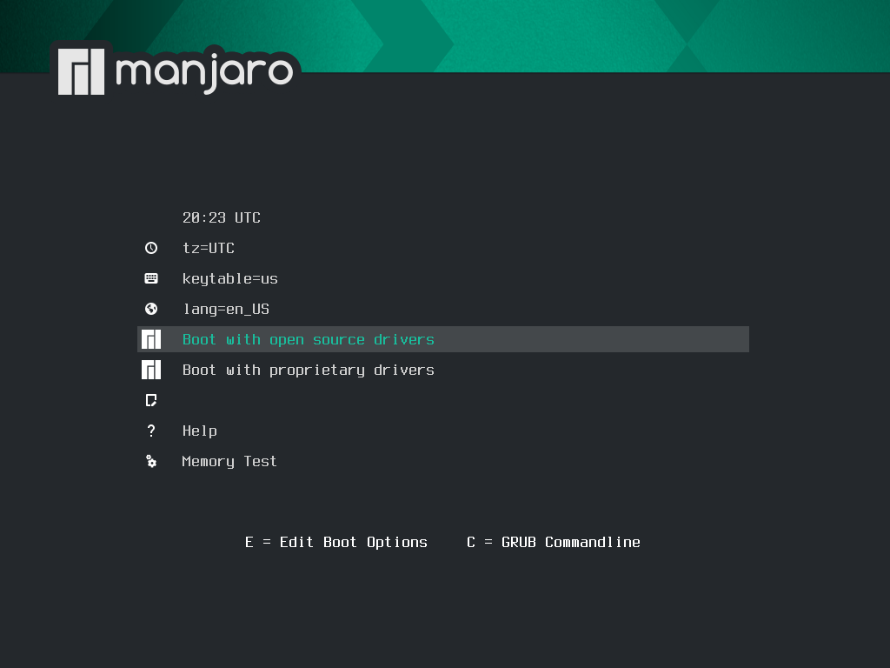{.align-center}

> Cliquer sur "Boot with open source drivers", puis patienter jusqu'à ce que le programme d'installation arrive sur l'écran suivant...
> Vous pouvez également à ce moment régler la zone de temps et la langue, mais cela n'est pas obligatoire !
> ***Si l'installation avec des drivers open source ne fonctionne pas, tentez une installation avec les drivers propriétaires (surtout si vous avez une carte graphique nvidia)***
{.is-info}

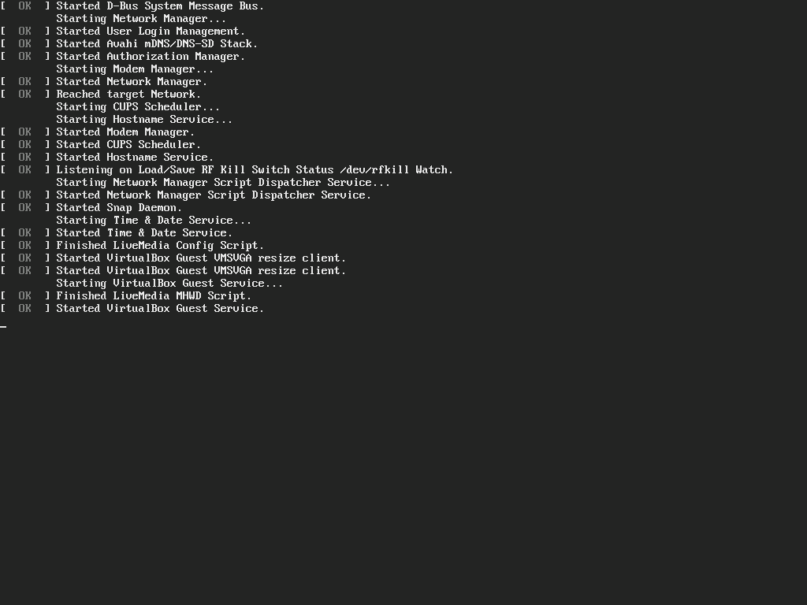{.align-center}
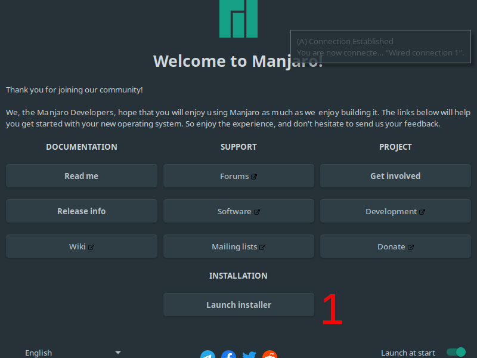{.align-center}
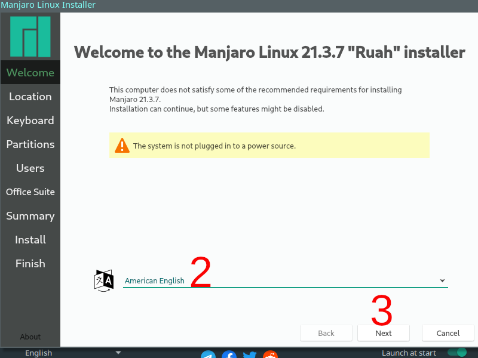{.align-center}

> Le message d'avertissement ci-dessus (triangle orange) peut ne pas apparaître chez vous ; celui-ci nous a juste prévenu que notre ordinateur portable n'était pas branché sur le secteur. *Branchez votre ordinateur si vous avez le même message*...
{.is-info}

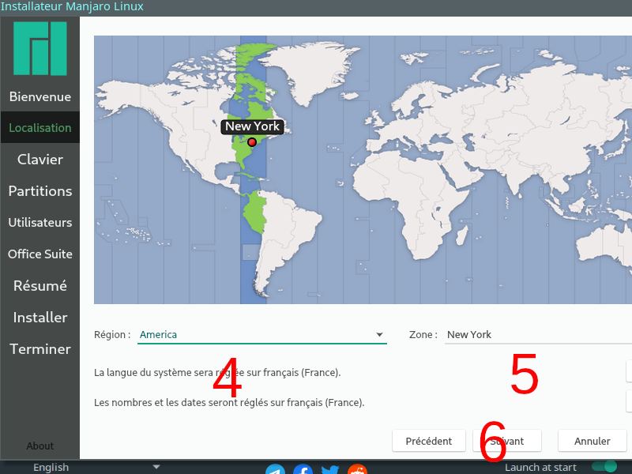{.align-center}
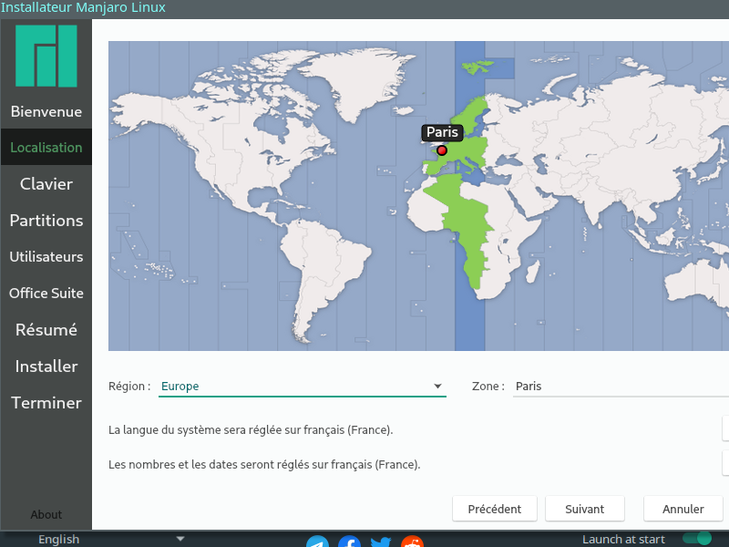{.align-center}
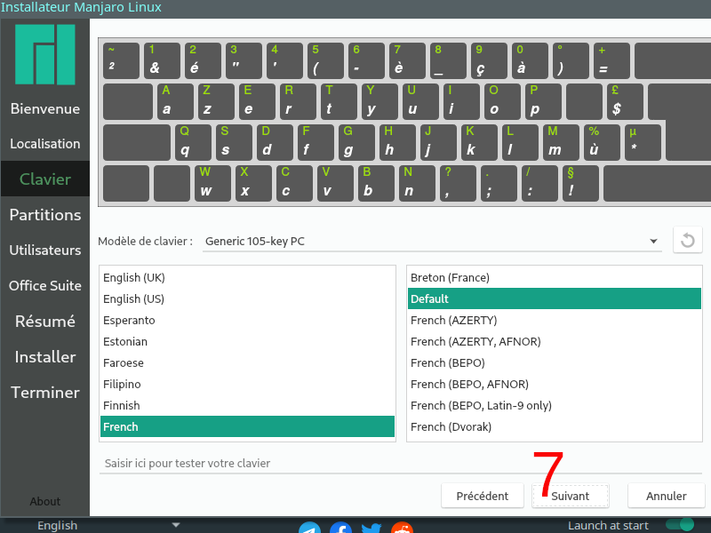{.align-center}
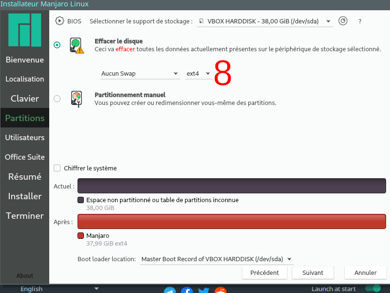{.align-center}
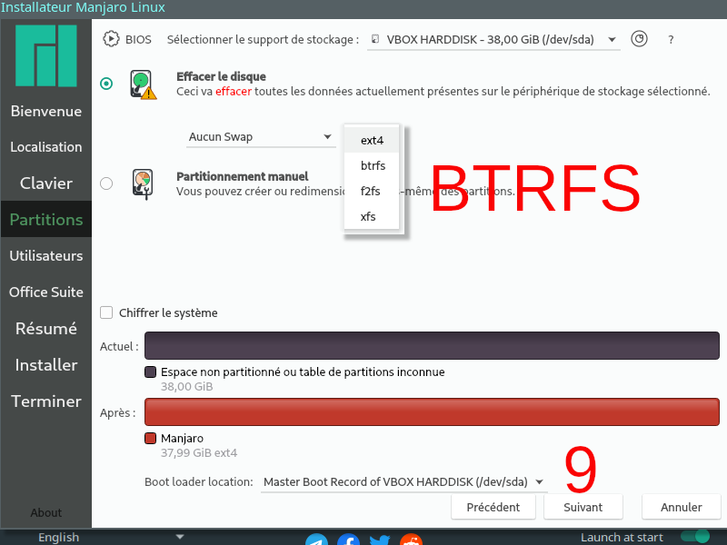{.align-center}
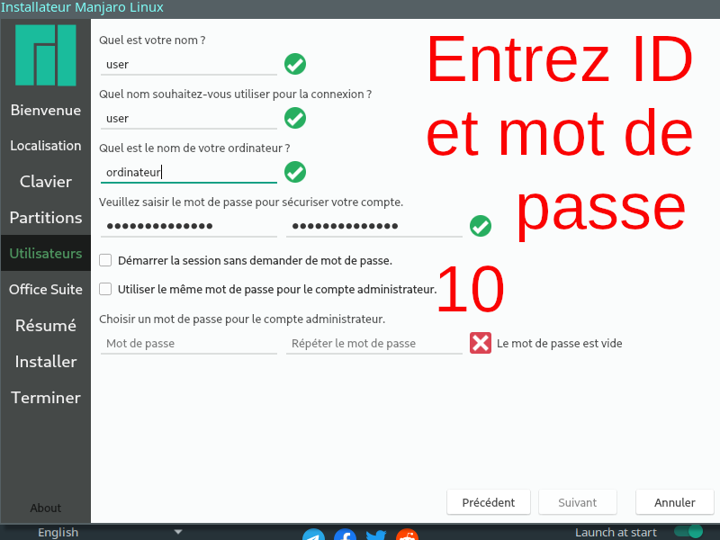{.align-center}
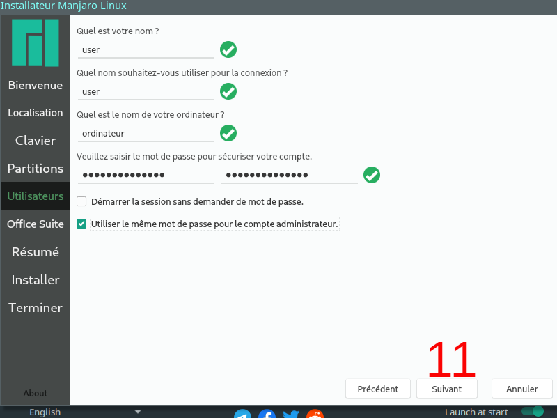{.align-center}
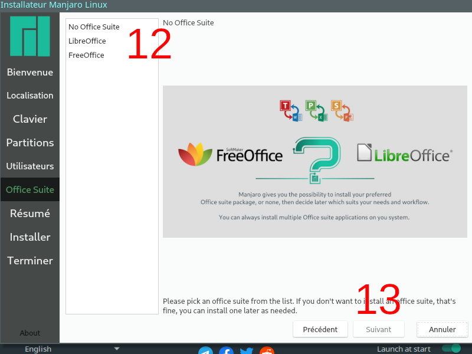{.align-center}

> **(12)** No Office Suite : Vous pouvez choisir de ne pas installer de suite bureautique.
libreOffice ou FreeOffice ?  En cas de doute, LibreOffice étant l'option communément empaquetée dans les autres distributions, vous pouvez choisir celle-ci.
Ou simplement opter pour FreeOffice si vous avez déjà vos habitudes avec cette suite.
Finalement, vous pourrez également opter pour une toute autre option, comme OnlyOffice, post installation.
{.is-info}

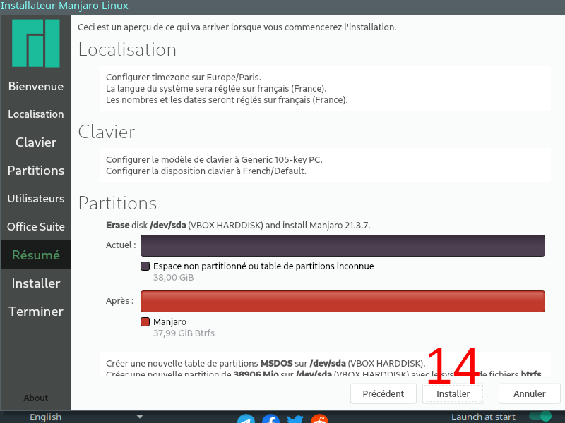{.align-center}
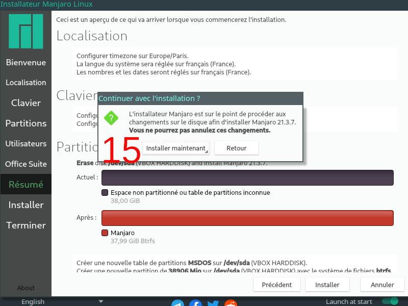{.align-center}
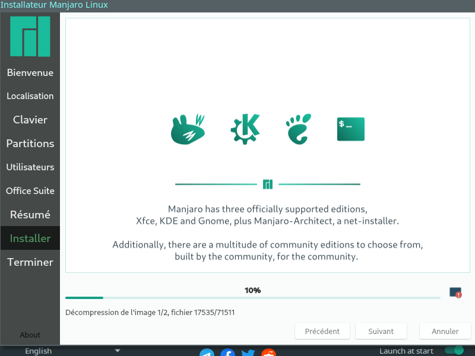{.align-center}
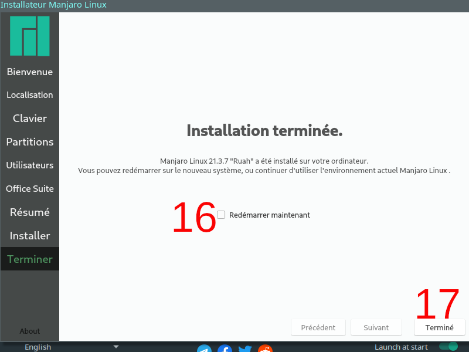{.align-center}
> **(16)** : cocher "Redémarrer maintenant", puis **(17)** : cliquer sur "Terminé"
{.is-info}

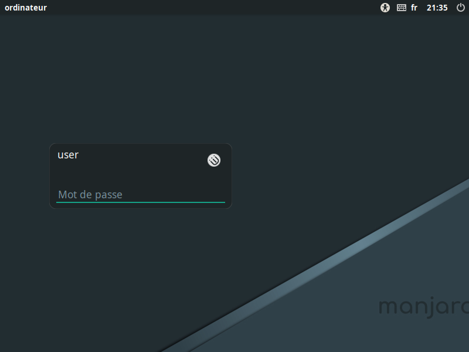{.align-center}
{.align-center}

Voilà, votre distribution Manjaro tout neuve est maintenant prête.

---
{.align-right} *Contributeur(s): Ayo, Nemtech*