Bienvenue dans ce tutoriel tout en images, afin d'installer votre distribution Linux Mint. C'est très simple, vous allez voir !

> Au préalable, assurez-vous bien : 
> ~~ D'avoir configuré correctement votre [BIOS](./bios-boot.md#).
> ~~ D'avoir créé correctement votre [clé USB bootable](./usb-bootable.md#).
{.is-warning}

---

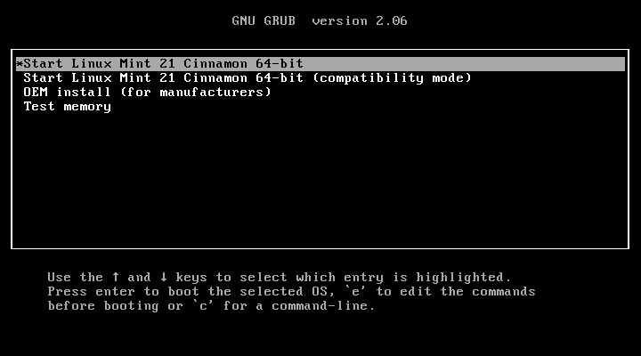{.align-center}

> Cliquer sur "Start Linux Mint 21 Cinnamon 64-bit" (évidemment 21 s'accorde avec la version de Mint que vous installerez), puis patienter jusqu'à ce que le programme d'installation arrive sur l'écran suivant...
{.is-info}

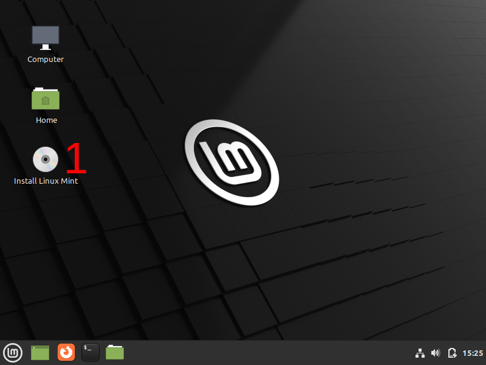{.align-center}
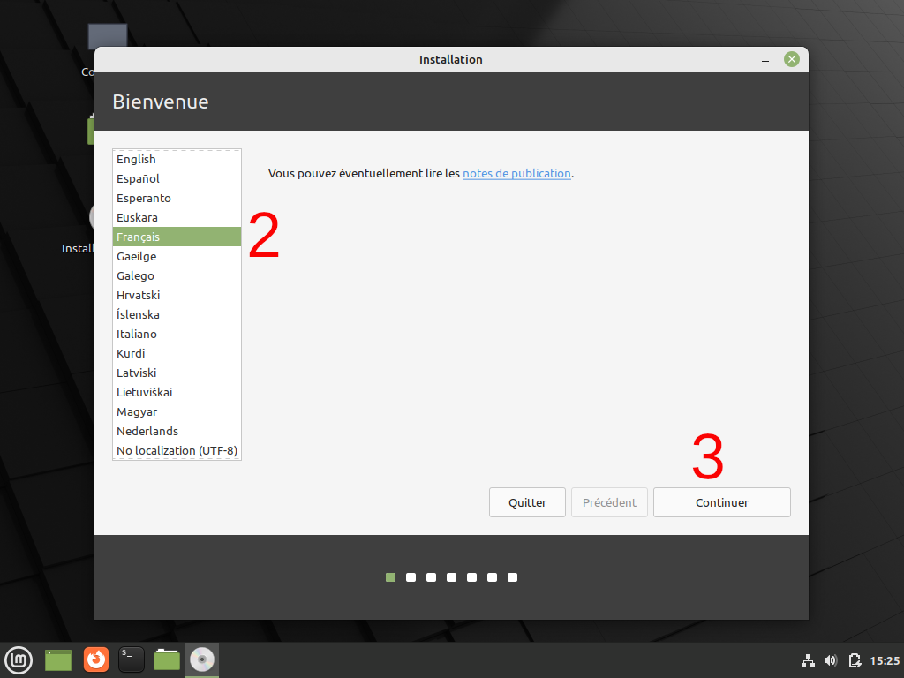{.align-center}
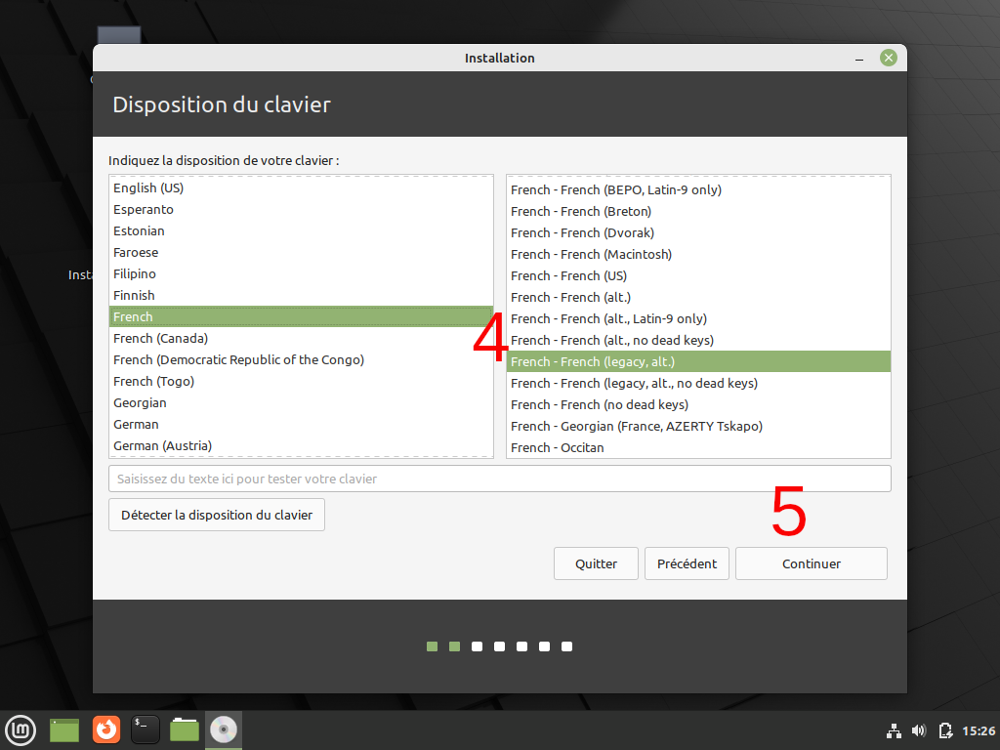{.align-center}
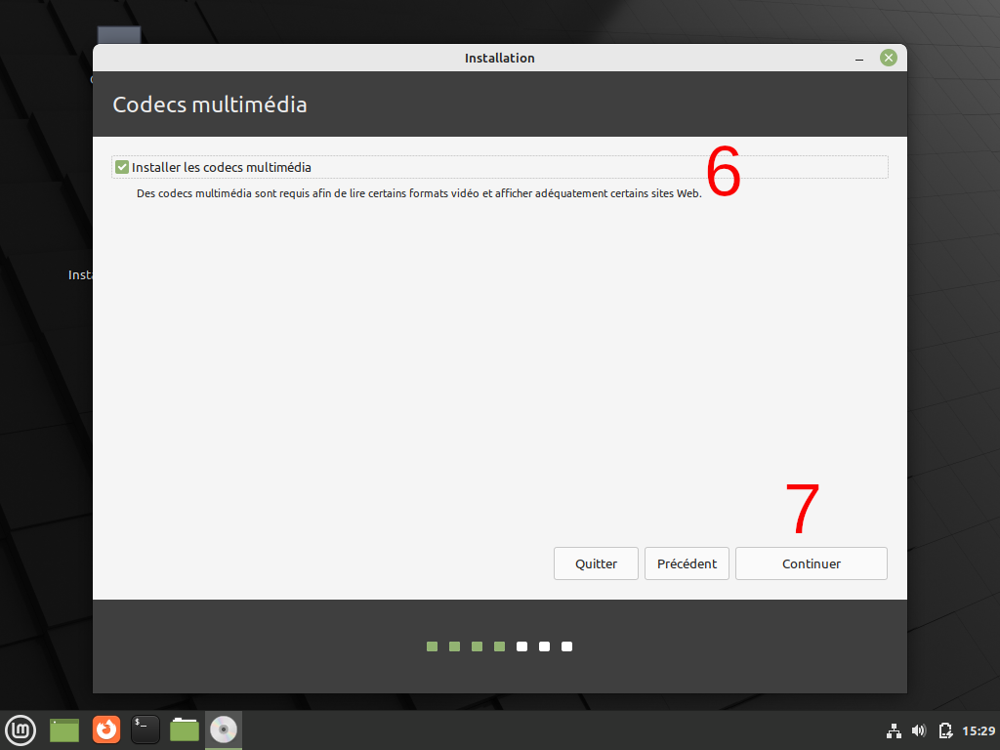{.align-center}

> Vous pouvez très bien ne pas cocher cette case (6), ce qui pourrait poser quelques problèmes mineurs de prise en charge du matériel...
{.is-info}

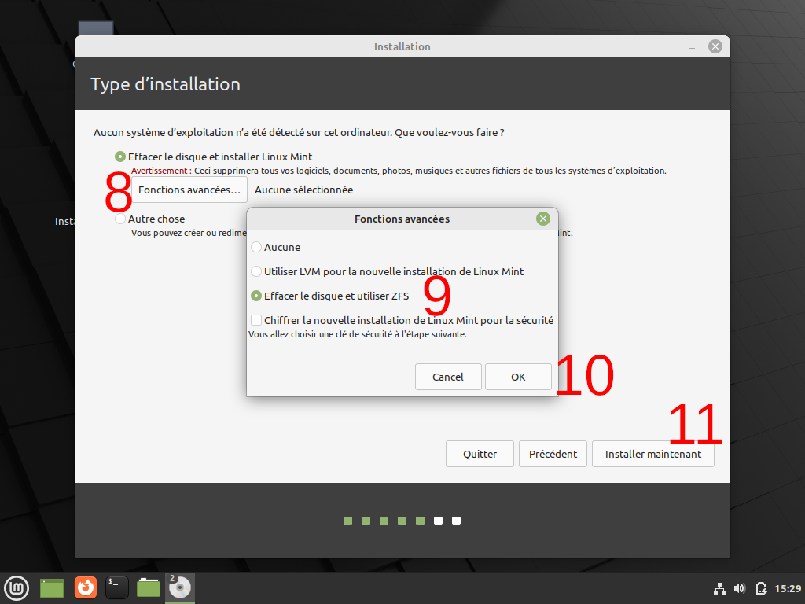{.align-center}
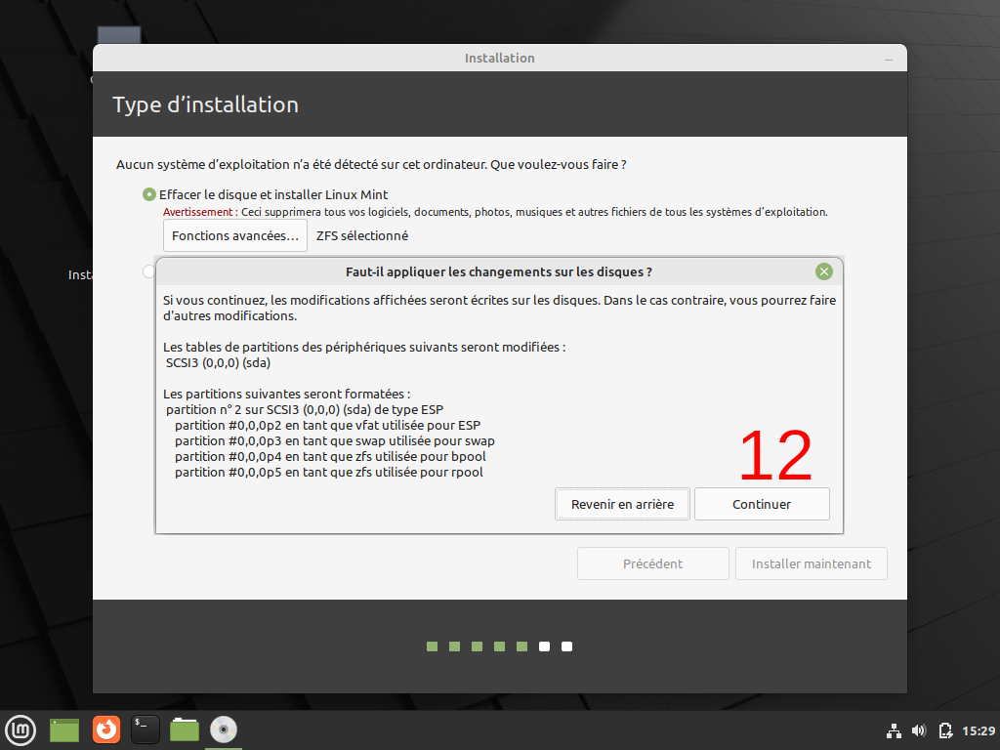{.align-center}
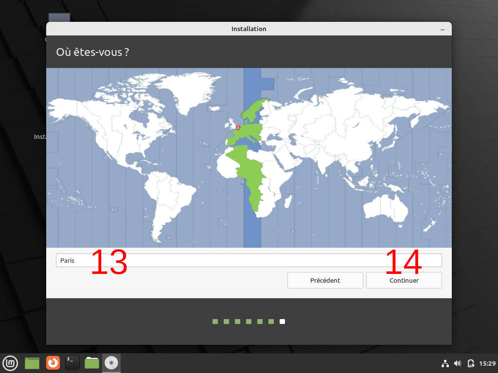{.align-center}
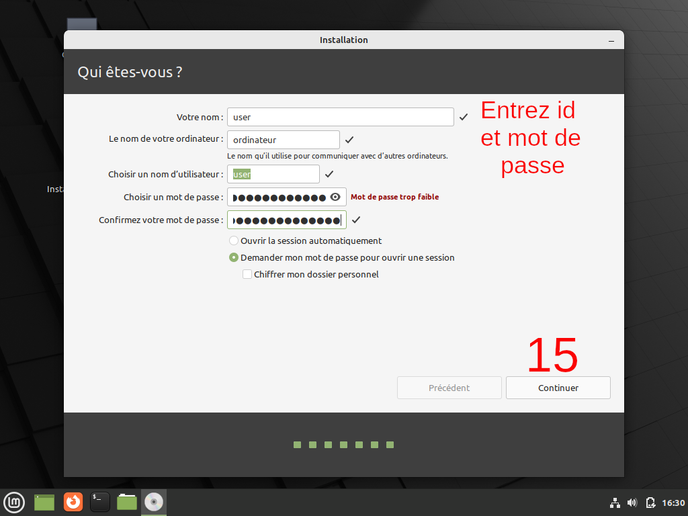{.align-center}
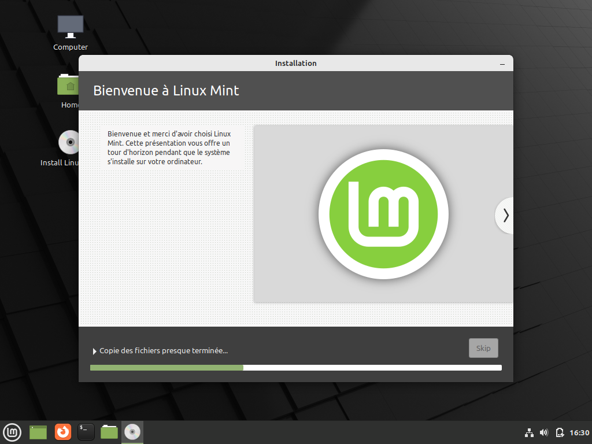{.align-center}
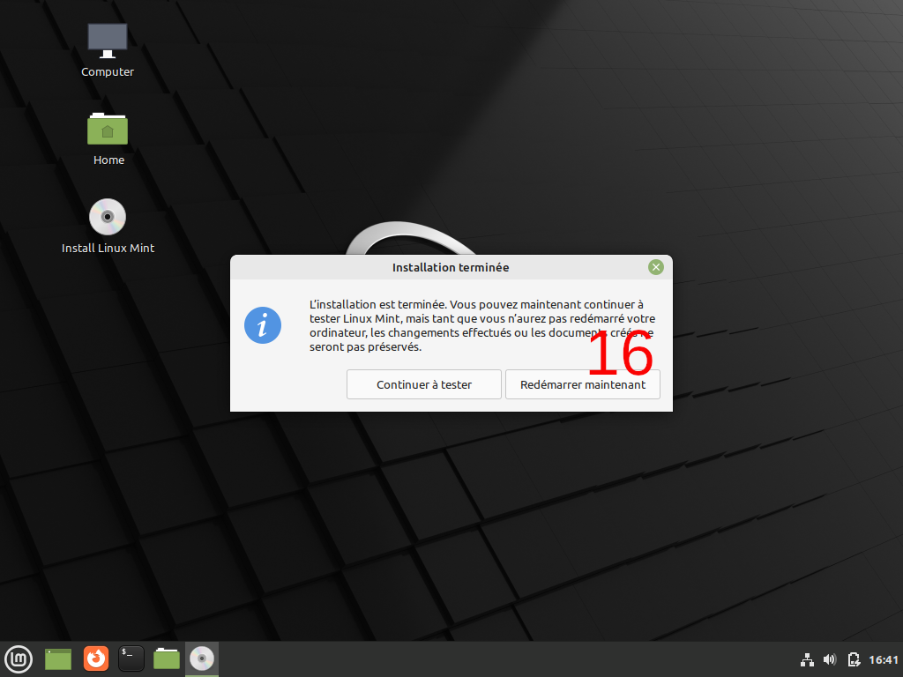{.align-center}
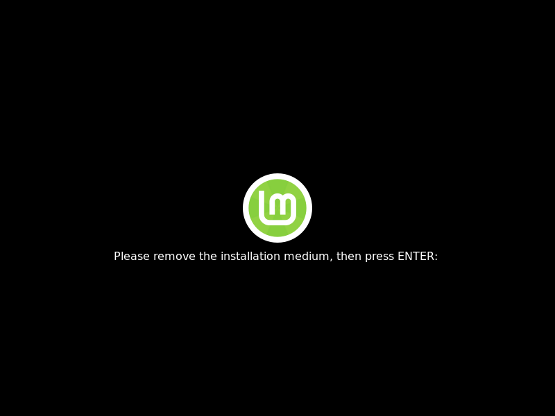{.align-center}

> Débranchez votre clé USB puis appuyez sur <kbd>ENTREE</kbd>.
{.is-info}

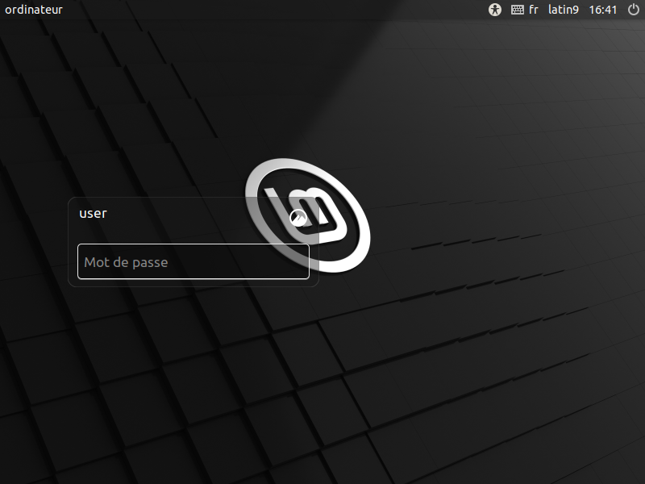{.align-center}
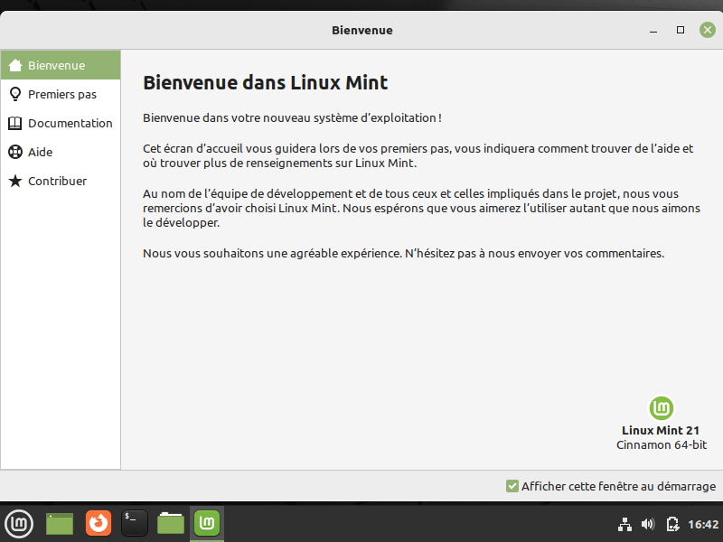{.align-center}

Voilà, votre distribution Linux Mint tout neuve est maintenant prête.

**Vous pouvez continuer en cliquant sur "Premier pas", pour configurer finement votre distro et installer potentiellement des pilotes ou applications importantes manquants**.

---
{.align-right} *Contributeur(s): Ayo, Nemtech*