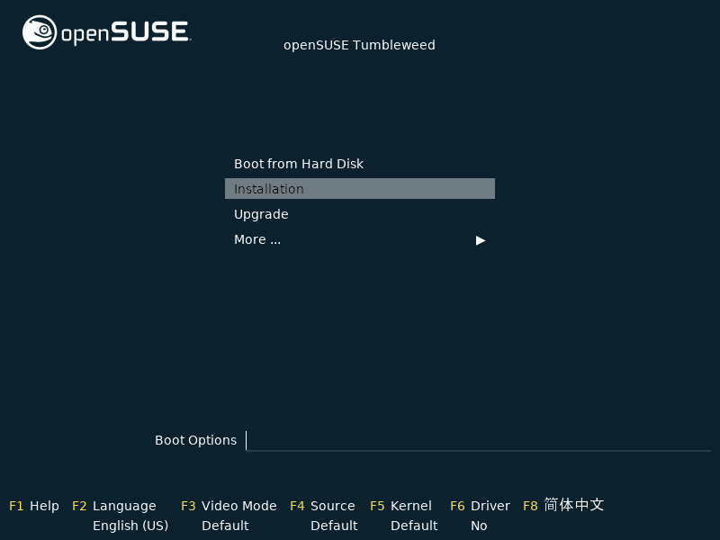

Bienvenue dans ce tutoriel tout en images, afin d'installer votre distribution OpenSUSE Tumbleweed. C'est très simple, vous allez voir !

> Au préalable, assurez-vous bien : 
> ~~ D'avoir configuré correctement votre [BIOS](./bios-boot.md#).
> ~~ D'avoir créé correctement votre [clé USB bootable](./usb-bootable.md#).
{.is-warning}

---

{.align-center}

> Cliquer sur "Installation", puis patienter...
{.is-info}

{.align-center}
{.align-center}
{.align-center}
{.align-center}
{.align-center}
{.align-center}
{.align-center}
{.align-center}
{.align-center}
{.align-center}
{.align-center}
{.align-center}
{.align-center}

Voilà, vous arrivez sur votre distribution OpenSUSE tout neuve.

> Pour l'exemple nous avons sélectionné l'environnement de bureau KDE Plasma
{.is-info}

---
{.align-right} *Contributeur(s): Ayo*