> -- Vous aimeriez bloquer les publicités et traceurs sur tous les appareils de votre réseau local (branchés via câble ou Wi-Fi) ?
> -- Vous voulez vous passer de la surveillance [DNS](./glossaire.md##dns) de votre fournisseur d'accès Internet ([FAI](./glossaire.md##fai)) ?
> -- Ou vous souhaiteriez même bloquer l'accès à certains sites Internet ?
{.is-info}

>**Pi-Hole est capable de réaliser tout cela et c'est ce que nous allons voir dans ce tutoriel !**
{.is-success}

{.align-center}

# Présentation

[Pi-Hole](https://pi-hole.net/) est un logiciel libre sous licence EUPL. Ce projet a été lancé par Jacob Salmela en 2014. Une communauté de développeurs et de contributeurs l'ont rejoint depuis.

Pi-Hole agit comme un "DNS menteur" pour bloquer les publicités et traceurs en tous genres sur tous les appareils de votre réseau local.

Pour être capable de bloquer les publicités et traceurs indésirables, il faudra reconfigurer le DNS sur tous vos appareils, pour cela le plus simple consiste à le faire au niveau de votre Box Internet. Pas d'inquiétude, nous allons vous guider pour le faire.

> Pi-Hole deviendra alors votre serveur [DNS](./glossaire.md.md##dns) en lieu et place de celui de votre fournisseur d'accès Internet.
> Il sera ainsi capable d'intercepter les publicités pour qu'elles ne s'affichent plus sur les appareils de votre réseau local :)
{.is-success}

Ci-dessous, voyez plutôt en image, la différence avec ou sans blocage de pubs sur un site d'actualité :

## Tabs {.tabset}

### Sans Blocage

{.align-center}

### Avec Blocage

{.align-center}


# Installation

## Pré-requis

Pi-Hole est compatible avec les RaspberryPi (que nous nommons classiquement **Rpi**), mais pas seulement. Vous pourrez l'installer sur n'importe quel ordinateur doté de 512 Mo de RAM et 8 Go d'espace disque libre au minimum.

Cependant dans notre cas, la machine va tourner 24h/24, il est donc fortement recommandé d'opter pour un [SBC](./glossaire.md##sbc) que ce soit un RPi ou n'importe quel autre nano-PC car il consommera beaucoup moins d'énergie.

Les distributions GNU/Linux suivantes sont supportées :
- Raspbian (Raspberry Pi OS)
- Debian 10/11
- Ubuntu 20.04/22.04
- CentOS Stream
- Fedora
- Docker

> Au vu des distributions supportées, **nous recommandons l'installation de Debian** (actuellement version 11/Bullseye) que ce soit sur PC ou sur RaspberryPi.
{.is-success}

> Le Raspberry Pi requiert, même sous Debian, le paquet non libre [raspi-firmware](https://salsa.debian.org/debian/raspi-firmware), il sera installé automatiquement et [pour le moment il n'y a pas de solution stable pour le remplacer](https://gwolf.org/2022/04/how-is-the-free-firmware-for-the-raspberry-progressing.html).
{.is-warning}

## Installation du Système

### Raspberry Pi

Bien que non officielle, il existe une version Debian maintenue par [Gunnar Wolf](https://gwolf.org/).
- Depuis votre PC de bureau, rendez-vous sur la page du [projet debian pour RPi](https://raspi.debian.net/tested-images/) et téléchargez le fichier `xz-compressed image` de la **version "11 (Bullseye)"** pour votre modèle. Téléchargez aussi le fichier `sha256sum` correspondant.
- Vérifiez grâce au SHA que le fichier `img.xz` est [intègre](./chiffrement.md#).
- Munissez-vous d'une carte SD d'au moins 8 GB.
- Suivez enfin scrupuleusement les [instructions pour installer](https://raspi.debian.net/how-to-image/).

### PC

L'installation d'une Debian minimale (appropriée pour les serveurs) est expliquée dans cet article : [Serveur sous Debian Stable](./serveur-debian-stable.md#).

## Installation de Pi-Hole

L'installation de Pi-Hole est triviale, elle est décrite [ici](https://github.com/pi-hole/pi-hole/#one-step-automated-install), et nous reprenons la commande dans l'article. Il vous suffit donc de :
- Vous connecter en SSH sur votre serveur fraîchement installé,
- Puis lancer la commande suivante :
```
curl -sSL https://install.pi-hole.net | bash
```

> Notez bien le mot de passe par défaut de Pi-Hole, il sera généré aléatoirement à la fin de l'installation et vous en aurez bientôt besoin pour la configuration. ;)
{.is-warning}


## Configurer Pi-Hole comme serveur DNS sur votre réseau local

> **Connexion à l'interface d'administration de votre Box Internet :**
> Vous allez devoir vous connecter à l'interface d'administration de votre box. Pour cela rendez-vous sur la page suivante :
> - [x] FreeBox: http://mafreebox.freebox.fr
> - [x] OrangeBox (type LiveBox) : http://192.168.1.1 (ou http://192.168.0.1)
> - [x] SFRBox : http://192.168.1.1
> - [x] BouyguesBox : http://192.168.1.1

> Pour que Pi-Hole puisse intercepter et bloquer les publicités et traceurs, il vous faut maintenant le configurer comme serveur DNS par défaut sur votre réseau local.
{.is-info}


- Il y a deux cas de figure :
  - [x] 1. La configuration DNS est modifiable sur votre Box.
  - [x] 2. La configuration DNS _n'est PAS_ modifiable sur votre Box.

## Tabs {.tabset}

### Cas 1 : La configuration DNS est modifiable

**Dans ce cas, c'est très simple : nous allons simplement reconfigurer votre Box pour que Pi-Hole soit le serveur DNS par défaut sur votre réseau local.**

Dans l'interface d'administration, cherchez la partie dénommée DNS ou DDNS, exemple ci-dessous avec une LiveBox d'Orange :

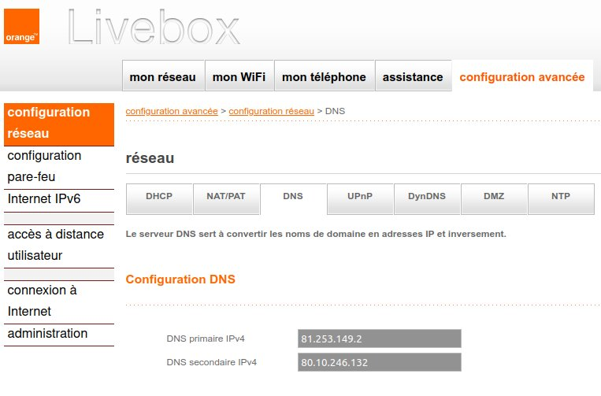{.align-center}

> Remplacez les DNS par l'adresse IP de votre serveur Pi-Hole et sauvegardez la configuration.
{.is-success}

> Si le paramètre est "grisé", alors c'est que votre FAI n'autorise pas la modification du DNS, malheureusement !
> **Si vous êtes dans cette situation, suivez plutôt le Cas 2** car nous allons devoir ruser ;)
{.is-warning}

### Cas 2 : La configuration DNS n'est PAS modifiable

**Dans ce cas, il va falloir désactiver le service DHCP sur votre box, activer le DHCP dans Pi-Hole pour qu'il envoie les configurations DHCP et DNS aux appareils de votre réseau local.**

> [DHCP](./glossaire.md##dhcp) pour "Dynamic Host Configuration Protocol" (protocole de configuration dynamique des hôtes).
{.is-info}

Le mécanisme DHCP permet, d'une part d'attribuer une adresse IP sur chaque machine de votre réseau local, mais aussi d'envoyer la configuration réseau, par exemple le DNS.

En général, c'est votre box qui s'occupe du DHCP, mais il est tout à fait possible de désactiver le DHCP ; plus de DHCP, plus d'IP automatique sur les machines... :confused:

...mais ne vous inquiétez pas, Pi-Hole est tout à fait capable de s'occuper des tâches DHCP et ainsi, par la même occasion, automatiquement dire aux appareils de votre réseau local qu'il est le DNS :smiling_imp:

#### **Désactivation du DHCP sur la Box**

- Rendez vous sur l'interface d'administration de votre box, puis dans la partie dénommée "DHCP", sélectionnez "Désactiver" et enregistrez la configuration, exemple sur une LiveBox d'Orange :

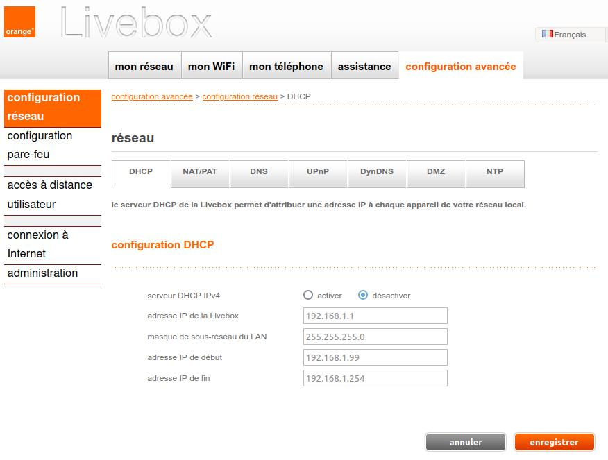{.align-center}

> Attention : Maintenant il n'y a plus de service DHCP sur votre réseau local, donc plus d'attribution d'IP automatique pour vos appareils !
> **Il va donc falloir activer le DHCP de Pi-Hole, c'est ce que nous allons faire ci-dessous.**
{.is-danger}

#### **Activation du DHCP sur Pi-Hole**

- Depuis votre PC, ouvrez votre navigateur et rendez-vous sur la page d'administration web de Pi-Hole : http://192.168.1.100/admin/login.php

> `192.168.1.100` est un exemple, à adapter avec l'adresse IP que vous aviez choisie pour votre serveur lors de sa configuration !
{.is-warning}

- Entrez votre mot de passe par défaut de Pi-Hole (celui qui vous a été donné lors de l'installation) et cliquez sur "Log-In" :

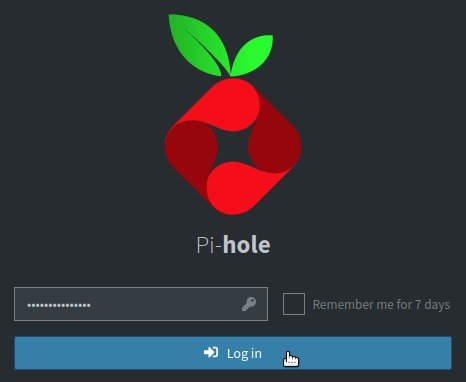{.align-center}

- Pour activer le DHCP :
1. Cliquez sur "Settings"
1. Cliquez sur l'onglet "DHCP"
1. Cochez "DHCP Server enabled"
1. Dans la case "Router", entrez l'adresse IP de votre Box, généralement 192.168.1.1
1. Entrez la plage d'adresses IP à servir, par exemple de 192.168.1.120 à 192.168.1.254
1. N'oubliez pas de cliquer sur "Save" pour valider les modifications !

> Surtout ne commencez pas par "From" = 192.168.1.1, qui est l'IP de votre Box !
> Si vous avez des machines en IP fixe, ne les incluez pas dans cette plage.
{.is-warning}

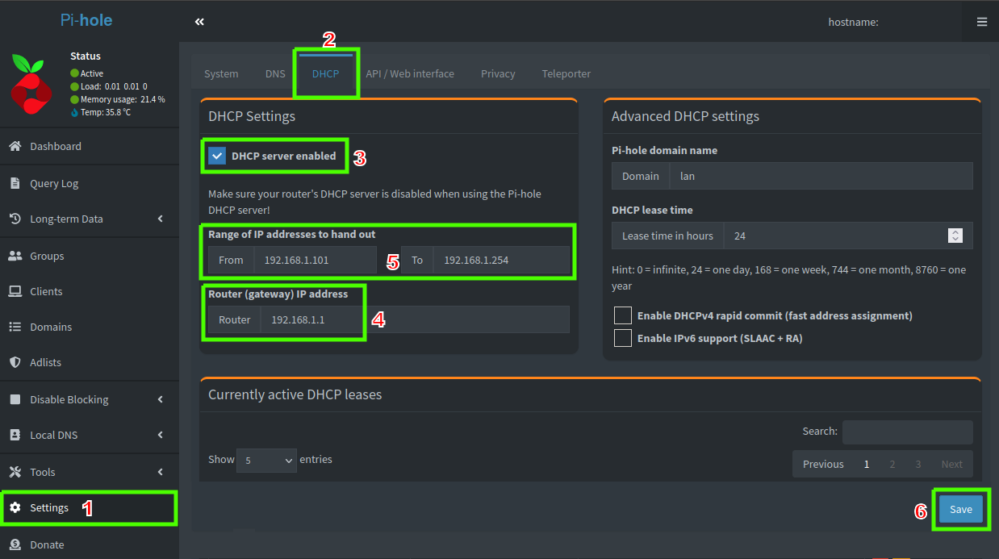{.align-center}

## Paramétrage de Pi-Hole

### Mot de passe d'administration

> La première chose à faire est de changer le mot de passe de la console d'administration web de Pi-Hole.
{.is-info}

- Depuis votre PC, connectez-vous en SSH sur votre serveur et lancez simplement cette commande :

```bash
pihole -a -p
```

- Saisissez le nouveau mot de passe de l'interface web de Pi-Hole

> Il est fortement recommandé :
> -- de le stocker dans un gestionnaire de mots de passe
> -- de choisir un mot de passe fort
> -- de choisir un mot de passe différent de vos autres comptes !
> **:arrow_right: Consultez l'article lié aux [mots de passe](./gestionnaire-mots-passe.md#) pour plus d'informations.**
{.is-warning}

- Depuis votre PC, ouvrez votre navigateur et rendez-vous sur la page d'administration web de Pi-Hole : http://192.168.1.100/admin/login.php

> `192.168.1.100` est un exemple, à adapter avec l'adresse IP que vous aviez choisie pour votre serveur lors de sa configuration !
{.is-warning}

- Entrez votre nouveau mot de passe et cliquez sur "Log In" :

{.align-center}

- La page d'accueil devrait s'afficher :

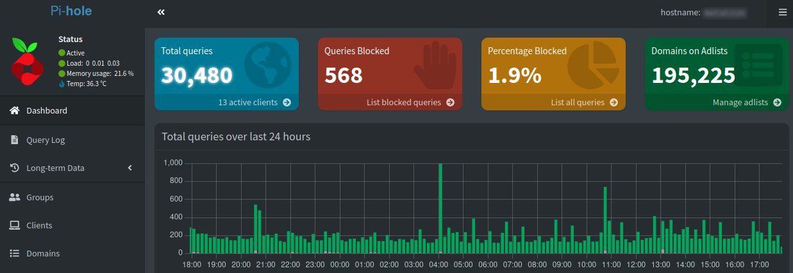{.align-center}

### Choisir un fournisseur racine de DNS

- Dans l'interface d'administration :

1. Cliquez sur le menu de gauche "Settings"
1. Puis sur l'onglet en haut "DNS"
1. Cochez les 2 cases "IPv4" pour un des fournisseurs DNS, nous vous conseillons "Quad9 (filtrered, DNSSEC)" mais vous pouvez évidemment en choisir un autre ou même ajouter à droite un DNS qui ne serait pas listé !
1. Laissez les autres paramètres par défaut
1. Cliquez sur "Save".

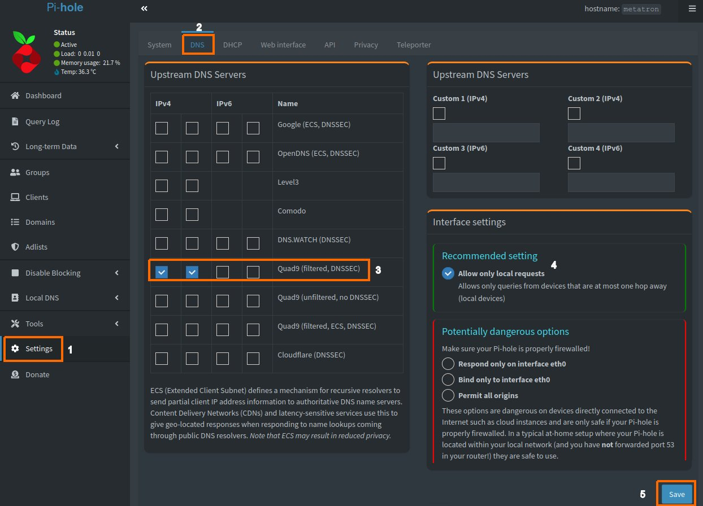{.align-center}

### Mise à jour des listes de blocage

Le blocage des publicités et des traceurs est basé sur des listes de noms de domaine : dans Pi-Hole, celles-ci sont stockées dans une base de données appelée `Gravity`.

- Pour les mettre à jour manuellement :

1. Cliquez sur "Tools"
1. Cliquez sur "Update Gravity"
1. Cliquez sur le bouton "Update" :

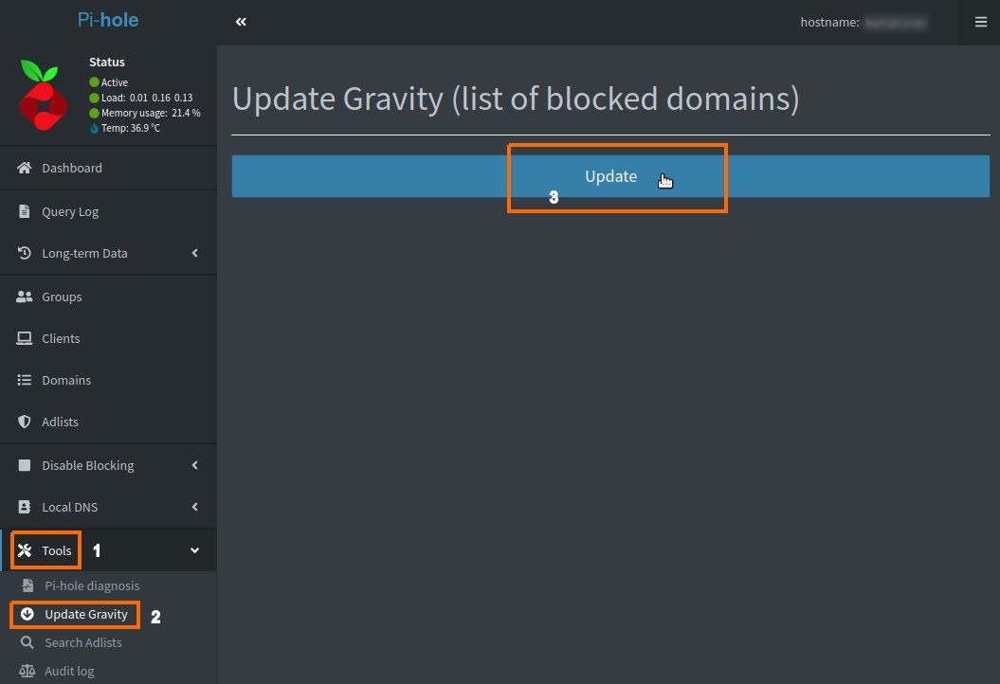{.align-center}

- La mise à jour est terminée lorsque le message vert "Success!" apparaît en haut de la page :

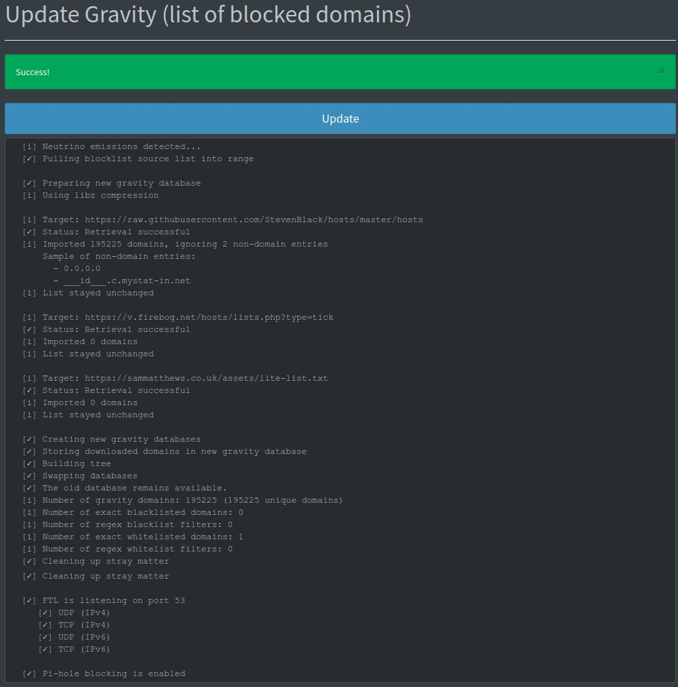{.align-center}

### Ajout de nouvelles listes de blocage

Voici pour commencer, deux très bonnes listes mises à jour régulièrement par [Sam Matthews](https://sammatthews.co.uk/), au choix :
- [x] Liste complète / full (plus agressive) : https://sammatthews.co.uk/assets/Full-on-ad-trackinglist.txt
- [x] Liste légère / lite (contenant moins de domaines) : https://sammatthews.co.uk/assets/lite-list.txt

> Il existe de nombreuses listes plus ou moins agressives en terme de blocage.
{.is-info}

- Pour ajouter vos listes :
1. Cliquez sur "Adlists" dans le menu de gauche
1. Ajoutez l'URL de la liste et éventuellement un commentaire pour vous y retrouver
1. Cliquez sur le bouton "Add" pour ajouter la liste
1. La nouvelle liste s'affiche maintenant en bas de l'écran dans "List of adlists" :

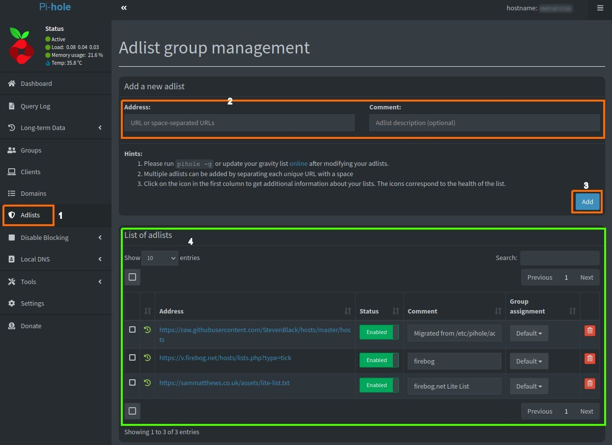{.align-center}

### Mise à jour de Pi-Hole

- Lorsqu'une mise à jour de Pi-Hole est disponible, vous verrez ce message en bas de l'interface d'administration :

> Il est recommandé de lire les notes de version (changelog) en cliquant sur le lien "update available" avant de procéder à la mise à jour.
{.is-warning}

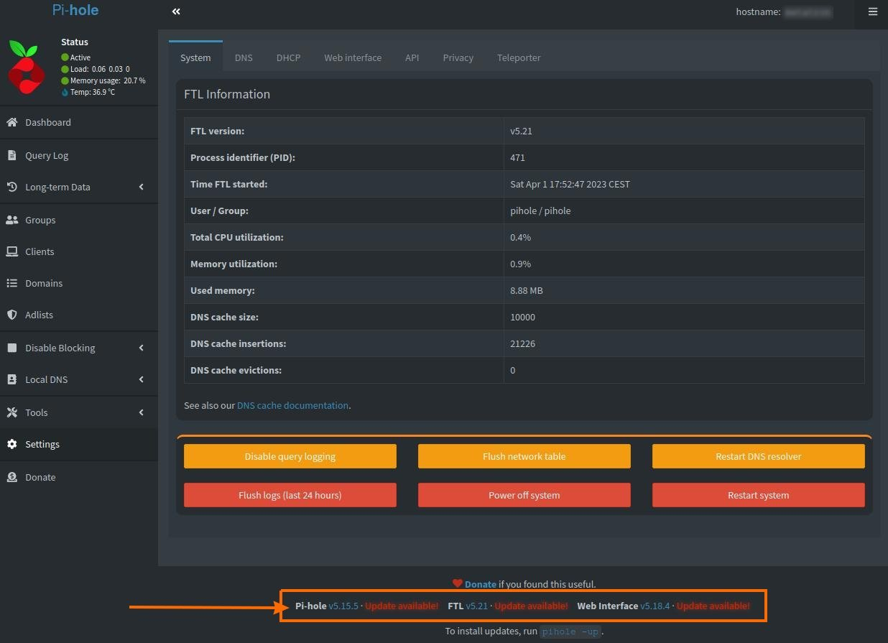{.align-center}

- Pour tout mettre à jour, connectez-vous en SSH sur votre serveur et lancez simplement cette commande :

```bash
pihole -up
```

- La sortie-écran suivante devrait s'afficher : attendez quelques minutes et assurez-vous qu'il n'y ait pas d'erreur. Lorsque c'est terminé, le message `[✓] Update complete!` s'affichera :
```brainfuck
  [✓] Update local cache of available packages
  [i] Existing PHP installation detected : PHP version 7.4.33
  [✓] Checking for git
  [✓] Checking for iproute2
  [✓] Checking for dialog
  [✓] Checking for ca-certificates

  [i] Checking for updates...
  [i] Pi-hole Core:	update available
  [i] Web Interface:	update available
  [i] FTL:		update available

  [i] Pi-hole core files out of date, updating local repo.
  [✓] Check for existing repository in /etc/.pihole
  [i] Update repo in /etc/.pihole...HEAD is now at d885e926 Hotfix Core v5.16.2 (#5235)
  [✓] Update repo in /etc/.pihole

  [i] If you had made any changes in '/etc/.pihole/', they have been stashed using 'git stash'

  [i] Pi-hole Web Admin files out of date, updating local repo.
  [✓] Check for existing repository in /var/www/html/admin
  [i] Update repo in /var/www/html/admin...HEAD is now at d7f18428 Release v5.19 (#2551)
  [✓] Update repo in /var/www/html/admin

  [i] If you had made any changes in '/var/www/html/admin/', they have been stashed using 'git stash'

  [i] FTL out of date, it will be updated by the installer.

  [✓] Root user check

        .;;,.
        .ccccc:,.
         :cccclll:.      ..,,
          :ccccclll.   ;ooodc
           'ccll:;ll .oooodc
             .;cll.;;looo:.
                 .. ','.
                .',,,,,,'.
              .',,,,,,,,,,.
            .',,,,,,,,,,,,....
          ....''',,,,,,,'.......
        .........  ....  .........
        ..........      ..........
        ..........      ..........
        .........  ....  .........
          ........,,,,,,,'......
            ....',,,,,,,,,,,,.
               .',,,,,,,,,'.
                .',,,,,,'.
                  ..'''.

  [i] SELinux not detected
  [✓] Update local cache of available packages
  [i] Existing PHP installation detected : PHP version 7.4.33

  [✓] Checking apt-get for upgraded packages... 1 updates available
  [i] It is recommended to update your OS after installing the Pi-hole!

  [i] Checking for / installing Required dependencies for OS Check...
  [✓] Checking for grep
  [✓] Checking for dnsutils

  [✓] Supported OS detected
  [i] Checking for / installing Required dependencies for this install script...
  [✓] Checking for git
  [✓] Checking for iproute2
  [✓] Checking for dialog
  [✓] Checking for ca-certificates

  [i] Performing unattended setup, no dialogs will be displayed
  [i] Performing reconfiguration, skipping download of local repos
  [✓] Resetting repository within /etc/.pihole...
  [✓] Resetting repository within /var/www/html/admin...
  [i] Checking for / installing Required dependencies for Pi-hole software...
  [✓] Checking for cron
  [✓] Checking for curl
  [✓] Checking for iputils-ping
  [✓] Checking for psmisc
  [✓] Checking for sudo
  [✓] Checking for unzip
  [✓] Checking for idn2
  [✓] Checking for libcap2-bin
  [✓] Checking for dns-root-data
  [✓] Checking for libcap2
  [✓] Checking for netcat-openbsd
  [✓] Checking for procps
  [✓] Checking for jq
  [✓] Checking for lighttpd
  [✓] Checking for php7.4-common
  [✓] Checking for php7.4-cgi
  [✓] Checking for php7.4-sqlite3
  [✓] Checking for php7.4-xml
  [✓] Checking for php7.4-intl
  [✓] Checking for php7.4-json

  [✓] Enabling lighttpd service to start on reboot...
  [✓] Checking for user 'pihole'

  [i] FTL Checks...

  [✓] Detected ARMv7 processor (with hard-float support)
  [i] Checking for existing FTL binary...
  [✓] Downloading and Installing FTL
  [✓] Installing scripts from /etc/.pihole

  [i] Installing configs from /etc/.pihole...
  [i] Existing dnsmasq.conf found... it is not a Pi-hole file, leaving alone!
  [✓] Installed /etc/dnsmasq.d/01-pihole.conf
  [✓] Installed /etc/dnsmasq.d/06-rfc6761.conf

  [✓] Installing sudoer file

  [✓] Installing latest Cron script

  [i] Installing latest logrotate script...
	[i] Existing logrotate file found. No changes made.
  [i] Backing up /etc/dnsmasq.conf to /etc/dnsmasq.conf.old
  [i] man not installed
  [i] Testing if systemd-resolved is enabled
  [i] Systemd-resolved is not enabled
  [✓] Restarting lighttpd service...
  [✓] Enabling lighttpd service to start on reboot...
  [i] Restarting services...
  [✓] Enabling pihole-FTL service to start on reboot...
  [✓] Restarting pihole-FTL service...
  [✓] Deleting existing list cache
  [i] Neutrino emissions detected...
  [✓] Pulling blocklist source list into range

  [✓] Preparing new gravity database
  [i] Using libz compression

  [i] Target: https://raw.githubusercontent.com/StevenBlack/hosts/master/hosts
  [✓] Status: Retrieval successful
  [i] Imported 195225 domains, ignoring 2 non-domain entries
      Sample of non-domain entries:
        - 0.0.0.0
        - ___id___.c.mystat-in.net

  [i] Target: https://v.firebog.net/hosts/lists.php?type=tick
  [✓] Status: Retrieval successful
  [i] Imported 0 domains

  [i] Target: https://sammatthews.co.uk/assets/lite-list.txt
  [✓] Status: Retrieval successful
  [i] Imported 0 domains

  [✓] Creating new gravity databases
  [✓] Storing downloaded domains in new gravity database
  [✓] Building tree
  [✓] Swapping databases
  [✓] The old database remains available.
  [i] Number of gravity domains: 195225 (195225 unique domains)
  [i] Number of exact blacklisted domains: 0
  [i] Number of regex blacklist filters: 0
  [i] Number of exact whitelisted domains: 1
  [i] Number of regex whitelist filters: 0
  [✓] Flushing DNS cache
  [✓] Cleaning up stray matter

  [✓] FTL is listening on port 53
     [✓] UDP (IPv4)
     [✓] TCP (IPv4)
     [✓] UDP (IPv6)
     [✓] TCP (IPv6)

  [✓] Pi-hole blocking is enabled

  [i] The install log is located at: /etc/pihole/install.log
  [✓] Update complete! 

  Current Pi-hole version is v5.16.2
  Current AdminLTE version is v5.19
  Current FTL version is v5.22
```

- Rafraîchissez la page d'administration, le message devrait avoir disparu :

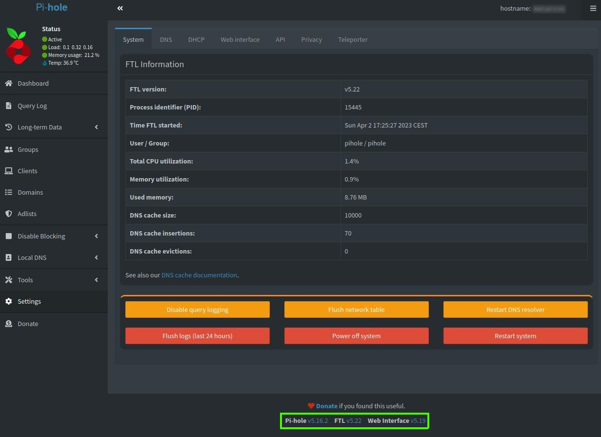{.align-center}

### Désactiver momentanément Pi-Hole

Il arrive que certains sites ne fonctionnent plus du tout :/

Si cela se produit et que vous n'avez pas le temps ou que vous souhaitez savoir si c'est réellement Pi-Hole qui crée ce genre de problème, il vous suffit de le désactiver soit temporairement (10 ou 30 secondes, voire 5 minutes) ou indéfiniment le temps de trouver le problème :

- Ça se passe dans le menu de gauche "Disable Blocking" :

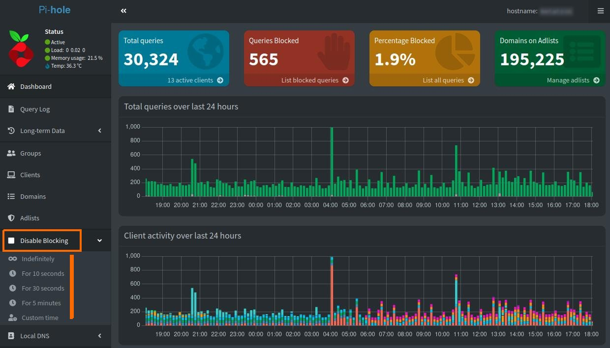{.align-center}


# Références

Le site officiel : https://pi-hole.net/
Le forum : https://discourse.pi-hole.net/
Le code source : https://github.com/pi-hole
Liste de blocage complète : https://sammatthews.co.uk/posts/Pi-Hole-Ad-Lists/

---
{.align-right} *Contributeur(s): Marmotte, Theudric, Ayo*