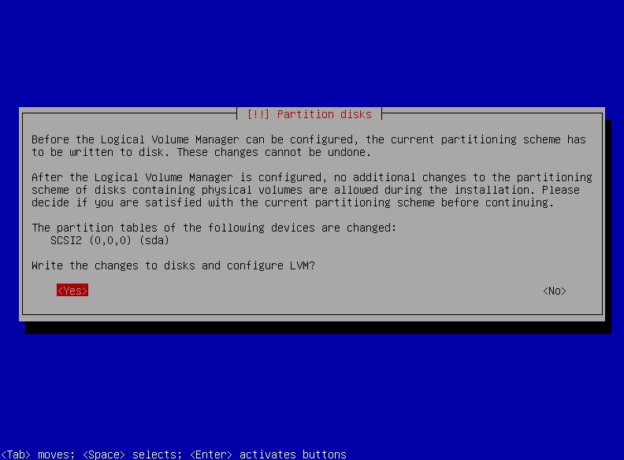
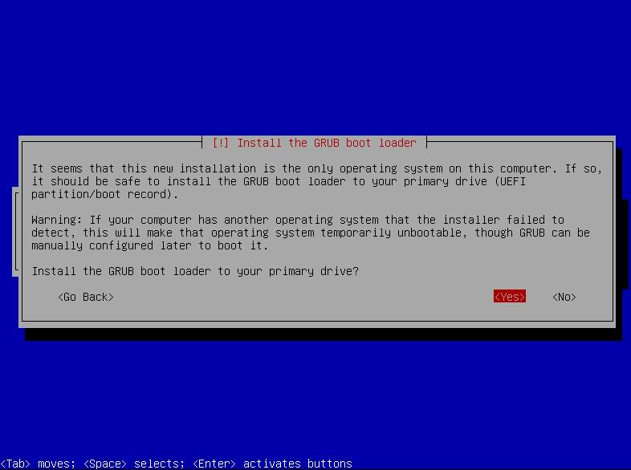

Dans ce tutoriel sur l'installation et la configuration d'un serveur GNU/Linux nous allons utiliser la distribution [Debian](https://www.debian.org/index.fr.html) avec un déploiement de type minimal.

> Fiche Debian sur : [DistroWatch](https://distrowatch.com/table.php?distribution=debian)
{.is-info}

> Parce que de nombreuses distro GNU/Linux se basent sur celle-ci, Debian est d’intérêt **crucial**.
> Si vous souhaitez supporter ce magnifique projet, vous pouvez leur [faire un don](https://www.debian.org/donations.fr.html) ou [les aider d'autres façons](https://www.debian.org/intro/help.fr.html).
{.is-warning}

{.align-center}

# A propos
## Version / Branche
Il existe plusieurs branches de Debian : Stable, Testing, Unstable.
> Dans ce tutoriel nous utiliserons la branche Stable.
> Bullseye (v11) est la version la plus récente à ce jour.
> **Sur serveur n'utilisez que la branche Stable** !
{.is-info}

## Debian
Debian **Stable** est une distribution particulièrement appréciée sur serveur pour :
- la stabilité du système :) dû à un cycle de développement long
- une faible empreinte en mémoire et en ressources matérielles
- une compatibilité avec le support de nombreux processeurs 32 et 64 bits (Intel/AMD/ARM mais aussi PowerPC, MIPS)
- la grande fiabilité et qualité des mises à jour de sécurité
- l'utilisation d'un [noyau Linux avec Support Long Term](https://kernel.org/category/releases.html)
- la facilité et fiabilité des mises à jour des logiciels
- la mise à niveau robuste d'une version stable à l'autre
- la pré-configuration des logiciels juste après leur installation
- une communauté constituée de nombreux contributeurs et utilisateurs à travers le monde

# Pré-requis
## Matériel
Debian est très léger, le système minimal fonctionne sans problème avec environ 128 Mo de mémoire RAM et 2 Go d'espace disque ! De plus de nombreux types de processeurs sont supportés pour les architectures 32 ou 64 bits : Intel, AMD, ARM, RISC...

Cependant, un minimum de 256 Mo de RAM et 5 Go d'espace disque est recommandé pour tenir la charge.

> Attention, évidemment **cette configuration dépendra avant tout des services que vous installerez sur votre serveur.** C'est pourquoi vous devriez plutôt vous référer aux pré-requis des fournisseurs des logiciels que vous y installerez !
{.is-warning}

## Source d'installation
Tout d'abord, il vous faut récupérer les sources d'installation, c'est un fichier de type `.iso`.

> :warning: Les manipulations suivantes sont à faire depuis votre ordinateur :warning:
{.is-info}

- Ouvrez la page web Debian sur [Official CD/DVD images stable](https://www.debian.org/CD/http-ftp/#stable)
- Cliquez sur le lien correspondant à l'architecture du processeur de votre serveur (en général amd64)
- en bas de la page, téléchargez le fichier `debian-11.6.0-<arch>-netinst.iso` et aussi le fichier `SHA256SUMS`

> Avec `<arch>`  correspondant à l'architecture de votre processeur (amd64 pour machines Intel/AMD 64 bits, arm64 pour processeurs arm 64bits, etc...).
> Dans ce tutoriel, nous prendrons la version **amd64**.
{.is-info}

> Attention pour le RaspberryPi, le processus est différent, on en parle dans l'article [Installer et configurer Pi-Hole](./pi-hole.md#)
{.is-warning}

> `SHA256SUMS` est juste un fichier texte qui contient la somme de vérification au format SHA256 associée au nom du fichier `.iso`.
> Elle va nous permettre de s'assurer que le téléchargement du fichier ISO s'est bien déroulé et n'est à priori pas corrompu.
> :arrow_right: Référez-vous à l'article [Intégrité et Signature](./chiffrement.md#) pour plus d'informations.
{.is-info}

- Ouvrir un terminal et se rendre dans le répertoire "Téléchargements" :
```bash
cd ~/Téléchargements
```
- Lancez la commande suivante :
```bash
sha256sum -c SHA256SUMS --ignore-missing
```
- Nous obtenons :
```brainfuck
debian-11.6.0-amd64-netinst.iso: Réussi
```

> Si vous voyez le nom de votre fichier `.iso` suivi de **Réussi**, vous pouvez passer au chapitre suivant :)
{.is-success}

> Si ce message s'affiche:
> `sha256sum: SHA256SUMS : aucun fichier n'a été vérifié`
> :warning: Cela veut dire que votre fichier `.iso` n'est pas dans le même dossier que le fichier `SHA256SUMS`
>
> Si par contre c'est ce message qui s'affiche :
`debian-11.6.0-amd64-netinst.iso: Échec`
`sha256sum: Attention : 1 somme de contrôle ne correspond pas`
> :x: Renouvelez le téléchargement car votre fichier `.iso` est corrompu !
{.is-warning}

## Création d'un média d'installation
Rendez-vous sur l'article dédié pour [rendre une clé USB bootable](./usb-bootable.md#) et ainsi créer le média d'installation de Debian.

# Préparation du serveur
> On part du principe que le Secure Boot a été désactivé dans votre BIOS. Si vous souhaitez tout de même installer avec Secure Boot activé, suivez les instructions sur le wiki [Debian SecureBoot](https://wiki.debian.org/fr/SecureBoot)
>
> **Avant l'installation**, si le  serveur contient déjà des données, **les sauvegarder sur un support externe** (clef ou disque dur USB, partage réseau...) car l'installation détruira toutes les données présentes sur le serveur !
{.is-warning}

## Branchement du réseau
Pour un serveur, il est préférable d'utiliser un câble Ethernet.
Le brancher entre votre Box et votre serveur avant l'installation.
> Lors de l'installation, Debian téléchargera et installera ainsi les paquets les plus récents.
{.is-info}

## Préparation du BIOS
Afin d'autoriser le démarrage sur clef USB et désactiver le SecureBoot, vous devrez tout d'abord accéder au BIOS de votre machine.

> N'hésitez pas à aller sur notre tutoriel [dédié](./bios-boot.md#).
{.is-success}

- Démarrez le serveur et accéder au BIOS via la touche idoine.
- Pour naviguer dans le BIOS, utiliser les touches fléchées du clavier et aller sur le menu "BOOT".
- Le but est de passer "USB ..." en priorité de boot n°1
- Dans le menu "Security", désactiver le SecureBoot en le passant à l'état "Disabled"

> Du fait de la grande diversité de BIOS, marques et modèles de carte mère, il est très difficile de vous guider sur cette étape. Demandez de l'aide si vous ne vous en sortez pas.
{.is-info}

> Une fois terminé, n'oubliez pas de sauvegarder la configuration du BIOS avant de redémarrer.
{.is-warning}


## Démarrage sur clef USB
- Branchez la clef USB que vous avez préparé précédemment sur un port USB du serveur.
- Redémarrez le serveur.
- L'écran suivant devrait apparaître, sélectionnez "Install" en utilisant les flèches clavier et <kbd>ENTRÉE</kbd>.

> Sur un serveur il est préférable de _ne pas utiliser l'option "Graphical Install"_.
> L'option "Install" fonctionnera à tous les coups et ne provoquera pas de problème d'affichage, c'est pourquoi nous l'utiliserons ici.
{.is-info}

{.align-center}

> Si cet écran n'apparaît pas, vérifiez votre clef USB et/ou la configuration du BIOS !
{.is-danger}


# Installation de Debian
> Les premiers écrans de l'installeur sont triviaux et concernent la langue, le nom du serveur et les comptes utilisateurs.
{.is-info}

- La première chose qui vous sera demandée est la langue à utiliser, nous choisirons "English"...

> ...Dans la suite de ce tutoriel pour serveur, on utilisera toujours l'anglais.
> Évidemment vous pouvez choisir Français mais cela est déconseillé sur serveur :
> La raison est simple, quelle que soit la langue, les commandes que vous entrerez sur votre serveur au quotidien seront toutes en anglais. Aussi si vous choisissez Anglais le retour des commandes sera en Anglais.
> Cela est préférable lorsque vous chercherez de l'aide sur Internet !
{.is-warning}

{.align-center}

> Voici comment naviguer entre les écrans de l'installeur :
> -- la touche <kbd>TAB</kbd> de votre clavier vous permettra de sélectionner la partie d'écran suivant
> -- la touche <kbd>ENTRÉE</kbd> valider la sélection pour passer à l'écran suivant
> -- la touche <kbd>ESPACE</kbd> permet de sélectionner un ou des éléments d'une liste à choix multiples
{.is-info}

- Il vous faut maintenant choisir dans quel pays est situé sur votre serveur (cela sera utile pour régler l'heure et choisir le dépôt le plus proche).
- Cliquez sur "Other" :

{.align-center}

- Sélectionnez votre continent, par exemple "Europe" :

{.align-center}

- Sélectionnez votre pays, par exemple "France" :

{.align-center}

- Nous n'avons généralement pas besoin de "locale" supplémentaire sur notre serveur, sélectionnez "United States - en_US.UTF-8" :

{.align-center}

- Sélectionnez votre type de clavier, ici "Français" (French) :

{.align-center}

- Le chargement se poursuit, patientez...

{.align-center}

- Entrez le nom d'hôte de votre serveur (hostname) puis à l'aide de la touche <kbd>TAB</kbd> (tabulation), naviguez sur "Continue" :
> Petit conseil, n'utilisez pas de nom _explicite_ qui pourrait, sur le réseau, désigner les services hébergés ou le système d'exploitation installé ou toute autre information qui pourrait compromettre la sécurité de votre serveur, y compris votre identité ;)
> Ici par exemple le nom du serveur correspond à une couleur ("black") mais cela pourrait très bien être un monument, une célébrité, une planète... soyez créatif !
{.is-success}

{.align-center}

- Seulement si votre serveur doit être accessible publiquement sur Internet et que vous avez un nom de domaine, entrez-le ici, par exemple : `wikilibriste.fr` :)
- Sinon laissez ce champ vide. Vous pouvez aussi y mettre `local` sur un réseau local.

{.align-center}

- Les 2 écrans suivants vous demanderont de choisir un mot de passe pour le compte `root`

> Il est fortement recommandé :
> -- de ne pas oublier ce mot de passe
> -- de le stocker dans un gestionnaire de mots de passe
> -- de choisir un mot de passe fort
> **:arrow_right: Consultez l'article lié aux [mots de passe](./gestionnaire-mots-passe.md#) pour plus d'informations.**
{.is-warning}

> Notez que si vous laissez le mot de passe `root` vide, ce compte sera désactivé. De plus, le compte utilisateur (crée juste après) sera membre du groupe `sudoers` automatiquement.
{.is-info}

{.align-center}

- Confirmez le mot de passe pour le compte root :

{.align-center}

> Debian impose maintenant la création d'un compte utilisateur. Celui-ci sera utilisé pour les tâches courantes.
{.is-info}

- Entrez le nom que vous souhaitez voir afficher pour cet utilisateur :

{.align-center}

- Entrez maintenant l'identifiant de cet utilisateur en minuscule et sans espace :

{.align-center}

> Vous ne pourrez pas modifier l'identifiant plus tard, il est figé. Un répertoire portant son nom sera d'ailleurs crée sous le dossier `/home/`
> Choisissez un identifiant qui ne vous identifie pas explicitement sur le système, par exemple, utilisez plutôt un pseudo.
{.is-warning}

- Les 2 écrans suivants vous demanderont de choisir un mot de passe pour votre compte utilisateur

> Il est fortement recommandé :
> -- de le stocker dans un gestionnaire de mots de passe
> -- de choisir un mot de passe fort
> -- de choisir un mot de passe différent de celui du compte `root`
> **:arrow_right: Consultez l'article lié aux [mots de passe](./gestionnaire-mots-passe.md#.md#) pour plus d'informations.**
{.is-warning}

{.align-center}

- Confirmez le mot de passe de votre compte utilisateur :

{.align-center}

- Vous allez maintenant devoir partitionner le disque de votre machine.

> Le partitionnement est un sujet complexe et controversé, particulièrement sur serveur.
> La raison est qu'il n'existe pas de meilleure façon de le réaliser car il dépendra du type de machine (PC ou serveur) et des services hébergés !
> Le [Wiki de Arch Linux](https://wiki.archlinux.org/title/partitioning) explique très bien les différents cas d'usage.
{.is-warning}

> Dans notre exemple nous partirons sur un partitionnement de type "LVM guidé".
> C'est l'installeur guidé Debian qui réalisera tout pour vous et va nous créer automatiquement dans notre cas 3 partitions :
>  **/boot** : Qui contient tous les fichiers nécessaires à l'amorçage (noyau Linux, ...)
>  **SWAP**: Le "fichier" d'échange
>  **/** : Ce point de montage sera la racine du système de fichiers, et contiendra tout le reste
{.is-success}

- Nous allons choisir "Guided - use entire disk and set up LVM"

{.align-center}

> LVM (Logical Volume Manager) vous permettra facilement le repartitionnement si à l'avenir cela s'avère nécessaire.
{.is-info}

- Sélectionnez le disque principal, généralement "**sda**":

{.align-center}

- Choisissez "All files in one partition (recommanded for new users)" :

{.align-center}

- Placez-vous sur "Yes" à l'aide de la touche <kbd>TAB</kbd> et validez avec la touche <kbd>ENTRÉE</kbd> :

> Attention, une fois cet écran validé, la table des partitions sera détruite et une nouvelle sera crée ! Toutes les données seront effacées par la suite.
{.is-warning}

{.align-center}

- Laissez la valeur par défaut et choisir "Continue" :

{.align-center}

- Choisir "Yes" pour appliquer les changements :

{.align-center}

- Les partitions sont créées et l'installation du système débute :

{.align-center}

- Choisissez "No" pour ne pas analyser d'autre média :

{.align-center}

> Debian utilise `apt` pour installer et mettre à jour les paquets logiciels.
{.is-info}

- Vous devez maintenant choisir le "miroir" le plus proche géographiquement, nous choisirons "France" :

{.align-center}

> Pour stocker et distribuer les paquets logiciels, les distributions GNU/Linux utilisent des dépôts dupliqués et répliqués sur les serveurs de contributeurs à travers le monde, que l'on appelle "miroir".
{.is-info}

- Vous pouvez sélectionner un miroir proche de chez vous ou opter pour celui par défaut :

{.align-center}

- Dans la plupart des cas on laisse ce champ vide (si toutefois vous avez un "proxy", renseignez les informations pour y accéder) :

{.align-center}

- `apt` va maintenant installer et mettre à jour le système :

{.align-center}

- Vous devez maintenant choisir de participer ou non aux [statistiques d'utilisation des paquets Debian](https://popcon.debian.org/). Choisissez "No" si vous ne souhaitez pas participer aux statistiques :

{.align-center}

- Dans le cadre d'une installation minimale, désélectionnez toutes les options avec la barre <kbd>ESPACE</kbd> **à l'exception de "SSH Server"** :

{.align-center}

- Choisissez "Yes" pour installer le chargeur d'amorçage "GRUB" :

{.align-center}

- Sélectionnez votre disque principal (généralement "sda") pour y placer GRUB :

{.align-center}

- L'installation est en cours de finalisation...

{.align-center}

> L'installation est terminée, **vous devez maintenant éjecter votre média d'installation**.
{.is-success}

- Choisissez "Continue" pour redémarrer votre serveur.

{.align-center}

- Votre serveur redémarre, si tout s'est bien passé vous verrez brièvement pendant quelques secondes l'écran de sélection du noyau (kernel).

{.align-center}

> Debian va démarrer automatiquement au bout de quelques secondes.
{.is-info}

# Configuration
> Si vous ne connaissez pas la ligne de commande, **nous vous conseillons fortement de lire l'article [Utilisation du Terminal](./terminal.md#) avant de continuer** !
{.is-warning}

## Première connexion console
- Sur l'écran de connexion, saisissez `root` :
> root
- Entrez votre mot de passe `root`
> Notez que même si vous saisissez le mot de passe rien ne s'affichera à l'écran.
> Ceci est un comportement normal, les caractères saisis ne sont pas affichés pour des raisons de sécurité !
{.is-info}

{.align-center}

> Vous êtes maintenant connectés sur votre serveur fraîchement installé. **Bravo !**
{.is-success}

## Configuration du réseau
### Récupération de l'adresse IP
> Pour la suite vous aurez besoin de connaître l'adresse IP de votre serveur.
> Celle-ci a été attribué automatiquement par votre serveur DHCP et généralement c'est votre Box qui s'en occupe.
{.is-info}

Pour afficher l'adresse IP entrez :
```bash
ip addr
```
La sortie écran devrait afficher :
```brainfuck
1: lo: <LOOPBACK,UP,LOWER_UP> mtu 65536 qdisc noqueue state UNKNOWN group default qlen 1000
    link/loopback 00:00:00:00:00:00 brd 00:00:00:00:00:00
    inet 127.0.0.1/8 scope host lo
       valid_lft forever preferred_lft forever
    inet6 ::1/128 scope host 
       valid_lft forever preferred_lft forever
       
2: eth0: <BROADCAST,MULTICAST,UP,LOWER_UP> mtu 1500 qdisc pfifo_fast state UP group default qlen 1000
    link/ether b8:27:eb:a1:b7:65 brd ff:ff:ff:ff:ff:ff
    inet 192.168.1.134/24 brd 192.168.1.255 scope global noprefixroute eth0
       valid_lft forever preferred_lft forever
    inet6 fe80::ba27:ebff:febd:f755/64 scope link 
       valid_lft forever preferred_lft forever
```
> Le premier bloc ``lo`` est la [boucle local loopback](https://fr.wikipedia.org/wiki/Loopback) et est toujours ``127.0.0.1``, ignorez-la, elle ne nous sera pas utile.
{.is-info}

Ce qui nous intéresse c'est l'adresse IP, juste après `inet`, dans notre cas `192.168.1.134`.

Localisez le nom de l'interface réseau : `eth0` (dans cette exemple). C'est la carte réseau Ethernet.
Notez surtout l'[adresse MAC](./glossaire.md##mac) correspondante, ici `b8:27:eb:a1:b7:65`, **c'est elle qui va nous être utile tout de suite** :)
> Vous pouvez aussi retrouver la carte sous le nom `enp0s3`, `enp0s25`, ... tout dépend de votre matériel (`wlo1` correspond à une carte réseau sans fil / wifi).
{.is-info}

### Réservation de l'adresse IP
**Sur serveur, il est fortement recommandé d'attribuer une _adresse IP fixe_ pour qu'elle ne change jamais.**
Cela est indispensable car les PC clients se connecteront dessus et si l'IP change, alors il faudra reconfigurer chaque PC à chaque changement !

Nous allons donc devoir fixer l'adresse IP de notre serveur :)
Pour cela il existe deux méthodes :
1. Modifier le fichier de configuration de votre carte réseau. Ce fichier est situé dans le dossier **/etc/network/interfaces/**
> Cette méthode a 2 inconvénients :
> -- Le premier c'est que si la topologie de votre réseau change, alors cette configuration sera à revoir.
> -- Le second c'est que cela nécessite de savoir ce qu'est une IP, un masque, une passerelle, ...

2. L'alternative est de réserver une adresse IP sur votre serveur DHCP.
> Cette méthode est simple et ne nécessite pas de connaissance particulière.
> **C'est ce que nous allons faire dans ce tuto !**

En général, c'est votre box qui fait office de serveur DHCP, donc nous allons nous connecter à la box pour modifier la configuration.
**Depuis votre PC**, rendez-vous sur la page suivante :
- Pour FreeBox: http://mafreebox.freebox.fr
- Pour OrangeBox (type LiveBox) : http://192.168.1.1
- Pour SFRBox : http://192.168.1.1
- Pour BouyguesBox : http://192.168.1.1

Une fois sur la page d'accueil de votre Box :
- Entrez votre mot de passe et rendez vous dans configuration puis réseau.
- Dans la partie DHCP, vous devriez trouver "Baux DHCP" ou "Réservation DHCP". C'est ici que nous rentrerons l'adresse IP à réserver, ici `192.168.1.101` et l'adresse MAC de notre serveur : `b8:27:eb:a1:b7:65` (celle que vous avez identifié précédemment).
> `192.168.1.101` et `b8:27:eb:a1:b7:65` ne sont que des exemples, à vous choisir une adresse IP et entrez l'adresse MAC de votre serveur (voir chapitre précédent) !
{.is-warning}

- Enfin, sauvegardez la configuration.

{.align-center}

- Maintenant, **depuis votre serveur**, entrez les commandes suivantes pour récupérer votre nouvelle adresse IP :
```bash
dhclient -r
dhclient
```
> `dhclient` est le logiciel client DHCP, `-r` permet de "relâcher" une IP (release) enfin `dhclient` sans paramètre va renouveller l'IP (renew).
{.is-info}

- Depuis votre PC, vous pouvez vérifier que le serveur est joignable sur cette nouvelle IP avec la commande :
```bash
ping 192.168.1.101
```
Vous devriez voir à l'écran ce genre de résultat :
```brainfuck
PING 192.168.1.101 (192.168.1.101) 56(84) bytes of data.
64 bytes from 192.168.1.101: icmp_seq=1 ttl=64 time=1 ms
```

> Pour terminer la commande ``ping`` appuyez simultanément sur les touches <kbd>CTRL</kbd> et <kbd>C</kbd>
{.is-info}


> Votre serveur est désormais accessible par l'adresse IP `192.168.1.101`
{.is-success}

## Première connexion SSH (Secure Shell)
[SSH](./glossaire.md##ssh) est un outil indispensable lorsqu'il s'agit d'administrer un serveur.
Il vous permettra de vous y connecter de façon sécurisée depuis une autre machine.

> Nous partirons du principe que le service SSHd (deamon secure shell) a été installé et activé sur le serveur.
> Si ce n'est pas le cas, pas de panique ! Depuis votre serveur, lancez cette commande : `apt install -y openssh-server`
{.is-info}

> Les commandes qui suivent seront à exécuter depuis votre PC connecté via SSH sur le serveur.
> Pour apprendre à utiliser SSH, suivez le tuto [SSH utilisation](/tutoriels/ssh) :x: **(à venir)**
{.is-info}

- **Depuis votre PC**, connectez-vous sur le serveur, pour cela, ouvrez un terminal (<kbd>CTRL</kbd> + <kbd>ALT</kbd> + <kbd>T</kbd>) et lancez :
```bash
ssh root@192.168.1.101
```

> `192.168.1.101` est à remplacer par l'adresse IP de votre serveur.
{.is-info}

- Le message suivant s'affichera, mais seulement lors de votre première connexion :
```brainfuck
The authenticity of host '192.168.1.101 (192.168.1.101)' can't be established.
ED25519 key fingerprint is SHA256:m65eoXR7/NGxhE169ey8YjE3pwYAR3O4vs0bc3Keyh5.
This key is not known by any other names
Are you sure you want to continue connecting (**yes**/no/[fingerprint])?
```

- saisissez `yes` :
> **yes**

- Le message suivant va apparaître :
```brainfuck
Warning: Permanently added '192.168.1.101' (ED25519) to the list of known hosts.
```

> Cela aura pour effet de valider l'authenticité de votre connexion en modifiant le fichier suivant sur votre PC : `~/.ssh/known_hosts`
{.is-info}

- Vous devrez entrer le mot de passe du compte `root` et la connexion sera ensuite établie.
- Ce message correspond au message par défaut (la bannière) que votre serveur affichera lors de chaque connexion :
```brainfuck
Linux black 5.10.0.21-amd64 #1 SMP Debian 5.10.162-1 (2023-01-21) x86_64

The programs included with the Debian GNU/Linux system are free software; the exact distribution terms for each program are described in the individual files in /usr/share/doc/*/copyright.

Debian GNU/Linux comes with ABSOLUTELY NO WARRANTY, to the extent permitted by applicable law.
Last login: Sun Feb 19 21:08:19 2023
```

## Logiciels recommandés
Nous avons effectué une installation minimale, c'est à dire que seuls les logiciels de base sont installés. Certains logiciels pratiques sont donc manquants.

Sur serveur, nous conseillons les applications suivantes :
- `bash-completion` : Auto complète les commandes shell, avec la touche <kbd>TAB</kbd>
- `locate` : index et recherche rapide d'un fichier sur le système
- `wget` : pour télécharger un fichier
- `nano` : un éditeur de texte plus simple que le très célèbre `vi`
- `htop` : une moniteur de performance plus évolué que `top`

> Sur Debian c'est le logiciel `apt` qui s'occupe de la gestion des paquets logiciels.
{.is-info}

Lancez la commande suivante pour installer tout d'un coup :
```bash
apt install -y bash-completion locate wget nano htop
```
> Notez que pour le moment nous sommes connectés avec le compte `root` donc pas besoin de sudo devant la commande `apt`
> Il est possible que certains de ces logiciels soient déjà installés.
> `-y` permet de ne pas demander de confirmation.
{.is-info}

Pour que `locate` fonctionne, il faut lancer une première indexation :
```bash
updatedb
```
Maintenant vous pouvez chercher l'emplacement de n'importe quel fichier ;)
Par exemple, cherchons le fichier de version de debian :
```bash
locate debian_version
```
On découvre qu'il est situé dans le dossier `/etc/` :
```brainfuck
/etc/debian_version
```

> Pour que l'auto-complétion du shell bash fonctionne, notez qu'il vous faut vous déconnecter puis reconnecter de votre session.
{.is-info}

## Ajoutons de la couleur et des raccourcis
Vous l'aurez sûrement remarqué, le shell est un peu austère !

Par exemple la commande `ls -l` pour "lister" le contenu de votre disque dur, n'affiche que du texte blanc sur fond noir :

{.align-center}

> Tâchons d'arranger cela :D :
> -- nous allons coloriser le prompt et la sortie écran de la commande `ls`
> -- nous allons ajouter des alias, pour éviter de taper `ls -l` ou `ls -la`, on tapera respectivement `ll` ou `l`. Aussi nous activerons la confirmation avant suppression/déplacement/copie
{.is-info}

- Éditer le fichier .bashrc :
```bash
nano /root/.bashrc
```

- Décommentez les lignes suivantes :
```brainfuck
export LS_OPTIONS='--color=auto'
eval "`dircolors`"
alias ls='ls $LS_OPTIONS'
alias ll='ls $LS_OPTIONS -l'
alias l='ls $LS_OPTIONS -lA'
alias rm='rm -i'
alias cp='cp -i'
alias mv='mv -i'
```

> Dans les fichiers de configuration sous Linux :
> -- En début de ligne, le symbole dièse `#` permet de commenter la ligne complète.
> -- Pour décommenter, retirez le symbole dièse `#` du début de la ligne.
{.is-info}

Ajoutez la ligne suivante, elle va coloriser le "prompt" :
```brainfuck
PS1='\[\e[01;31m\]\u\[\e[m\]@\[\e[01;33m\]\h\[\e[m\]: \[\e[01;33m\]\w\[\e[m\]\$ '
```

Maintenant nous allons sortir de l'éditeur tout en sauvegardant les modifications.
- Appuyez simultanément sur les touches <kbd>CTRL</kbd> et <kbd>X</kbd>
- Il va vous demander de confirmer, appuyez sur la touche <kbd>Y</kbd>

{.align-center}

- Il va vous demander d'entrer le nom du fichier, on garde le même nom donc on fait juste <kbd>ENTRÉE</kbd>

{.align-center}

- Enfin, lancez cette commande pour recharger le shell bash et activer les modifications :
```bash
exec bash
```
- Admirez le résultat :

{.align-center}

> - Le prompt est colorisé, c'est la variable PS1 qui fait cela: <p style="color:red;">root</p>@<p style="color:orange;">black: /</p>#
> Vous retrouverez sur cette page tous les [codes couleur](https://linuxhint.com/bash-ps1-customization/) pour faire votre propre prompt.
> - Lorsque vous taperez `ll` en fait un `ls -l` sera exécuté pour afficher une liste détaillée.
> - Lorsque vous taperez `l` en fait un `ls -lA` sera exécuté et affichera aussi les fichiers cachés.
> - La sortie écran de `ls` est maintenant colorisée :
>   - en bleu les <p style="color:blue;">dossiers</p>
>   - en cyan les <p style="color:cyan;">liens symboliques</p>
>   - en vert les <p style="color:green;">exécutables ou dossiers avec droit RWX</p>
>   - en rouge les <p style="color:red;">archives</p>
>   - en blanc le reste
{.is-info}

  
> Enfin, les commandes `rm`, `mv` et `cp` demanderons maintenant une confirmation avant la suppression, déplacement ou copie.
> vous pouvez à tout moment commenter ces alias en ajoutant un dièse `#` en début de ligne, mais nous recommandons de les laissez pour les débutants.
{.is-warning}

> Notez que cette configuration a été effectuée seulement pour le compte `root`.
> Si vous souhaitez aussi la faire pour votre compte utilisateur, il faudra la répeter en étant connecté sous ce compte.
{.is-info}


## Mise à jour
La première chose à faire est de mettre à jour votre système.
Sur Debian c'est le logiciel `apt` qui s'occupe aussi de la mise à jour des paquets logiciels.

Lorsque vous voulez mettre à jour ou installer un logiciel il est recommandé de mettre à jour la liste des paquets avec la commande :
```bash
apt update
```
La sortie écran suivante va s'afficher :
```brainfuck
Hit:1 http://deb.debian.org/debian bullseye InRelease
Get:2 http://security.debian.org/debian-security bullseye-security InRelease [48.4 kB]
Get:3 http://deb.debian.org/debian bullseye-updates InRelease [44.1 kB]
...
...
Fetched 655 kB in 1s (1,051 kB/s)
Reading package lists... Done
Building dependency tree... Done
Reading state information... Done
3 packages can be upgraded. Run 'apt list --upgradable' to see them.
```
A partir de maintenant on peut mettre à jour les paquets logiciels :
```bash
apt upgrade
```
- `apt` va vous afficher les paquets qui nécessitent une mise à jour, la taille des données à télécharger et à installer :
```brainfuck
Reading package lists... Done
Building dependency tree... Done
Reading state information... Done
The following packages will be upgraded:
  libgnutls30 libssl1.1 openssl
3 upgraded, 0 newly instzlled, 0 to remove, and 0 not upgraded.
Need to get 3,753 kB of archives.
After this operation, 4,096 B of additional disk space will be used.
```
Il va surtout vous demander une confirmation, appuyez sur <kbd>Y</kbd> puis <kbd>ENTRÉE</kbd>.
```brainfuck
Do you want to continue? [Y/n]
```
> Notez que sous Debian (et Linux en général) lors de saisie de choix (Yes ou No), la valeur en majuscule (ici "Y") est la valeur par défaut. Vous pouvez donc juste appuyer sur la touche <kbd>ENTRÉE</kbd> pour valider.
{.is-info}

## Mise à jour automatique
Soyons honnête, combien d'entre vous se connecterons régulièrement sur leur serveur pour réaliser les mises à jour ?

> L'une des principales mesure de sécurité est **d'installer régulièrement** les mises à jour de sécurité.
{.is-warning}


On vous conseille vivement d'installer l'outil `unattended-upgrades`, il fera automatiquement les mises à jour pour vous :
```bash
apt install -y unattended-upgrades
```

Une fois l'installation terminée, nous allons éditer le fichier suivant :
```bash
nano /etc/apt/apt.conf.d/50unattended-upgrades
```

Décommentez les lignes suivantes, sauvez et quittez :
```brainfuck
Unattended-Upgrade::Mail "root";
Unattended-Upgrade::MailOnlyOnError "true";
Unattended-Upgrade::Remove-Unused-Dependencies "true";
Unattended-Upgrade::Automatic-Reboot "true";
Unattended-Upgrade::Automatic-Reboot-Time "05:00";
Acquire::http::Dl-Limit "500";
```
Dans l'ordre, ces lignes vont :
- envoyer un email à root (il vous faudra configurer une passerelle relai SMTP pour que cela fonctionne)
- email seulement si erreur
- on retire les dépendances non utilisées
- on redémarre automatiquement sans avertissement
- à 5 heures du matin
- on limite la bande passante à 500 kbps

Pour l'activation il va falloir créer ce fichier :
```bash
touch /etc/apt/apt.conf.d/20auto-upgrades
```

Puis l'éditer :
```bash
nano /etc/apt/apt.conf.d/20auto-upgrades
```
Ajoutez les lignes suivantes, sauvez et quittez :
```brainfuck
APT::Periodic::Update-Package-Lists "1";
APT::Periodic::Download-Upgradeable-Packages "1";
APT::Periodic::Unattended-Upgrade "1";
APT::Periodic::AutocleanInterval "7";
```
- Cela va mettre à jour quotidiennement et nettoyer toutes les semaines, très pratique :).

> Maintenant tous les jours, les mises à jour de sécurité seront installées automatiquement avec redémarrage à 5 heures du matin si besoin (pour les mises à jour du noyau).
{.is-success}

> Seules les mises à jour de sécurité seront effectuées automatiquement !
> Pour le reste, à vous de le faire de temps en temps :
> -- mettre à jour les logiciels : `apt upgrade`
> -- nettoyer les anciens paquets ou dépéndences devenues inutiles : `apt autoremove`
> -- nettoyer les anciens noyaux : `dpkg -l 'linux-*' | sed '/^ii/!d;/'"$(uname -r | sed "s/\(.*\)-\([^0-9]\+\)/\1/")"'/d;s/^[^ ]* [^ ]* \([^ ]*\).*/\1/;/[0-9]/!d' | xargs sudo apt-get purge`
> -- faire la mise à niveau de version de Debian. Voir le [Debian Lifecycle](https://endoflife.date/debian) et la page [Debian LTS](https://wiki.debian.org/LTS) pour plus d'information.
{.is-warning}


## Installation de sudo

> Si vous n'aviez pas mis de mot de passe sur le compte `root`, alors vous pouvez ignorer ce chapitre car l'installateur aura déja désactivé le compte `root`, installé `sudo` et configuré votre compte utilisateur pour obtenir des privilèges administrateur lorsque vous le demanderez.
{.is-info}


> Après ce chapitre, **nous allons arrêter d'utiliser le compte `root`.**
> A la place nous allons utiliser notre compte utilisateur, vous vous souvenez ? 
> Celui que l'on a créé lors de l'installation...
{.is-warning}


Dans notre exemple le compte sera `john`, bien-sûr vous devrez adapter au nom que vous auvez choisi lors de l'installation.

- Installons l'outil `sudo` :
```bash
apt install -y sudo
```
> `sudo` (super user do) veut dire : "faire en tant que super-utilisateur" ou en tant qu'administrateur.
> On l'utilisera au début de chaque commande nécessitant des droits superutilisateur.
{.is-info}

- Rajoutez votre compte utilisateur dans le groupe "sudoers" :
```bash
sudo usermod -aG sudo john
```
> Cette commande va ajouter votre compte dans le fichier de configuration `/etc/sudoers`
{.is-info}

- Vous pouvez fermer la session `root`, nous n'en avons plus besoin et nous utiliserons à partir de maintenant notre compte utilisateur :
```bash
exit
```

- Connectez-vous avec votre compte utilisateur, ici `john` et entrez votre mot de passe :

{.align-center}

## SSHd (Service OpenSSH)
> Il est important de sécuriser un minimum notre serveur SSH, pour cela nous allons :
> -- interdire la connexion par mot de passe via SSH, vous devrez utiliser une paire de clef publique/privée.
> -- interdire la redirection X11, elle n'est en général pas utile.
> -- interdire la connexion avec le compte `root` à travers SSH, vous vous connecterez avec votre compte utilisateur
{.is-info}

>  Notez que vous pourrez toujours basculer sur l'utilisateur `root` en SSH mais seulement après vous être connecté avec votre compte utilisateur et avoir tapé `sudo su -`.
>  Vous pourrez toujours vous connecter avec `root` directement en local sur la console (sans SSH).
{.is-success}

- Depuis votre PC, connectez-vous sur le serveur avec votre compte utilisateur en SSH :
```bash
ssh john@192.168.1.101
```
> La suite se fera avec votre compte utilisateur, ici `john` et en utilisant `sudo` pour élever vos droits.
{.is-info}

- Depuis le serveur, éditez le fichier de configuration du "deamon" SSH nommé "sshd" (oui, sous Linux, BSD, ... un service est appelé un deamon = :smiling_imp:, nous avons de l'humour !) :
```bash
sudo nano /etc/ssh/sshd_config
```

- Dans le fichier de configuration, ajustez les lignes suivantes :
```brainfuck
PermitRootLogin no
PasswordAuthentication no
X11Forwarding no
```
- Sauvez et quittez avec les touches <kbd>CTRL</kbd> et <kbd>X</kbd> puis appuyez sur <kbd>ENTRÉE</kbd> pour valider.

> Pour le moment cette configuration n'est pas encore prise en compte car nous n'avons pas rechargé le service SSHd.
{.is-info}

- Depuis votre PC, vous allez maintenant créer une paire de clef de sécurité (cf. article [chiffrement](./chiffrement.md##robustesse-force)), au format RSA ; pour cela tapez :
```bash
ssh-keygen -f ~/.ssh/black -t rsa -b 4096
```

- Vous avez le choix d'ajouter un mot de passe pour ces clefs ou pas (dans ce dernier cas juste faire <kbd>ENTRÉE</kbd>) :
```brainfuck
Generating public/private rsa key pair.
Enter passphrase (empty for no passphrase): 
Enter same passphrase again: 
```

- L'écran suivant devrait apparaître, la clef est créée dans un dossier caché `.ssh` de votre répertoire utilisateur :

> Sous Linux, un fichier ou un dossier qui commence par un point (**`.`**) est caché.
{.is-info}

```brainfuck
Your identification has been saved in /home/votre-pseudo-pc/.ssh/black
Your public key has been saved in /home/votre-pseudo-pc/.ssh/black.pub
The key fingerprint is:
SHA256:Nrxaso0qRM4rJnQpxNyZb8t+B0Hq0n/AKoGJWoGmk john@pc
The key's randomart image is:
+---[RSA 4096]----+
|=+o+o            |
|=*=o.+           |
|B=*.X            |
|OE & o   .       |
|Oo* +   S .      |
|+  + o o =       |
|    . . o .      |
|         o       |
|                 |
+----[SHA256]-----+
```

> `ssh-keygen` est le programme qui permet de créer une paire de clefs SSH
> `-f` est le paramètre qui permet de spécifier le fichier de sortie, ici la clef sera stockée dans votre dossier utilisateur dans un sous dossier .ssh
> `-t` permet de choisir l'algorithme, ici RSA
> `-b` sa taille, ici 4096 octets
> 
> **Notez que 2 fichiers ont été créés :
> -- un fichier `black` (c'est la clef privée à ne jamais communiquer et à ne pas perdre !)
> -- un fichier `black.pub` (c'est la clef publique) à copier sur le serveur dans le fichier `~/.ssh/autorized_keys` de votre utilisateur.**
>
> **Pour les concepts de cryptographie asymétrique, se référer à l'[article dédié](./chiffrement.md#.md#)**.
{.is-info}

> **Ne _jamais_ communiquer la clef privée.**
> La stocker ainsi que sa passphrase associée (si applicable) dans un coffre-fort chiffré comme par exemple KeePassXC !
> **:arrow_right: Consultez l'article lié aux [mots de passe](./gestionnaire-mots-passe.md#.md#.md#) pour plus d'informations.**
{.is-warning}

- Il vous faut maintenant, **depuis votre PC**, copier la partie publique `black.pub` de cette paire de clef sur le serveur (le mot de passe de votre compte utilisateur vous sera demandé) :
```
ssh-copy-id -i ~/.ssh/black.pub john@192.168.1.101
```
> `ssh-copy-id` est le programme qui permet de transférer la clef publique SSH de votre PC au serveur
> `-i` est le paramètre qui permet de spécifier le fichier d'entrée, ici votre **clef publique**
> `john` est votre compte utilisateur sur votre serveur
> `192.168.1.101` est l'adresse IP de votre serveur
> **A la suite de cette commande, le contenu du fichier black.pub à été inséré dans le fichier  /home/john/.ssh/authorized_keys**
{.is-info}

> Si vous n'avez accès à votre serveur qu'en SSH, après avoir exécuté cette commande, il est fortement recommandé de ne pas fermer cette session et de la conserver ouverte tant que vous n'aurez pas fini de valider le bon fonctionnement de SSH.
{.is-warning}

- Pour terminer, depuis le serveur rechargez la configuration de SSHd pour prise en compte : 
```bash
sudo systemctl reload sshd
```

- Depuis votre PC, testez une nouvelle connexion via SSH pour vous assurer que la reconfiguration de SSH n'a pas bloqué l'accès distant :
{.is-info}
```bash
ssh john@192.168.1.101
```

> Aucun mot de passe ne vous sera demandé.
> La passphrase de votre clef vous sera demandé si vous en avez défini une.
{.is-warning}

> Si vous arrivez à vous connecter, vous pouvez passer à la suite :)
{.is-success}

## Pare-feu
Le pare-feu est un élément incontournable quand il s'agit de sécuriser votre serveur.
Il va s'occuper de filtrer les connexions entrantes (on ne bloquera pas les connexions sortantes dans ce tutoriel).

> Dès qu'une machine est sur le [réseau](/glossaire#r%C3%A9seaux-et-topologies) et que par exemple sur votre serveur un service est actif (comme SSHd), le ou les [port(s)](/glossaire#ports-r%C3%A9seau) correspondants sont ouverts. Si un autre appareil y accède on parle d'une connexion entrante sur votre serveur.
> A l'inverse une application sur votre serveur qui irait sur le réseau (comme l'outil `apt` qui téléchargerait un logiciel pour l'installer) va effectuer une connexion sortante.

> Voici comment activer rapidement un logiciel pare-feu "simple" sur votre serveur.
{.is-info}

- Depuis votre PC, connectez-vous sur le serveur avec votre compte utilisateur en SSH :
```bash
ssh john@192.168.1.101
```

- Nous allons installer le pare-feu `ufw` (Uncomplicated FireWall) :
```bash
sudo apt install ufw
```

- Voyons quel est l'état du firewall juste après l'installation :
```bash
sudo ufw status
```

- On s'aperçoit qu'il est inactif :
```brainfuck
Status: inactive
```

C'est normal, nous devons tout d'abord créer des règles.

> **Nous n'activerons le firewall qu'à la fin.**
{.is-warning}

- La première commande va bloquer toute connexion entrante :
```bash
sudo ufw default deny incoming
```

- Cette commande va autoriser les connexions sortantes (c'est le cas de `apt` pour les installations et mises à jour) :
```bash
sudo ufw default allow outgoing
```

- Maintenant, il nous faut à minima autoriser les connexions entrantes au travers de SSH (port 22 en TCP).
`ufw app list` permet d'afficher les protocoles/applications supportées :
```bash
sudo ufw app list
```

- `ssh` est l'une d'entre elle:
```brainfuck
Available applications:
  AIM
  Bonjour
  CIFS
  DNS
  Deluge
  IMAP
  IMAPS
  IPP
  KTorrent
  Kerberos Admin
  Kerberos Full
  Kerberos KDC
  Kerberos Password
  LDAP
  LDAPS
  LPD
  MSN
  MSN SSL
  Mail submission
  NFS
  OpenSSH
  POP3
  POP3S
  PeopleNearby
  SMTP
  SSH
  Socks
  Telnet
  Transmission
  Transparent Proxy
  VNC
  WWW
  WWW Cache
  WWW Full
  WWW Secure
  XMPP
  Yahoo
  qBittorrent
  svnserve
```

- Ainsi avec cette commande vous pourrez ajouter les règles simplement pour une application, ici `ssh`
```bash
sudo ufw allow ssh
```
> Notez que vous pouvez aussi spécifier vous-même le port et le protocole (TCP et/ou UDP) :
> `sudo ufw allow 22/tcp`
{.is-info}

> **Gardez en tête que votre serveur n'autorise maintenant aucune connexion entrante (à part SSH).
> Donc à l'avenir, si vous installez un nouveau service, il vous faudra autoriser les ports utilisés par ce service.**
> Par exemple pour un serveur web, il vous faudra autoriser les ports liés au web : 80/tcp et 443/tcp.
{.is-warning}

- Voyons maintenant les règles ajoutées :
```bash
sudo ufw status verbose
```

```brainfuck
Status: inactive
Logging: on (low)
Default: deny (incoming), allow (outgoing), disabled (routed)
New profiles: skip

To                         Action      From
--                         ------      ----
22/tcp                     ALLOW IN    Anywhere
22/tcp (v6)                ALLOW IN    Anywhere (v6)
```

> Les connexions entrantes sur le port 22 (protocol TCP) sont maintenant autorisées en IPv4 et IPv6.
{.is-success}


- Enfin, activons le pare-feu :
> Si vous n'avez accès à votre serveur qu'en SSH, après avoir exécuté cette commande, il est fortement recommandé de ne pas fermer cette session et de la conserver ouverte tant que le problème n'est pas réglé.
{.is-warning}
```bash
sudo ufw enable
```

> Depuis votre PC, testez une nouvelle connexion via SSH pour valider que l'activation du firewall et la reconfiguration de SSH n'ont pas bloqué l'accès distant.
{.is-success}

> **Si vous n'arrivez plus à vous connecter, retournez sur la fenêtre de session SSH toujours fonctionnelle et réglez le problème.**
> {.is-danger}


## Sécurisation du BIOS
Maintenant que tout est installé et fonctionnel, il est recommandé de :
- Désactiver le démarrage sur clef, CD, DVD et réseau dans le BIOS.
- Activer un mot de passe dans votre BIOS. Assurez-vous de mettre un mot de passe fort **mais attention à la langue du clavier** car dans le BIOS c'est souvent un clavier _QWERTY_.
- Sauvegarder ce mot de passe dans un coffre-fort, par exemple KeePassXC.

> **:arrow_right: Consultez l'article lié aux [mots de passe](./gestionnaire-mots-passe.md#.md#.md#.md#) pour plus d'informations.**
{.is-warning}

# Bonnes pratiques

Par ordre d'importance, vous trouverez ici la boîte à outils du bon administrateur... que ce soit pour votre serveur personnel voire renforcer vos connaissances.

## Sauvegardes
Il est très important voire **primordial de réaliser des sauvegardes _régulières_** de votre serveur et d'avoir une documentation pour restaurer les données. Si une coupure se produit, vous pourrez ainsi récupérer les données rapidement et remettre votre serveur en piste.
- Réalisez des sauvegardes journalières des données stockées sur votre serveur.
- Ces sauvegardes devront être chiffrées et stockées sur une autre machine que votre serveur, c'est ce que l'on appelle externaliser ses sauvegardes.
- Les sauvegardes sont faites pour être restaurées, il est donc recommandé de tester la restauration de vos sauvegardes régulièrement.
- Les données à sauvegarder :
  - fichiers de configuration généralement dans `/etc/`
  - répertoires de votre site web, généralement dans `/var/www/`
  - si les logiciels installés proposent un export (format XML ou autres), profitez-en (export XML d'un CMS...)
  - les données partagées sur le réseau, généralement dans `/srv/`
  - le dossier "home" de root, dans `/root/`
  - les dossiers "home" de vos utilisateurs, dans `/home/`
  - le dossier suivant est inutile et ne nécessite pas de sauvegarde : `/tmp/`
  - si vous avez compilé et installé un logiciel manuellement sans passer par `apt` ou `dpkg`, sauvegardez le contenu de `/opt/`
  - les dossiers suivants peuvent contenir des données de vos disques USB, eSATA ou réseau : `/mnt/`, `/media/`, `/data/`.

> Pour sauvegarder une base de données **on fait un export SQL ou on utilise l'outil inclus pour réaliser un "[dump](/glossaire#dump-base-de-donn%C3%A9es)" de la base complète** de façon à avoir un état consistent. Par exemple, pour MySQL ou MariaDB, nous utilisons `mysqldump` ou bien `automysqlbackup`.
{.is-success}

> On ne sauvegarde jamais les fichiers bruts d'une base de données car on ne pourrait pas restaurer les données.
> Par exemple pour une base MySQL ou MariaDB il est inutile de sauvegarder le dossier `/var/lib/mysql/` ! On utilise plutôt `mysqldump` ou `automysqlbackup`.
{.is-danger}

  
## Mots de passe
- utilisez des mots de passe forts et à chaque fois différents pour chaque compte.
- pour les connexions via SSH, préférez l'utilisation d'une paire de clefs avec passphrase.
- stockez tous les mots de passe dans un gestionnaire de mots de passe.
> **:arrow_right: Consultez l'article lié aux [mots de passe](./gestionnaire-mots-passe.md#.md#.md#.md#.md#) pour plus d'informations.**
{.is-info}

## Documentation
Documentez pas à pas l'installation de votre serveur dans un mémo, ainsi si vous avez besoin de le réinstaller cela ira plus vite et vous évitera de perdre du temps ou de faire des erreurs.
En général, écrire vos propres documentations vous permettra d'assimiler et de vous approprier votre environnement.
> Ne stockez **JAMAIS** de mot de passe dans vos documentations !
{.is-danger}

## Administration
- Il est préférable d'utiliser un PC sous GNU/Linux pour administrer votre serveur en vous connectant via SSH et une paire de clef que vous aurez généré sur votre PC.
- Evitez l'utilisation d'un PC sous Windows ou MacOS qui sont sujets à diverses attaques et malwares. Cela pourrait être une porte d'entrée facile sur votre serveur !
- L'utilisation d'un logiciel tel que Cockpit n'est pas recommandé, certes il simplifie grandement l'administration pour un néophyte mais il ne va pas vous aider à apprendre l'administration d'un serveur sous Linux, de plus il va _augmenter la surface d'attaque_ de votre serveur (ouverture de ports réseau supplémentaires, ajout d'un nouveau service, à configurer...).

# Conclusion
> Votre serveur est maintenant fonctionnel. Bravo !
> Il ne fait rien pour le moment :/, à vous d'y installer les logiciels que vous souhaitez servir :)
{.is-success}

> Pour aller plus loin dans la sécurisation de votre serveur, suivez le tutoriel [Serveur Hardening](/tutoriels-serveur/serveur-hardening) :x: (à venir).
{.is-info}

---
{.align-right} *Contributeur(s): marmotte, Theudric, Ayo, DyanZan*