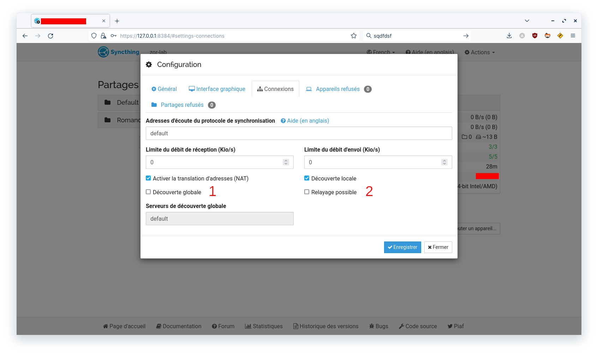

Bienvenue sur ce tutoriel qui vous présentera comment utiliser **Syncthing**.

Notre exemple porte sur une base de données de mots de passe initiée par l'application [KeepassXC](./keepass.md#), sur ordinateur fixe et mobile.

# Installation

Installer l'application sur votre ordinateur ainsi que sur votre téléphone :
- [Sur ordinateur](https://syncthing.net/downloads/)
- [Sur téléphone](https://f-droid.org/packages/com.nutomic.syncthingandroid/)

# Configuration

## Ordinateur

Ouvrez l'interface web sur votre ordinateur et l'application sur votre téléphone...

> N'oubliez pas de mettre un mot de passe la première fois que vous ouvrez l'interface web sur votre ordinateur : l'application vous le proposera. Ce n'est pas obligatoire mais fortement recommandé.
{.is-info}

{.align-center}
{.align-center}

Ajoutez un répertoire à partager :

{.align-center}

{.align-center}

{.align-center}

{.align-center}

{.align-center}

Veuillez notez que nous avons bien modifié l' "**ID du partage**". 

***Notez-le vous en aurez besoin plus tard...***

## Téléphone

Maintenant, occupons-nous du téléphone, initialisons Syncthing :

{.align-center}

Sur votre ordinateur, sur l'interface Web, cliquez sur "Actions" / "Afficher mon ID", vous obtiendrez un QR Code comme suit :

{.align-center}

Sur votre téléphone, faites comme suit, à l'étape 3, scannez le QR Code.

{.align-center}

Sur l'interface Web :

{.align-center}

{.align-center}

{.align-center}

Retournez sur votre téléphone :

{.align-center}

{.align-center}

> Bien, nous avons maintenant terminé la configuration.
{.is-success}

# Tests

Nous pouvons tester...

Ici pour l'exemple nous ajoutons une base nommée "MaBase.kdbx" sur notre ordinateur :

{.align-center}

Quelques instants plus tard, voici ce que nous obtenons :
- Vous pouvez voir que la synchronisation a été faite : nous avons maintenant 1 fichier
- A droite vous pouvez voir le fichier qui est apparu sur le téléphone

{.align-center}

# Lancement automatique

Afin de permettre un lancement automatique de Syncthing au démarrage de votre système, vous pouvez procéder de 2 façons :

1. Utiliser l'application graphique "Applications au démarrage" :
 - Lancez cette application
 - Ajouter une nouvelle application à démarrer
 - Donner un titre et choisissez "Start Syncthing" via le bouton parcourir : généralement cette application se trouve dans `/usr/share/applications/` et nommé "syncthing-start.desktop"

2. Si vous préférez la ligne de commande :
 - Localiser "Start Syncthing", via `locate syncthing-start.desktop` (si locate n'est pas installé, installez le)
 - Puis copier ce fichier dans le dossier .config, comme suit : `cp /usr/share/applications/syncthing-start.desktop ~/.config/autostart/`

---
{.align-right} *Contributeur(s): Ayo*