Bienvenue dans ce tutoriel tout en images, afin d'installer votre distribution Ubuntu. C'est très simple, vous allez voir !

> Au préalable, assurez-vous bien : 
> ~~ D'avoir configuré correctement votre [BIOS](./bios-boot.md#).
> ~~ D'avoir créé correctement votre [clé USB bootable](./usb-bootable.md#).
{.is-warning}

---
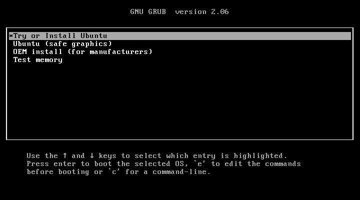{.align-center}

> Cliquer sur "Try or Install Ubuntu", puis patienter jusqu'à ce que le programme d'installation arrive sur l'écran suivant...
{.is-info}

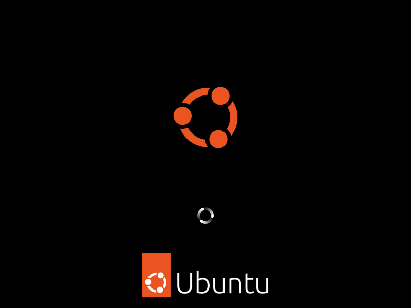{.align-center}
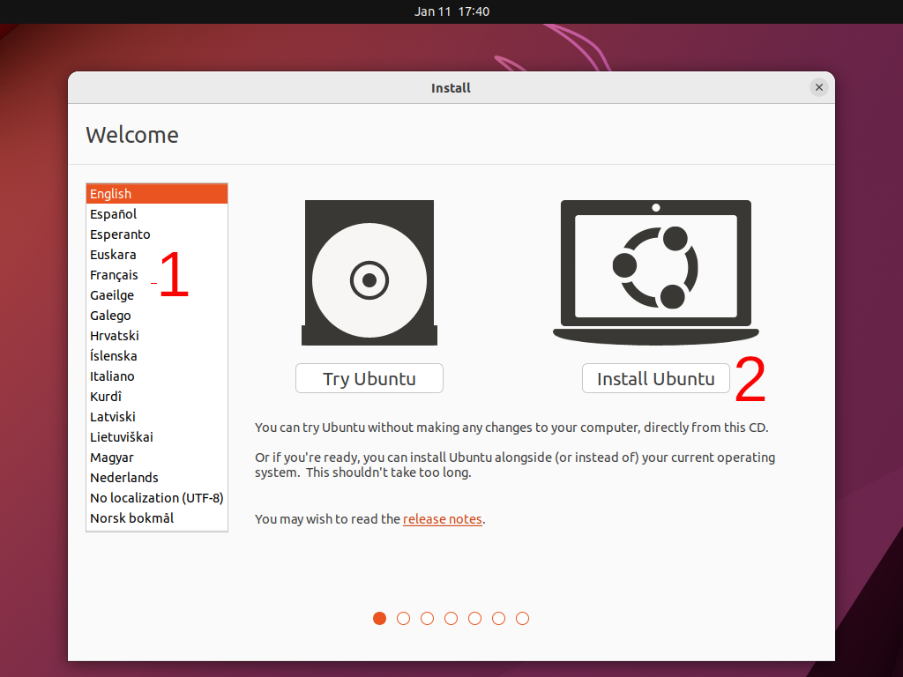{.align-center}
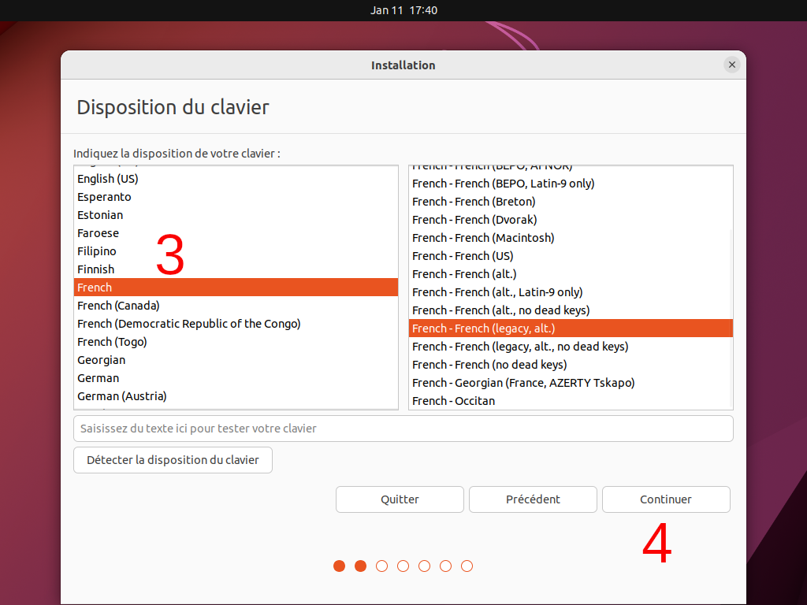{.align-center}
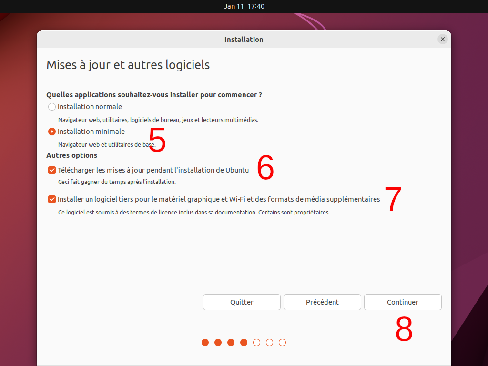{.align-center}
> **(**5**)** Vous pouvez ici choisir entre installation normale et installation minimale. 
Pour les besoins de la démonstration, et afin de gagner du temps, nous avons sélectionné "minimale" : à vous de choisir selon votre envie et vos besoins
{.is-info}

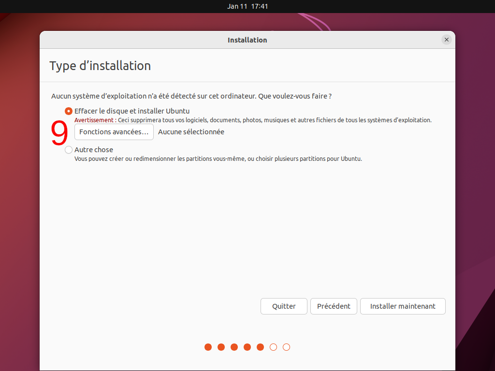{.align-center}
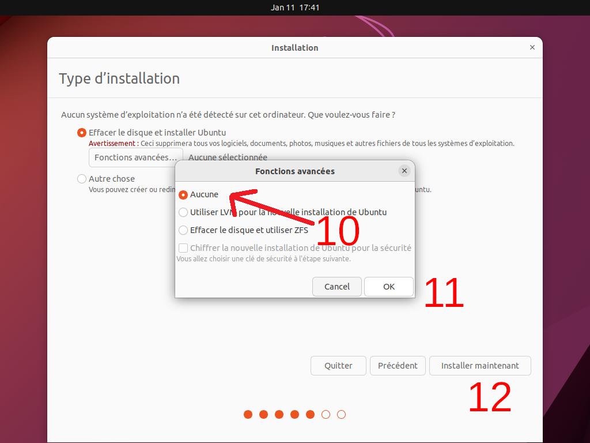{.align-center}
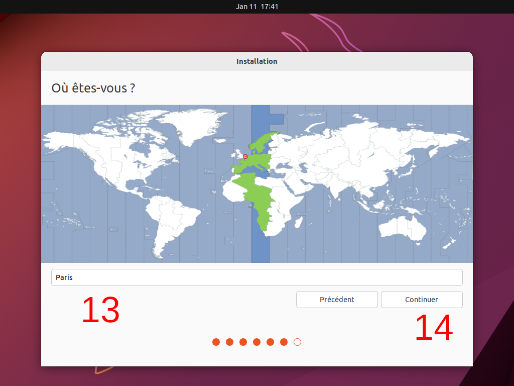{.align-center}
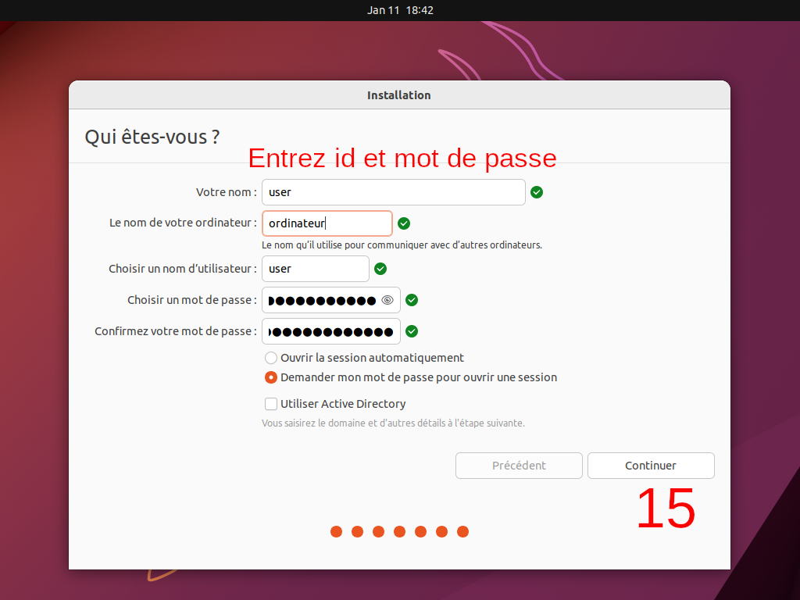{.align-center}
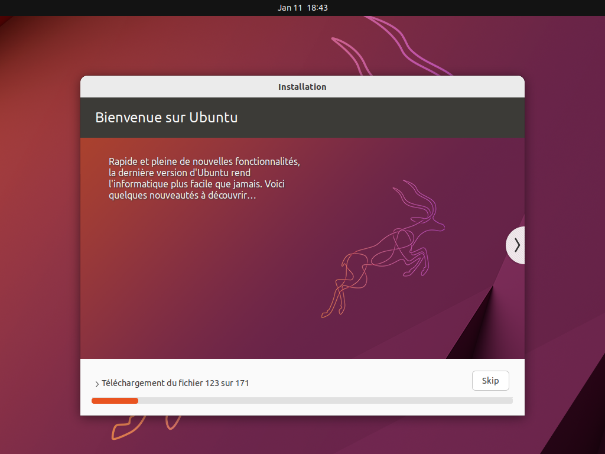{.align-center}

> En fin d'installation, l'installateur vous demandera de redémarrer la machine : cliquer sur le bouton "Redémarrer". Puis vous obtenez cet écran :
{.is-info}

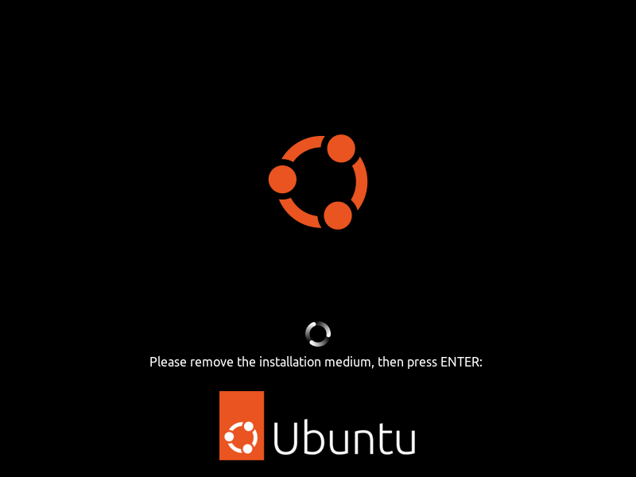{.align-center}

> Débrancher la clé USB, appuyer sur la touche <kbd>ENTREE</kbd> puis patienter jusqu'à la fin du redémarrage...
{.is-info}

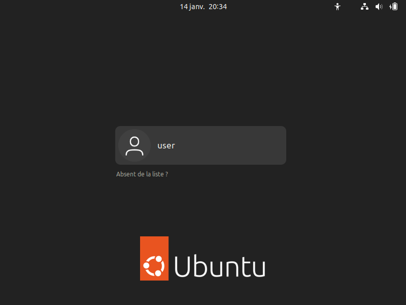{.align-center}

> Entrez votre mot de passe défini durant l'installation...
{.is-info}

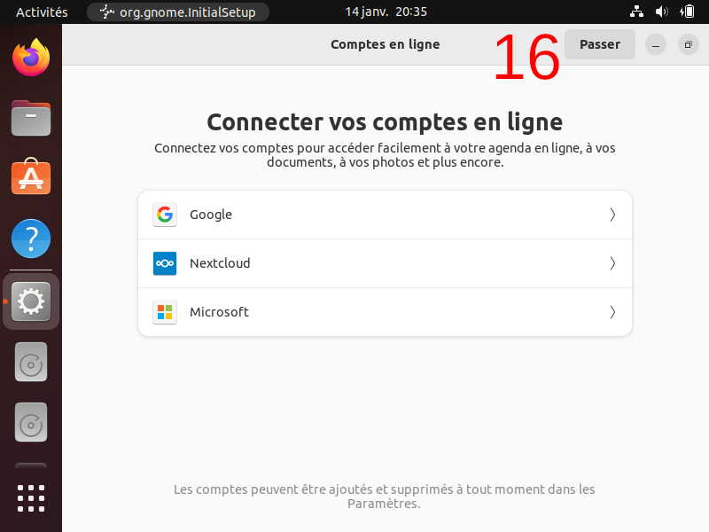{.align-center}
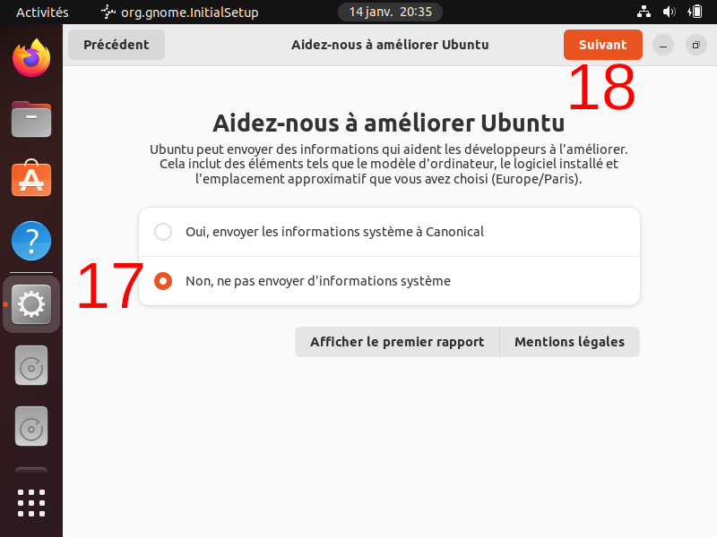{.align-center}
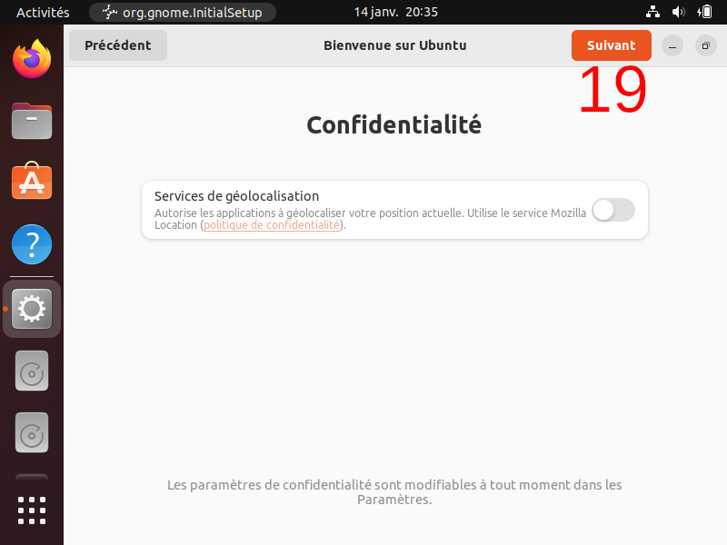{.align-center}
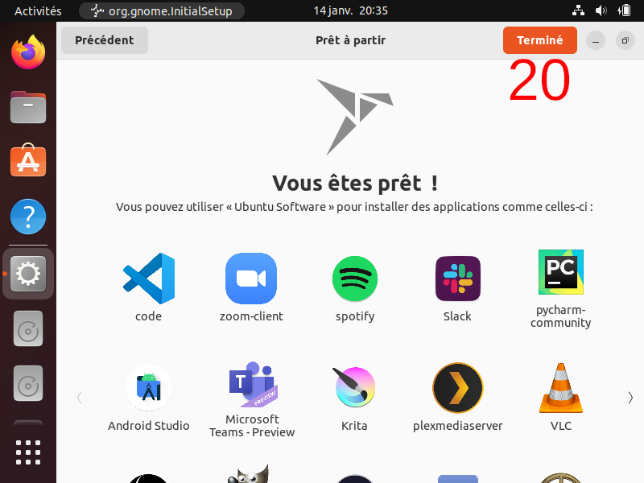{.align-center}

Voilà, votre distribution Ubuntu tout neuve est maintenant prête.

---
{.align-right} *Contributeur(s): Ayo, Nemtech*