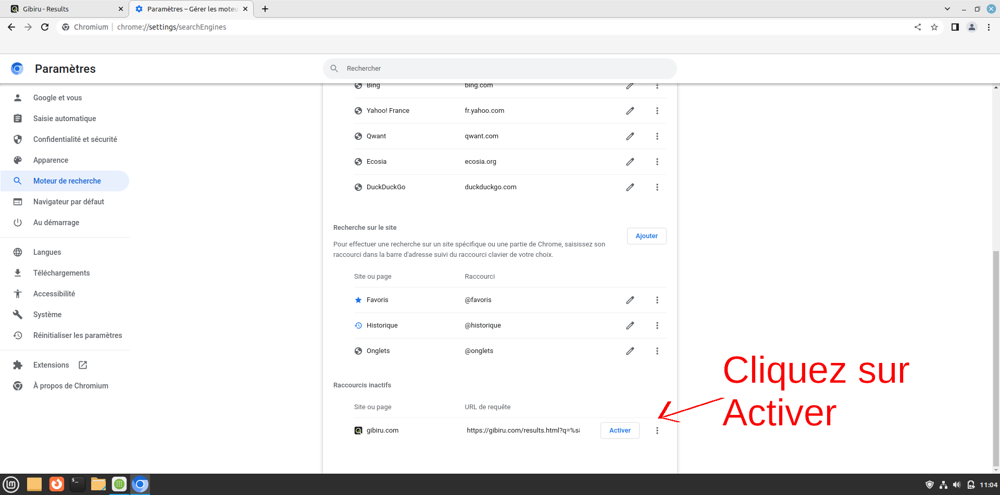
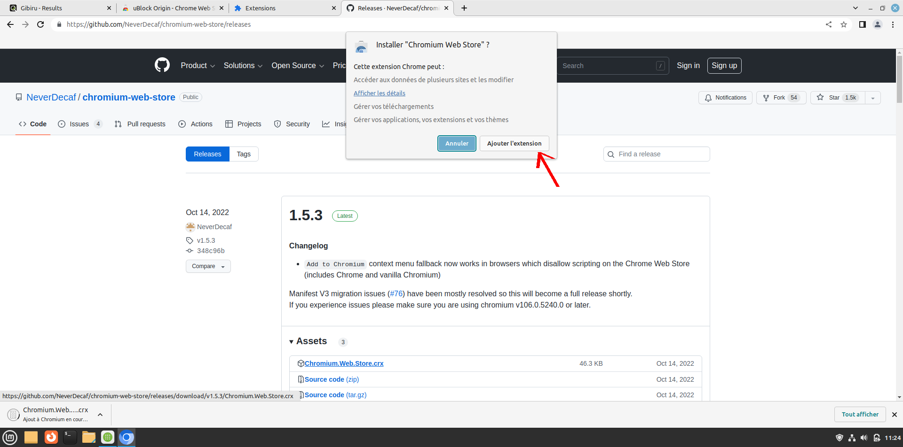

# Installation

Pour installer le navigateur, la procédure est "ultra" simple :
- Aller sur votre logithèque et intaller Ungoogled Chromium (UG).

> Nous recommandons l'installation via Flatpak pour la majorité des personnes souhaitant utiliser UG.
> Attention toutefois, avec certaines extensions, il conviendra de configurer votre distribution si vous rencontrez quelques problèmes (**extension de [KeePassXC](./keepass.md#) par exemple**).
{.is-success}

## En cas de problème

Il est possible que nous rencontrions des difficultés à rechercher Ungoogled Chromium sur la logithèque. En effet Flatpak ne sera parfois pas installé ou sera mal configuré de base.

Nous pouvons traiter ce cas de figure comme suit :
1. Ouvrez votre terminal, puis tentez d'exécuter cette commande : `flatpak list`.

- Si votre terminal vous renvoi une liste d'applications, Flatpak est donc installé !

_Exemple_ de renvoi lorsque Flatpak est installé :
```brainfuck
Name                           Application ID                                 Version             Branch               Installation
LibreWolf                      io.gitlab.librewolf-community                  114.0.2-1           stable               system
Freedesktop Platform           org.freedesktop.Platform                       22.08.12.1          22.08                system
Mesa                           org.freedesktop.Platform.GL.default            23.1.1              22.08                system
Mesa (Extra)                   org.freedesktop.Platform.GL.default            23.1.1              22.08-extra          system
ffmpeg-full                    org.freedesktop.Platform.ffmpeg-full                               22.08                system
openh264                       org.freedesktop.Platform.openh264              2.1.0               2.2.0                system
Yaru Gtk Theme                 org.gtk.Gtk3theme.Yaru                                             3.22                 system
```

> Vous pouvez donc passer directement à l'étape 2.
{.is-info}

- Si votre terminal vous renvoi :
```brainfuck
bash: flatpak : commande introuvable
# Ou en anglais :
bash: flatpak : unknown command
```

Cela signifie que Flatpak n'est pas installé.

> Procédez donc à son installation, suivant votre distribution : 
> 
> **Vous retrouverez toutes les procédures détaillées [ici](https://flatpak.org/setup/)**.
{.is-info}

2. Une fois Flatpak installé, indiquez-lui vers quel dépôt pointer (si ce n'est pas déjà fait) :

```bash
flatpak remote-add --if-not-exists flathub https://flathub.org/repo/flathub.flatpakrepo
```

3. Redémarrez votre machine, puis rendez vous dans votre logithèque pour vérifier que UG est disponible.


> Dans certains cas, il peut être nécessaire d'installer le navigateur via cette commande `flatpak install flathub com.github.Eloston.UngoogledChromium`.
{.is-warning}


# Configuration

Le navigateur est maintenant installé, nous allons le configurer convenablement afin d'en tirer le meilleur partie.

## Moteur de recherche

Rentrons dans les Paramètres afin de configurer un moteur de recherche par défaut. Procédez comme suit :

{.align-center}
{.align-center}
{.align-center}
{.align-center}

> Nous vous invitons à choisir votre moteur [ici](./moteurs-recherche.md#).
{.is-info}

{.align-center}
{.align-center}
{.align-center}
{.align-center}


## Cookies

Par défaut, Ungoogled Chromium bloque tous les "cookies tiers". Nous recommandons généralement de supprimer tous les cookies lorsque vous fermez le navigateur. Voici un aperçu :

{.align-center}

> Afin de ne pas supprimer certains _cookies de session_ (utiles, comme les webmails, etc.), il vous est possible d'ajouter une exception, montrée par la flèche en bas de l'image ci-dessus.
{.is-success}

> Il est également tout à fait possible de bloquer **TOUS** les cookies, mais la contre partie est un fonctionnement non nominal de certains sites.
{.is-warning}

## HTTPs

Il est tout à fait possible, voire recommandé, de forcer l'utilisation du HTTPs lors de toutes nos visites de site web. Pour ce faire :
- Direction les Paramètres
- Partie "Confidentialité et sécurité"
- Partie "Sécurité", et cocher comme suit :

{.align-center}


## Extensions

Ungoogled Chromium n'autorise pas par défaut l'installation d'extensions. En effet, UG coupe toute discussion avec les serveurs Google, et les extensions sont toutes stockés sur les serveurs Google. Lorsque vous visiterez le Chrome Web Store sur une page d'extension, vous tomberez sur cette page, qui ne contient aucun bouton pour ajouter l'extension au navigateur :

{.align-center}

Il va donc nous falloir ruser afin de pouvoir installer nos extensions. Nous présentons donc 2 méthodes.

### Méthode 1 : Semi auto

> Cette solution correspond à la meilleure solution pour la plupart des utilisateurs.
{.is-info}

#### Extension-Mime

Nous allons configurer un premier paramètre important : taper dans la barre de recherche `chrome://flags/#extension-mime-request-handling`.

Pas d'inquiétude ça ne ressemble pas à une URL basique comme nous avons déjà eu l'occasion de le voir, il s'agit simplement d'une URL locale au navigateur.

Cette URL vous ouvre la page suivante :

{.align-center}
{.align-center}
{.align-center}
{.align-center}

Sélectionner `Always prompt for install` et cliquer sur le bouton 'RELAUNCH' en bas à droite. Ceci aura pour conséquence de redémarrer le navigateur.

{.align-center}

#### Mode développeur

Nous allons ensuite activer le mode développeur pour pouvoir ajouter manuellement des extensions. Aller sur la page `chrome://extensions/` puis procéder comme suit :

{.align-center}
{.align-center}

#### CWS

Nous allons ensuite télécharger une première extension manuellement ; oui, je sais, une extension pour gérer des extensions, cela peut paraître déroutant :) ! Cette extension se nomme [Chromium Web Store](https://github.com/NeverDecaf/chromium-web-store/releases). Nous arrivons sur ce visuel :

{.align-center}

Télécharger la dernière version (dans notre exmple ici, il s'agit de la version 1.5.3).

> Attention de bien télécharger le fichier avec extension `.crx`.
{.is-warning}

{.align-center}

#### Accès extension

A ce stade, vous devriez maintenant pouvoir installer vos extensions comme d'habitude, via le [Chrome Web Store](https://chrome.google.com/webstore/category/extensions) :

{.align-center}

### Méthode 2 : Manuelle

Cette méthode n'est pas spécialement reommandée pour les débutants, mais elle a le mérite de permettre une installation directe d'une extension sans autre besoin d'extension tierce.

Nous allons utiliser pour cela une URL préformatée afin d'atteindre directement le fichier `.crx` sur le serveur. Voici la trame de cette URL :
- `https://clients2.google.com/service/update2/crx?response=redirect&acceptformat=crx2,crx3&prodversion={VERSION}&x=id%3D{EXTENSION_ID}%26installsource%3Dondemand%26uc`

Notez bien les 2 variables à modifier avant de lancer la requête :
- _{VERSION}_ : qui donne la version de notre navigateur UG (ex. : 1081.4526.83)
- _{EXTENSION_ID}_ : qui présente l'identifiant unique de l'extension que nous souhaitons installer (ex. : cjpalhdlnbpafiamejdnhcphjbkeiagm)

---
Un exemple : 
Nous allons installer *_Decentraleyes_* suivant cette méthode sur une distribution test Manjaro. Notez que nous n'avons rien configuré de base, ni Extension-Mime ni CWS.

Allons chercher la version de notre navigateur :

{.align-center}
{.align-center}
{.align-center}

> Notons la version : **109.0.5414.74**
{.is-info}

Allons ensuite chercher l'ID de l'extension Decentraleyes sur le [Chrome Web Store](https://chrome.google.com/webstore/category/extensions) :

{.align-center}

> Notons cet ID : **ldpochfccmkkmhdbclfhpagapcfdljkj**
{.is-info}

Ainsi nous pouvons construire manuellement l'URL que nous allons transmettre :
- `https://clients2.google.com/service/update2/crx?response=redirect&acceptformat=crx2,crx3&prodversion=109.0.5414.74&x=id%3Dldpochfccmkkmhdbclfhpagapcfdljkj%26installsource%3Dondemand%26uc`

{.align-center}

- Appuyer sur <kbd>ENTREE</kbd>, et nous voyons qu'un fichier (`.crx` d'ailleurs) s'est bien téléchargé.
- Ouvrir votre gestionnaire de fichier à l'emplacement où se trouve ce fichier téléchargé (chez nous, il se trouve dans le répertoire `Téléchargements`)
- Ouvrir votre navigateur à la page `chrome://extensions/` et activer le mode Développeur (en haut à droite)
- Glisser-déposer le fichier `.crx` directement depuis le répertoire (`Téléchargements` chez nous) vers votre navigateur. Nous obtenons une invite d'installation comme suit :

{.align-center}

- Puis à l'installation de celle-ci :

{.align-center}
{.align-center}

Voilà notre extension est bien installée et fonctionnelle.

### Mise à jour

Comme aucune connexion n'est faite vers les serveurs de Google, nous devrons mettre à jour _manuellement_ ces extensions. C'est la petite contre partie à l'utilisation d'un navigateur comme celui-ci.

> Suivant les méthodes 1 ou 2, vous devrez refaire exactement les mêmes étapes pour mettre à jour l'extension en question.
{.is-info}

## Configuration avancée

Entrer `chrome://flags/` dans la barre d'URL. Nous obtenons cette page :

- **Anonymize local IPs exposed by WebRTC** à ENABLED
- **Enable get\*ClientRects() fingerprint deception** à ENABLED
- **Enable Canvas::measureText() fingerprint deception** à ENABLED
- **Enable Canvas image data fingerprint deception** à ENABLED
- Cliquer sur le bouton 'RELAUNCH' en bas à droite. Ceci aura pour conséquence de redémarrer le navigateur.

{.align-center}
{.align-center}
{.align-center}
{.align-center}
{.align-center}

## Facultatif

Si vous souhaitez pointer depuis votre navigateur sur un [serveur DNS](./dns.md#) tiers, voici comment le configurer sous UG :

{.align-center}
{.align-center}

- Cliquez à gauche sur la partie "Confidentialité et sécurité"
- Puis sur la partie "Sécurité" (3) :

{.align-center}
{.align-center}
{.align-center}

> L'avertissement suivant "*Veuillez vérifier qu'il s'agit d'un fournisseur valide ou réessayer plus tard*" peut apparaître : celle-ci peut tout à fait être ignorée, car certains serveurs ne sont simplement pas répertoriés (FDN par exemple qui est en France, inconnu des USA).
> Faites un [test](https://www.dnsleaktest.com/) pour vous assurer que le serveur est bien accessible. Si le test n'est pas accessible, changez le DNS.
{.is-info}


Testons notre configuration pour vérifier que nous pointons bien vers le DNS de la FDN :

{.align-center}


> Voilà, vous êtes fin prêt pour naviguer sereinement.

---
{.align-right} *Contributeur(s): Ayo*