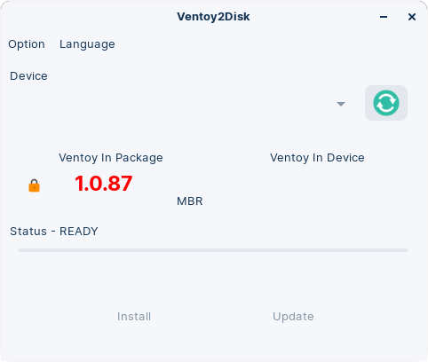

Afin d'installer sur son ordinateur une distribution GNU/Linux, il est nécessaire de créer une clé USB bootable.

**Bootable** signifie qu'à l'allumage de la machine, celle-ci, dès le début ne bootera pas sur le système que vous avez actuellement (Windows, Ubuntu, Debian ou autre), mais directement sur la clé USB.

Le problème est que l'on ne rend pas une clé bootable aussi facilement, en copiant une image d'une distribution sur la clé par exemple. Pour cela, nous allons devoir utiliser des outils spécifiques qui vont grandement nous simplifier la tâche.

Ce tutoriel vous montrera donc les manipulations autour de 2 outils très connus :
- :one: Balena Etcher
- :two: Ventoy

# Balena Etcher

Commençons par l'outil le plus fiable sur le marché, open-source, et capable de rendre bootable une clé USB de toute taille, avec un système d'exploitation.

Avant toute chose, veuillez télécharger la distribution Linux que vous souhaitez utiliser sur votre machine. Rendez vous sur cet [article](./linux-distributions.md#) afin d'en choisir une et téléchargez l'image sur votre ordinateur.

> Dans notre exemple, nous avons pris la distribution Ubuntu 22.10.
{.is-info}

Nous allons ensuite rendre une clé USB bootable. Commencez donc par insérer votre clé USB dans un port de l'ordinateur.

> Gardez bien à l'esprit que tant que votre système ne sera pas installé, vous ne pourrez utiliser cette clé USB pour autre chose.
{.is-warning}

## Téléchargements

Téléchargez Etcher [ici](https://www.balena.io/etcher/) en cliquant sur le bouton **Vert** au milieu de la page.

Nous partons du principe que vous êtes sous GNU/Linux : dans ce cas, un fichier .AppImage sera téléchargé, à l'endroit où vous stockez vos téléchargements. Généralement, il s'agira du répertoire `Downloads` ou `Téléchargements`. Rendez vous donc dans ce répertoire.

> Dans la suite du tutoriel, nous partons du principe que vous avez la version Etcher _**1.8.14**_.
{.is-info}

## Lancement

Il y a **2 manières de lancer Balena Etcher** : via un terminal avec une ligne de commande, ou en double-cliquant. Mais quoi qu'il arrive, **il est tout d’abord nécessaire de rendre le fichier exécutable**.


### Tabs {.tabset}
#### En interface graphique

Tout d'abord, rendez vous dans le répertoire où vous avez téléchargé le fichier (probablement les Téléchargements).

Ensuite, **rendons le fichier exécutable**.
Pour cela : faites un *clic-droit*  ▶️ *Propriétés* ▶️ Allez dans l'onglet *Permissions* ▶️ Cochez la case "*Autoriser l'exécution du fichier comme un programme*".
*Notez que cette opération n'aura plus besoin d'être effectuée à l'avenir.*
{.align-center}
Vous pouvez à présent fermer cette fenêtre.

**Pour lancer le logiciel, vous n'aurez plus qu'à double-cliquer sur le fichier.**
Au moment d'écrire l'image sur votre clé, Balena Etcher vous demandera votre mot de passe, qu'il faudra bien entendu valider.

#### En ligne de commande
Ouvrez un terminal dans le répertoire où se trouvent les fichiers téléchargés (clic-droit de la souris :arrow_right: Ouvrir dans un terminal).

**Rendons le fichier exécutable** avec la commande suivante :
*Notez que cette commande n'aura plus besoin d'être tapée à l'avenir.*
```
chmod +x balenaEtcher-1.8.14-x64.AppImage
```

Enfin, **pour lancer le logiciel**, tapez la commande suivante :
*Notez que sudo vous forcera à rentrer votre mot de passe.*
```
sudo ./balenaEtcher-1.8.14-x64.AppImage
```

## Utilisation

Voilà, l'outil est lancé :

{.align-center}

Cliquez sur "Flash from file". Une fenêtre s'ouvre :

{.align-center}

(1) Veuillez sélectionner l'image de la distribution que vous avez choisie au préalable.
(2) Puis, cliquez sur "Ouvrir"

{.align-center}

Cliquez ensuite sur "Select Target". Une fenêtre s'ouvre :

{.align-center}

(1) Vous devriez normalement voir votre clé USB dans la liste. Cliquez sur la case à cocher en haut à gauche, vous devriez obtenir ceci :

{.align-center}

(2) Puis cliquez sur "Select (1)".

{.align-center}

Pour terminer, veuillez cliquer sur "Flash!".

Etcher s'occupera de flasher votre clé, puis vérifier la clé. Et enfin, Etcher vous dira que vous êtes prêt.

> Voilà votre clé est *normalement* bootable.
{.is-success}

# Ventoy

Passons maintenant à un outil très intéressant : Ventoy. Cet outil vous permettra non seulement de rendre bootable votre clé USB, mais vous permettra également de garder cette clé pour continuer à stocker vos fichiers.

Généralement, Ventoy est utilisé par ceux qui :
- souhaitent ne pas gâcher une clé juste pour ce type d'outil,
- sont libristes, bénévoles, et qui souhaitent avoir sur eux un panel de plusieurs distributions !

## Téléchargements

Téléchargez Ventoy [ici](https://github.com/ventoy/Ventoy/releases). 

Vous verrez sur cette page plusieurs versions. Descendez un peu afin de retrouver ceci :

{.align-center}

Nous partons du principe que vous êtes sous GNU/Linux : dans ce cas, un fichier archive .tar.gz sera téléchargé, à l'endroit où vous stockez vos téléchargements. Généralement, il s'agira du répertoire `Downloads` ou `Téléchargements`. Rendez vous donc dans ce répertoire.

> A l'heure où nous écrivons ces lignes, il s'agit de la version Ventoy _**1.0.87**_. Il se peut que cela ait évolué depuis. Téléchargez la dernière version.
{.is-info}

## Lancement

Ouvrez un terminal dans le répertoire où se trouvent les fichiers téléchargés (clic-droit de la souris + Ouvrir dans un terminal), puis entrez cette suite de commandes :
*Notez que sudo vous forcera à rentrer votre mot de passe.*

```bash
tar xzvf ventoy-1.0.87-linux.tar.gz 
cd ventoy-1.0.87/ && sudo ./VentoyGUI.x86_64
```


## Utilisation

Voilà, l'outil est lancé :

{.align-center}

Insérez votre clé USB puis cliquez sur le bouton "Rafraîchir" (1) ci-dessous :

{.align-center}

Vous devriez maintenant voir votre clé. Ci-dessous, il a détecté une clé s'appelant "Generic Storage Device" de 64 GB. Cela peut être différent chez vous.

{.align-center}

Ensuite, cliquez simplement sur le bouton "Install". Il vous demandera de confirmer 2 fois, cliquez donc sur 'Valider' deux fois.
Le processus se déroule...

{.align-center}

Puis, il ouvre une fenêtre pour vous confirmer le bon déroulement de l'opération. Vous devriez ensuite obtenir quelque chose comme cela :

{.align-center}

Une fois effectué, fermez l'outil. Vous allez maintenant pouvoir copier les images que vous souhaitez sur cette clé USB. Ci-dessous, un aperçu de notre clé :

{.align-center}


> Voilà, votre clé est *normalement* bootable et vous aurez le choix dans les distributions.
{.is-success}

---
{.align-right} *Contributeur(s): Ayo, Esf, Theudric*