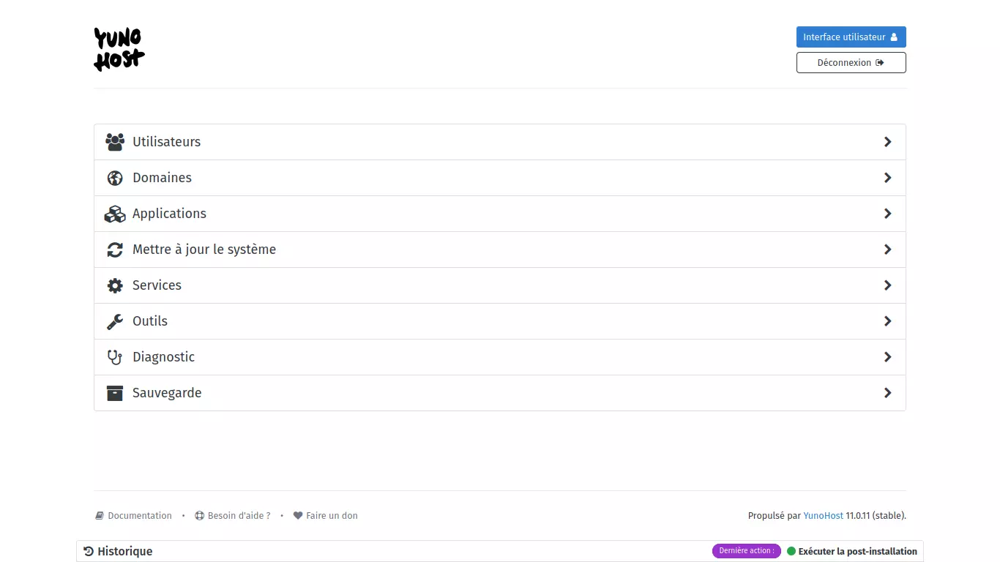
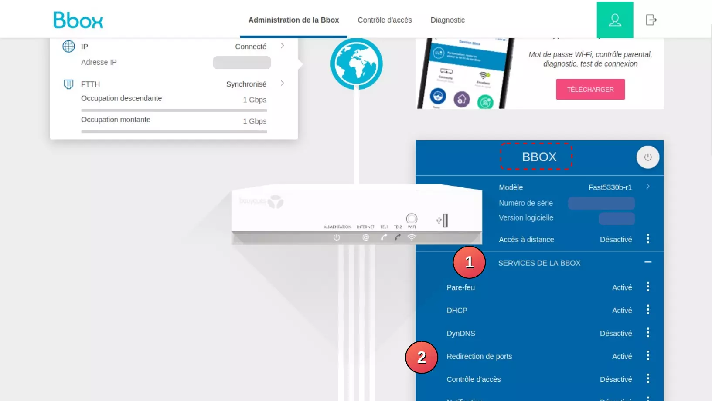
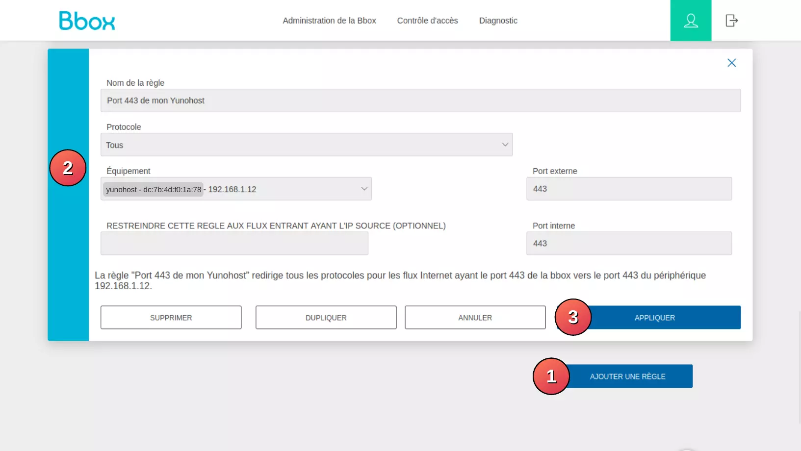
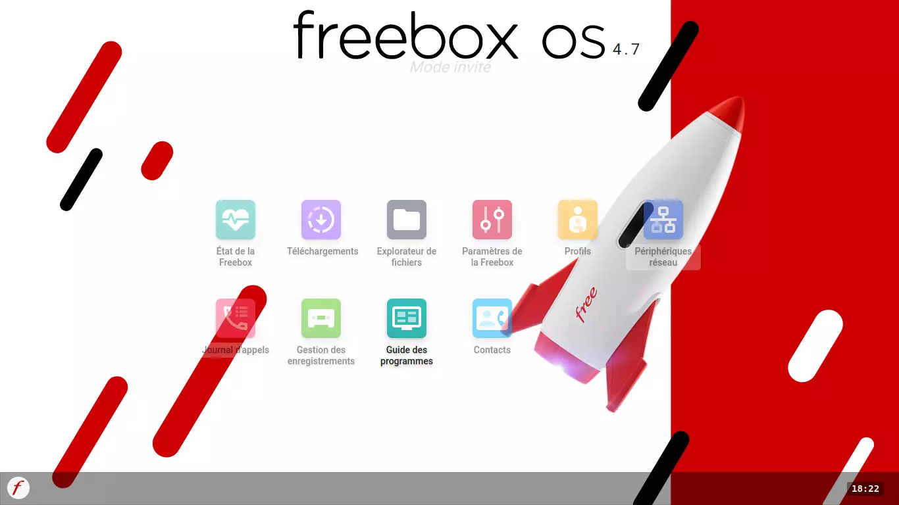

Nous proposons ici un condensé des étapes nécessaires à l'installation de Nextcloud sur Yunohost, sur un appareil auquel nous ajouterons un disque dur externe. Si vous n'êtes pas complètement à l'aise, nous vous invitons à lire ce résumé pour avoir une idée des étapes qui vont se succéder, puis à le réaliser un pas après l'autre, en suivant l'explication détaillée ci-dessous.

Pour installer Yunohost, nous allons suivre ces étapes dans l'ordre :

1. Télécharger [ici](https://yunohost.org/fr/install) l'image Yunohost, puis **l'écrire sur une clé USB** avec [Balena Etcher](./usb-bootable.md##balena-etcher), après en avoir vérifié l'[intégrité](./chiffrement.md#).

2. Une fois installé (pour les fichiers .iso) et démarré, nous nous connectons avec un navigateur à l'interface de notre Yunohost. Pour cela nous utilisons soit l'URL [<https://yunohost.local>](https://yunohost.local), soit l'adresse IP du matériel révélée dans le terminal avec la commande `nmap -sn $(hostname -I | cut -d'.' -f1,2,3).0/24` , ou grâce à l'outil [Angry IP Scanner](https://angryip.org/).

3. Nous choisissons d'utiliser un sous-domaine de Yunohost par simplicité, en suivant les indications sur l'interface Yunohost.

4. Nous définissons un mot de passe **robuste** pour l'utilisateur "*admin*" du système Yunohost.

5. Nous créons le premier utilisateur en cliquant sur "Utilisateurs :arrow_forward: Nouvel utilisateur". Nous choisissons de le nommer "administrateur" car **il sera administrateur pour les services** installés ultérieurement. Cet utilisateur sera le premier de l'annuaire [LDAP](./glossaire.md##LDAP) de Yunohost.

6. Il faut vérifier au niveau de votre box que les ports 80 et 443 sont ouverts (ou que UPnP est activé et fonctionnel). Nous vous invitons à vous tourner vers les paramètres de votre [FAI](./glossaire.md##fai). Il faut que les ports 80 et 443 de la box soient redirigés vers les mêmes ports que ceux de votre machine Yunohost.

7. Nous faisons un diagnostic, en cliquant sur "Diagnostic", pour vérifier qu'au moins le port 443 et 80 soient fonctionnels. Il se peut qu'il y ait des avertissements pour d'autres ports non ouverts, de fait ils ne sont pas indispensables. Pour la sécurité, nous évitons d'ouvrir des ports dont nous ne voulons pas.

8. Nous configurons un certificat Let's Encrypt en suivant : "Domaines :arrow_forward: votre_domaine.nohost.me :arrow_forward: Certificat SSL :arrow_forward: Installer un certificat Let's Encrypt" (nécessite les 2 étapes précédentes).

8. Nous mettons à jour le système : "Mettre à jour le système :arrow_forward: ...[*Attendre*]... :arrow_forward: Mettre à jour tous les paquets".

9. Nous ajoutons un disque dur externe. Nous vous invitons à suivre le point détaillé ci-dessous. Cette étape se fait nécessairement en ligne de commande.

10. Nous installons Nextcloud en suivant ce chemin : "Applications :arrow_forward: Installer :arrow_forward: Chercher "Nextcloud" :arrow_forward: Installer :arrow_forward: Installer".

11. Nous vous conseillons d'ajouter un nouvel utilisateur qui sera pour votre usage quotidien de Nextcloud et autres services que vous installerez. Pour cela, suivez les mêmes étapes qu'en 5. Pour des raisons de sécurité, il est fortement déconseillé d'utiliser un utilisateur ayant des droits d'administration dans votre usage quotidien.


Yunohost peut s'installer sur la grande majorité des supports que nous trouvons autour de nous. Ce système est conçu pour ne pas demander trop de ressources pour fonctionner. Ainsi, si vous voulez donner une seconde vie à un vieil ordinateur, c'est tout à fait possible.

**Voici le matériel supporté par Yunohost :**
- [Sur RaspberryPi (zero, 1, 2, 3, 4)](https://yunohost.org/fr/install/hardware:rpi2plus)
- [Sur autres cartes ARM](https://yunohost.org/fr/install/hardware:arm_sup)
- [Sur Ordinateur](https://yunohost.org/fr/install/hardware:regular) (si vous récupérez un vieil ordinateur par exemple)
- [En machine virtuelle](https://yunohost.org/fr/install/hardware:virtualbox)
- [Sur un VPS](https://yunohost.org/fr/install/hardware:vps_debian)

Vous aurez également besoin des **connecteurs nécessaires** (câble RJ45) **pour connecter à Internet** votre ordinateur/serveur/carte raspberry/machine virtuelle, et donc de la connexion Internet qui va avec (votre box dans la majorité des cas). Nous déconseillons fortement le Wi-Fi dans ce cas d'usage, celui-ci ajoutant certaines failles de sécurité (préfer donc une connexion via câble ethernet (RJ45) sur la machine hôte, que celle-ci soit réelle (hardware physique) ou virtuelle).

Selon l'espace de stockage disponible sur le support sur lequel vous installez Yunohost, il pourrait être **judicieux d'opter pour l'ajout d'un disque dur externe** sur lequel les données des utilisateurs seront enregistrées.

Vous aurez également besoin d'un autre ordinateur quelconque pour le temps de l'installation. Évitez le smartphone pour des soucis de clarté et de facilité liés à l'interface de Yunohost. Il est nécessaire d'être connecté au même réseau (même box, via Wi-Fi ou Ethernet, peu importe) que le matériel Yunohost.

# Téléchargement et écriture de l'image

1. **Téléchargement de l'image**

  Pour commencer, nous allons devoir télécharger Yuhonost.

  Dans notre cas, nous utilisons un Raspberry Pi4, nous téléchargeons donc l'image correspondante dans la section "[Télécharger l'image YunoHost](https://yunohost.org/fr/install/hardware:rpi2plus#telecharger-l-image-image)" de "RaspberryPi 2, 3 ou 4".
  
  Nous choisirons la version 64bits (à gauche) car nous utilisons un RPi version 3/4.

  Prenez le temps de vérifier la [somme de contrôle](./glossaire.md##checksum) de l'image Yunohost à la fin de son téléchargement, voir [ici](./chiffrement.md#.md#).

2. **Écriture de l'image**

  Comme nous utilisons un RaspberryPi, le système d'exploitation doit être installé sur une carte MicroSD. Nous recommandons une carte MicroSD d'au moins 16Go, même si 8Go suffisent probablement.

  Pour écrire l'image téléchargée précédemment, nous utilisons le logiciel Balena Etcher *(suivez [la page dédiée](./usb-bootable.md.md##balena-etcher), ou le [site officiel](https://yunohost.org/fr/install/hardware:rpi2plus#flasher-l-image-image-typ))*.

  Sur **Balena Etcher**, vous commencerez par **sélectionner le fichier Yunohost** téléchargé précédemment, puis par **sélectionner votre carte SD** (attention de ne pas vous tromper), puis **lancer l'écriture**.


# Démarrer et se connecter à l'interface Yunohost

1. **Démarrer le RaspberryPi**

  Une fois l'écriture terminée :
   - Insérer la carte micro SD dans le RaspberryPi,
   - Brancher le câble (RJ45) sur le Raspberry et dans une prise de votre box,
   - Terminer par brancher l'alimentation du RPi. Celui-ci devrait booter.

2. **Se connecter à l'interface Yunohost**

  Vous pouvez tenter de vous connecter avec cet [URL](./glossaire.md##URL) : [https://yunohost.local](https://yunohost.local).

  Si cela fonctionne, passer à la section suivante : [Configurer le domaine](yunohost.md##configurer-le-domaine).
  
  **Sinon, passer au point 3 suivant...**

3. **Trouver l'adresse IP du Raspberry Pi**

### {.tabset}
#### Nmap (ligne de commande)

En ligne de commande sur un ordinateur quelconque, vous pouvez utiliser la commande `Nmap` suivante depuis le terminal (il faut que Nmap soit installé sur votre ordinateur) :
  
```bash
nmap -sn $(hostname -I | cut -d'.' -f1,2,3).0/24 | grep -v "Host is up"
```
Sur les lignes qui vous seront retournées, chercher des informations qui vous permettent d'identifier votre Raspberry Pi, ou Yunohost lui-même. Et noter son adresse IP, qui sera de la forme : 192.168.0.19,  ou 192.168.1.163 par exemple.

#### AngryIpScanner

Ouvrez le logiciel [AngryIpScanner](https://angryip.org/download/).

Si c'est la première fois que vous l'ouvrez, décochez la case "*Send anonymous error reports*", puis cliquez sur *Suivant*.

Ensuite, dans le menu, allez dans "*Outils* > *Préférences...*".
Allez dans l'onglet *Affichage*, puis cochez la case *Hôtes actifs (répondant aux pings) seulement*.
Cliquer sur *OK*.

Pour lancer le scan, cliquez sur *Démarrer* puis attendez que le scan soit terminé.

{.align-center}

Enfin, dans la liste qui s'affiche, identifiez la ligne qui correspond à votre matériel ou à yunohost. Et notez son adresse ip (première colonne : *IP*).

###

4. **Se connecter à l'interface**

  Une fois l'adresse IP cible trouvée, ouvrir un navigateur sur un ordinateur quelconque, puis dans la barre d'URL saisir l'adresse IP récupérée juste avant (ex: 192.168.1.12).

  Un avertissement de sécurité sera levé. Vous pouvez cliquer sur ***Avancé...*** puis ***Accepter le risque et poursuivre***. Cet avertissement est lié au certificat qui n'est pas reconnu publiquement. Le problème sera résolu ultérieurement.


# Configurer le domaine

Le domaine, c'est le nom qui va être utilisé dans l'[URL](./glossaire.md.md##URL) pour accéder à votre site. Par exemple, pour le site [https://wikilibriste.fr](https://wikilibriste.fr), le nom de domaine est *wikilibriste.fr*. Ce nom est reconnu dans le monde entier, il doit donc être unique.

Yunohost propose 2 possibilités pour choisir son domaine :
 - Soit créer un domaine à cette étape ; il sera gratuit. En revanche, ce domaine est en réalité un sous-domaine d'un domaine appartenant à Yunohost.
 - Soit vous avez déjà un domaine, et il suffit de l'indiquer.

Pour plus d'informations, consultez le [site officiel](https://yunohost.org/fr/install/hardware:rpi2plus#domaine-principal).


Dans notre cas, nous utilisons la première solution. **Pour cela, en suivant les indications de l'interface** :
 - Choisir : "***Je n'ai pas de nom de domaine...***"
 - Puis entrer un nom que **l'on retiendra**, mais qui soit le plus unique possible.
 
> Attention, ce nom ne peut pas comporter de caractères spéciaux. Vous pourrez y mettre des minuscules, des chiffres, et des "-". Nous déconseillons tout autre caractère.
{.is-warning}

 - Nous pouvons également choisir parmi 3 possibilités le nom de domaine Yunohost parent.

Enfin, nous pouvons cliquer sur ***Suivant***.


# Mot de passe d'administration

<mark>**Très important**</mark> : **ce mot de passe est la barrière principale contre les attaques !** 

Il est impératif que les mots de passe soient de la plus grande qualité : très long, avec le plus de caractères possibles (caractères spéciaux, chiffres, etc...).

Le mieux serait d'utiliser un long mot de passe aléatoire que vous enregistrez dans un gestionnaire de mot de passe comme [Keepass](./keepass.md#).


# Arrivée sur l'interface standard de Yunohost

Attendez que Yunohost finisse la post-installation. Puis vous arriverez sur l'interface suivante, qui est l'interface d'administration de Yunohost. C'est de là que tout se configure :

{.align-center}


# Création du premier utilisateur (admin)

Certaines applications Yunohost nécessitent qu'un utilisateur existe avant qu'elle ne soient installables (c'est le cas de Nextcloud). Il faut donc immédiatement créer cet utilisateur.

Ce premier utilisateur a des droits d'administration pour tous les services qui seront installés par la suite. Il faut donc également que cet utilisateur ait un mot de passe très fort.

**Pour créer l'utilisateur**, nous suivons l'interface :
  1. Cliquer sur ***Utilisateurs***
  2. Puis sur ***Nouvel utilisateur***
  3. Remplir comme suit (vous pouvez adapter les noms, mais nous suggérons de le nommer *administrateur*) :
   - Nom d'utilisateur : administrateur
   - Nom complet : Prénom : Admin ; Nom de famille : Admin
   - Courriel : *ne pas toucher*
   - Mot de passe : *un mot de passe très robuste*
  4. Cliquez sur ***Sauvegarder***


# Ouvrir les ports nécessaires sur votre box

Cette étape va se passer sur l'interface d'administration de votre box. Cette interface sera accessible sur l'un des liens suivants : [http://192.168.1.0](http://192.168.1.0), [http://192.168.1.1](http://192.168.1.1) ou [http://192.168.1.254](http://192.168.1.254).

> *~~Étant donné que l'interface peut changer d'une box à une autre, d'une version à une autre, nous n'allons pas détailler avec précision ce point. Nous vous invitons à chercher sur Internet une page qui pourrait vous éclairer.~~*
Les détails pour chaque opérateur sont en cours d'écriture.
{.is-info}

**Ce qu'il faut faire :**
Sur la page de configuration de votre box, trouvez les paramètres de redirection de ports.
Si vous avez un service *UPnP*, vous pouvez tenter de l'activer, et cela devrait suffire.
Sinon, **il faut trouver les paramètres de "redirection de port" souvent aux côtés de paramètres "Nat & Pat".**.
Une fois ces paramètres trouvés, configurez de tel sorte que la box le port 80 de la box soit connecté au port 80 de votre appareil Yunohost. Il faudra refaire la même opération pour le port 443 (obligatoire), et les autres ports (facultatif) que vous souhaiteriez exposer.

Détail pour ouvrir les ports pour chaque box (autres opérateurs à venir) :

#### {.tabset}

##### Bouygues

**Connectez-vous :**

Tout d'abord, ouvrez le lien suivant : [https://192.168.1.254](https://192.168.1.254)
Une fois la page chargée, entrez votre mot de passe d'administrateur de la box (ou configurez le si nécessaire en suivant les indications affichées).
Puis connectez vous en cliquant sur *Connexion*

**Allez dans les paramètres d'ouverture de ports :**

En arrivant sur la page de configuration de votre Box, allez dans la section *BBOX*.
Puis déroulez le menu *SERVICES DE LA BBOX*.
Enfin cliquez sur *Redirection de ports*.

{.align-right}

**Ouvrir un port : 443**

Tout d'abord, il faut activer la fonction *NAT & PAT* de la box en activant le bouton Off/On comme ceci : {.align-right}


Nous allons ouvrir le port 443 en suivant ces étapes :

1. Cliquez sur *AJOUTER UNE RÈGLE*.
2. Remplissez le formulaire comme dans la capture suivante, en adaptant l'*Équipement* à celui que vous voulez exposer (l'adresse ip doit correspondre à l'adresse ip que vous avez trouvé plus tôt). Le nom de la règle vous permet juste de comprendre à quoi sert la règle, vous pouvez y mettre ce que vous voulez.
3. Validez en cliquant sur *APPLIQUER*.

{.align-right}

Le port 443 de votre box redirigera à présent toutes les requêtes vers le port 443 de votre ordinateur Yunohost. Vous avez donc à présent accès à votre installation Yunohost depuis Internet, sans avoir nécessairement besoin d'être connecté à votre Wifi.

Vous pourrez **ajouter une seconde règle identique**, mais pour le port 80, et tous les autres ports que vous voudrez ouvrir.

Enfin, **pour vous déconnecter**, cliquez sur l'icône en haut (dans l'en-tête) à droite de l'interface Bouygues.

##### Free
**Se connecter à l'interface :**
 - Ouvrir le lien suivant : [https://192.168.1.254](https://192.168.1.254)
 - Cliquer sur *Avancé...* puis sur *Accepter le risque et poursuivre*.
 - Une fois la page chargée, cliquer sur le menu Freebox en bas à gauche puis sur *Connexion*.
 - Enfin, entrez le mot de passe qui est identique à votre mot de passe Wifi.

Vous arriverez dans une page semblable à celle-ci :
{.align-center}

**Trouver les paramètres d'ouverture de ports :**
 - Double-cliquez sur *Paramètres de la Freebox*
 - Puis double-cliquez sur *Gestion des ports*

Vous obtiendrez une "fenêtre" semblable à celle-ci :
{.align-center}

**Ouvrir un port : 80**
 - Cliquer sur "Ajouter une redirection"
 - Remplisser le formulaire :
   - *IP Destination* : choisissez votre matériel Yunohost (dans notre cas : 192.168.1.12)
   - *IP Source* : Toutes
   - *Protocole* : UDP
   - *Port de début* : 80
   - *Port de fin* : 80
   - *Port de destination* : 80
   - *Commentaire* : *quelque chose d'évocateur pour que vous compreniez l'utilité de cette règle.*
{.align-center}
 - Cliquez sur *Sauvegarder* pour enregistrer la règle.

Vous pourrez **ajouter une seconde règle identique**, mais pour le port 443, et tous les autres ports que vous voudrez ouvrir.

Enfin, vous pouvez terminer en cliquant sur "OK" en bas de la "fenêtre".
Puis vous déconnecter en allant dans le menu Freebox puis en cliquant sur *Déconnexion*.


# Diagnostic

Il est nécessaire à cette étape de vérifier que nos deux ports 80 et 443 sont ouverts, grâce à l'outil de diagnostic de Yunohost. Sans cette étape, nous ne pouvons passer à la suivante.

**Pour faire le diagnostic**, rien de plus simple :
 - Cliquer sur ***Diagnostic***
 - Attendre...

Il y aura probablement quelques avertissements qui seront remontés, notamment pour les e-mails (nous ne nous en occuperons pas dans ce tutoriel, peut-être un jour ;)). Tant que les ports 80 et 443 sont bien configurés et marqués comme "OK", ça devrait être bon.

# Configurer le certificat

Le certificat est un outil de sécurité qui permet d'authentifier le serveur à un client, grâce à des fonctions cryptographiques. *Let's Encrypt*, qui est utilisé par Yunohost pour créer ces certificats, est une autorité de certification qui fournit gratuitement et de manière automatisée des certificats reconnus.

Grâce à ce certificat "reconnu", vous n'aurez plus le message d'avertissement comme vous avez eu à la toute première connexion à l'interface de Yunohost.

**Attention** : Cette étape nécessite les deux étapes précédentes : ouverture des ports et diagnostic. Sinon celle-ci échouera à tous les coups.

**Pour installer le certificat**, il suffit de suivre l'interface comme suit :
 - Cliquer sur ***Domaines***
 - Puis sur le nom de votre domaine *(pour nous par exemple : wikilibriste.nohost.me)*
 - Puis sur le bouton ***Certificat SSL***
 - Enfin vous cliquerez sur ***Installer un certificat Let's Encrypt***

# Mettre à jour le système

Comme expliqué dans le point de sécurité en début d'article, les mises à jour sont extrêmement importantes.

Pour faire les mises à jour, suivez ces étapes :
 - Cliquer sur ***Mettre à jour le système***
 - *Attendre...*
 - Cliquer sur ***Mettre à jour tous les paquets*** (si des mises à jour sont disponibles).
 - Puis confirmer avec ***OK***
 - *Attendre...*

# Ajouter un disque dur externe

Lorsque l'on installe Nextcloud sur un RaspberryPi, il y a de fortes chances que vous soyez très limité en terme d'espace de stockage avec une simple carte SD. Nous allons donc voir comment déplacer les données des applications, sur un disque dur externe afin d'étendre ce stockage comme vous le souhaitez.

## Ajout disque

Dans notre cas, nous allons déplacer toutes les données du répertoire `/home` vers le disque dur. Cela inclue : les sauvegardes, les données lourdes des applications, les données lourdes partagées par plusieurs applications. *Plus de détail dans le tableau [ici](https://yunohost.org/fr/administer/tutorials/external_storage#1-identifier-les-dossiers)*.

Pour configurer Yunohost afin qu'il utilise bien le disque dur, il va falloir utiliser quelques [lignes de commande](./terminal.md#). 

**Le site officiel détaille toutes les étapes à suivre [ici](https://yunohost.org/fr/administer/tutorials/external_storage).**

> **ATTENTION** *: taper exactement les lignes de commande que nous vous invitons à taper. Si on vous invite à l'adapter, veillez à n'adapter que ce sur quoi on vous invite à adapter la commande. Par exemple, ne retirez pas les guillemets si nous ne spécifions pas qu'ils peuvent être retirés.*
> Soyez attentif tout au long de cette partie. Elle n'est pas compliquée, mais il est important de faire exactement ce qui est indiqué.
{.is-warning}

## Formater votre disque

:warning: **Attention : formater le disque supprimera toutes les données qui s'y trouvent enregistrées.**

Avant d'installer le disque dur, nous vous conseillons de le formater avec le système de fichier `ext4`. Il est impératif que le système de fichier ne soit ni `NTFS`, ni `FAT32`.

Pour cela, vous pouvez utiliser un logiciel tel que GParted : faire *clic droit sur le disque :arrow_forward: Formater en :arrow_forward: ext4.*

>_Note_ : Ne branchez pas votre disque dur tout de suite. Nous vous indiquerons quand le brancher ;)
{.is-info}

1. **Se connecter en SSH à Yunohost**

  Tout d'abord, trouvez l'adresse IP de votre appareil Yunohost si ce n'est pas déjà fait. Si nécessaire, vous pouvez revenir au point *2.3 Trouver l'adresse IP du Raspberry Pi*.

  Ensuite, ouvrir un terminal, et **taper une à une ces commandes** :
  
  *Penser à adapter "192.168.1.12" avec l'adresse IP récupérée quelques étapes avant.*
  ```bash
  ssh admin@192.168.1.12
  sudo -i
  ```

2. **Identifier votre disque dur**

  Tout d'abord, **identifiez les espaces de stockages disponibles** actuellement, avec la commande suivante :
  ```bash
  lsblk -a -l -o NAME,LABEL,SIZE,FSUSE%,FSTYPE
  ```

  Ensuite, **branchez votre disque dur**, et **relancez la commande** précédente :
  ```bash
  lsblk -a -l -o NAME,LABEL,SIZE,FSUSE%,FSTYPE
  ```

  **Identifiez l'espace de stockage qui est apparu**. Vous pouvez vous aider de l'espace disponible sur le disque pour l'identifier sans vous tromper.
  Ensuite, **noter son nom** (en première colonne, il devrait être de la forme : `sda1` ou `sdb1`).

  Nous enregistrons ce nom dans une variable pour faciliter la suite des commandes.
  **Tapez donc la commande suivante en adaptant "*sda1*"** avec le nom que vous venez de trouver :
  ```bash
  device_name="sda1"
  ```

3. **Préparation et montage de la cible**

  **Tapez une à une, sans adaptation,** les commandes suivantes :
  ```bash
  mkdir "/mnt/hdd"
  mount /dev/$device_name /mnt/hdd
  mkdir -p "/mnt/hdd/home"
  ```

4. **Mettre en maintenance toutes les applications**

> Si vous n'avez pas encore installé de service depuis Yunohost, vous pouvez passer à l'étape 5.
{.is-info}

  Sinon il faut passer chacune des applications en mode maintenance. Cela est possible de 2 manières :
   - Sur l'interface d'administration, en allant dans Applications :arrow_forward: *[l'application]* :arrow_forward: *[paramètres de l'application]* :arrow_forward: cocher *mettre en maintenance*.
   - Sinon vous pouvez tenter une commande du style : `service nom_du_service stop`. *Si vous ne connaissez pas le nom du service, tentez l'auto-complétion avec la touche* <kbd>TAB</kbd>.

5. **Déplacement des données**

  Si vous aviez déjà installé des applications sur Yunohost, il est possible que cette étape prenne du temps, car toutes les données vont être déplacées. Soyez patient ;)

  **Tapez une à une les commandes suivantes, sans adaptation** :
   ```bash
   mv /home /home.bkp
   mkdir /home
   mount --bind /mnt/hdd/home /home
   cp -a /home.bkp/. /home/
   ```

6. **Sortir de maintenance les applications**

> Si vous n'avez pas encore installé de service depuis Yunohost, vous pouvez passer à l'étape 7.
{.is-info}

  Sinon il faut sortir chacune des applications du mode maintenance. Cela est possible de 2 manières :
   - Sur l'interface d'administration, en allant dans Applications > *[l'application]* > *[paramètres de l'application]* > décocher *mettre en maintenance*.
   - Sinon vous pouvez tenter une commande du style : `service nom_du_service start`.

7. **Configurer le montage automatique du disque dur**

  **Tapez une à une les commandes suivantes**, sans adaptation :
  ```bash
  cp "/etc/fstab" "/etc/fstab.bkp"
  uuid=$(blkid -s UUID -o value /dev/$device_name)
  echo 'UUID=$uuid /mnt/hdd ext4 defaults,nofail 0 2' >> /etc/fstab
  echo '/mnt/hdd/home /home none defaults,bind 0 2' >> /etc/fstab
  ```

8. **Tester la configuration**

  Pour tester la configuration, il suffit de redémarrer. Pour cela, vous pouvez utiliser la commande `reboot` depuis le terminal, ou lancedr l'action depuis l'interface Yunohost. Attendre 1 à 2 minutes avant de tenter de se reconnecter en SSH (`ssh admin@192.168.1.12`, ou voir §1 ci-dessus si besoin).

  Une fois reconnecté, il suffit de **vérifier si le dossier "/home" contient des dossiers et fichiers**.
  Pour cela, taper la commande :
  ```bash
  ls "/home"
  ```

  Si rien ne s'affiche, c'est qu'il y a eu une erreur. Dans ce cas, vous pouvez retenter l'étape 7 avec les lignes de commande suivantes :
  ```bash
  sudo -i
  rm "/etc/fstab" && mv "/etc/fstab.bkp" "/etc/fstab"
  uuid=$(blkid -s UUID -o value /dev/$device_name)
  echo 'UUID=$uuid /mnt/hdd ext4 defaults,nofail 0 0' >> /etc/fstab
  echo '/mnt/hdd/home /home none defaults,bind 0 0' >> /etc/fstab
  ```

  Si l'erreur persiste, vous pouvez vous référer à la documentation officielle [ici](https://yunohost.org/fr/administer/tutorials/external_storage) ou demander de l'aide sur un forum...

9. **Supprimer les anciennes données**

  Si la configuration est fonctionnelle, vous pouvez supprimer les anciennes données avec cette commande :
  ```bash
  sudo rm -Rf /home.bkp
  sudo rm /etc/fstab.bkp
  ```

  Ensuite, vous pouvez vous déconnecter en tapant la commande suivante (*ou avec le raccourci* <kbd>CTRL</kbd> + <kbd>D</kbd>) jusqu'à ce que le terminal se ferme :
  ```bash
  exit
  ```

# Installer un service : Nextcloud

Pour installer une application qui vous fournira un service via Internet, rien de plus simple.

Il suffit de **suivre les étapes suivantes** :
 - Allez dans ***Applications***
 - Puis cliquez sur ***Installer***
 - Cherchez l'application voulue dans la barre de recherche. Dans notre cas : Nextcloud.
 - Cliquez sur ***Installer***
 - Vous pouvez changer quelques propriétés comme le chemin d'accès à nextcloud. Par défaut, Nextcloud sera accessible par [https://wikilibriste.nohost.me **/nextcloud**](https://wikilibriste.nohost.me/nextcloud).
   Notez qu'il faut laisser coché l'option "*Cette application devrait-elle être visible par les visiteurs anonymes ?*". Sans quoi, vous ne pourrez pas utiliser les clients de synchronisation Nextcloud.
 - Enfin, cliquer sur ***Installer*** en bas à droite.
 - *Attendre...*

À ce stade, vous pouvez vous connecter à Nextcloud en allant sur votre site *(dans notre exemple : https://wikilibriste.nohost.me/)*. Vous pourrez vous connecter avec l'utilisateur *administrateur* que nous avons créé en 5. Cet utilisateur aura les droits d'administration sur Nextcloud, il vous permettra donc d'ajouter des applications au sein de Nextcloud.

Pour ajouter des utilisateurs à Nextcloud, nous vous conseillons de passer par l'interface Yunohost qui gère l'ensemble des utilisateurs pour tous les services. Pour ce faire, il suffit de suivre exactement les mêmes étapes qu'au paragraphe 5 : *Création du premier utilisateur (admin)*. Les utilisateurs ajoutés ne seront pas administrateurs, mais simplement utilisateurs.

---
{.align-right} *Contributeur(s): Esf, Ayo*