Bienvenue dans ce tutoriel tout en images, afin d'installer votre distribution Zorin OS. C'est très simple, vous allez voir !

> Au préalable, assurez-vous bien : 
> ~~ D'avoir configuré correctement votre [BIOS](./bios-boot.md#).
> ~~ D'avoir créé correctement votre [clé USB bootable](./usb-bootable.md#).
{.is-warning}

---

{.align-center}

> Cliquez sur "Try or Install Zorin OS" puis patientez jusqu'à ce que le programme d'installation arrive sur l'écran suivant (il est possible qu'un écran de vérification 'checksum' apparaisse, patientez)...
{.is-info}

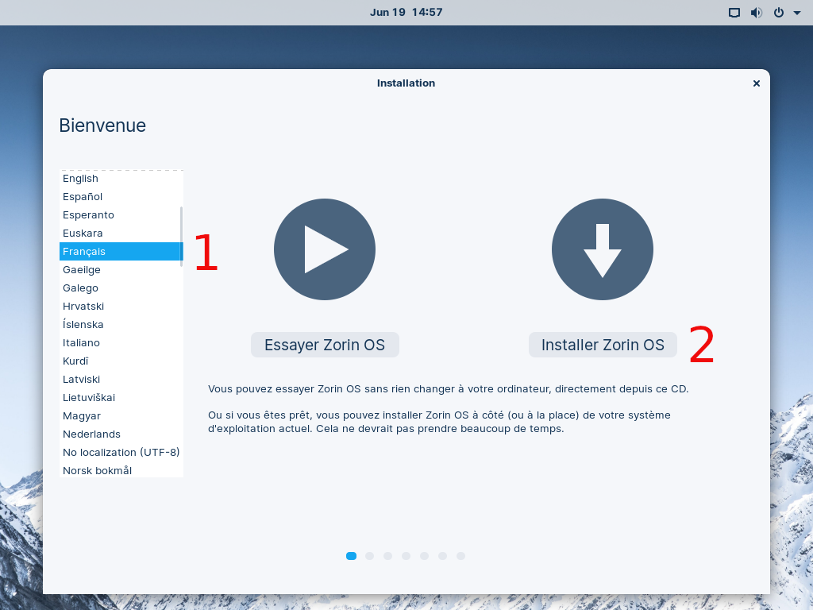{.align-center}
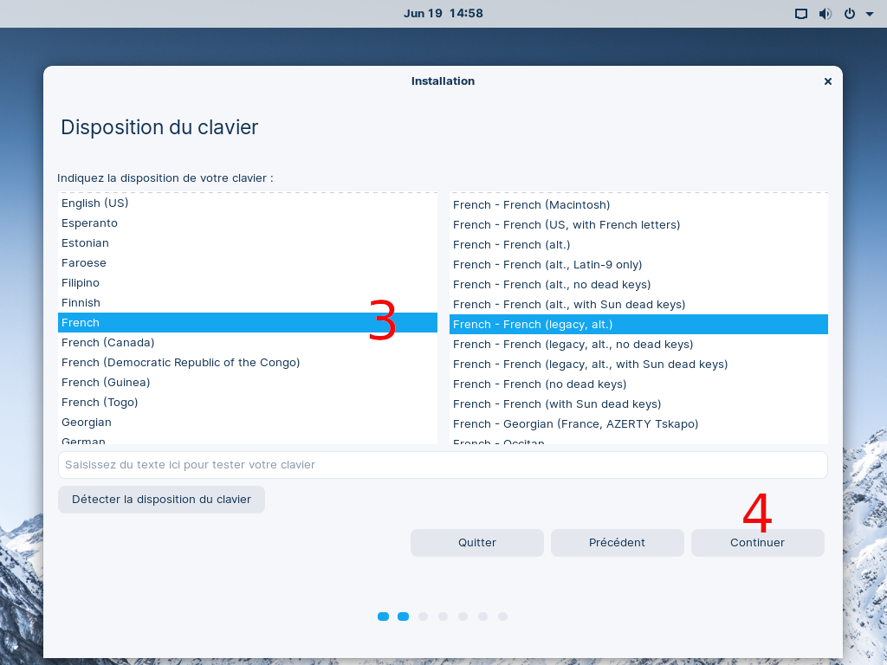{.align-center}
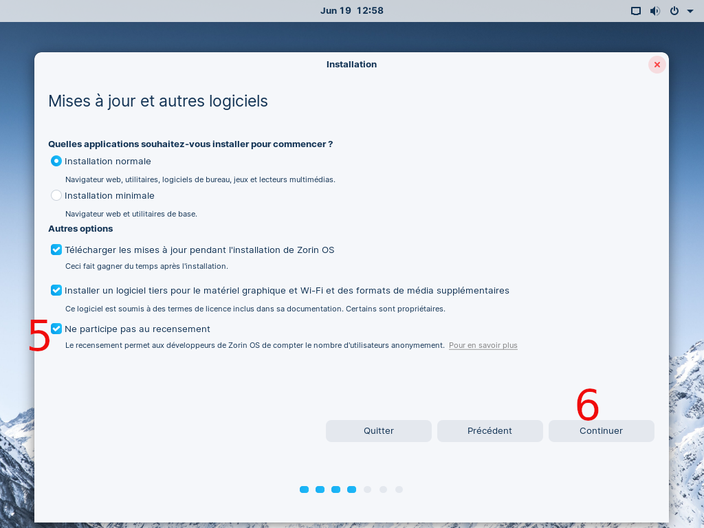{.align-center}

> Vous pouvez très bien ne pas cocher la case 'Installer un logiciel tiers...', ce qui pourrait poser quelques problèmes mineurs de prise en charge du matériel...
{.is-info}

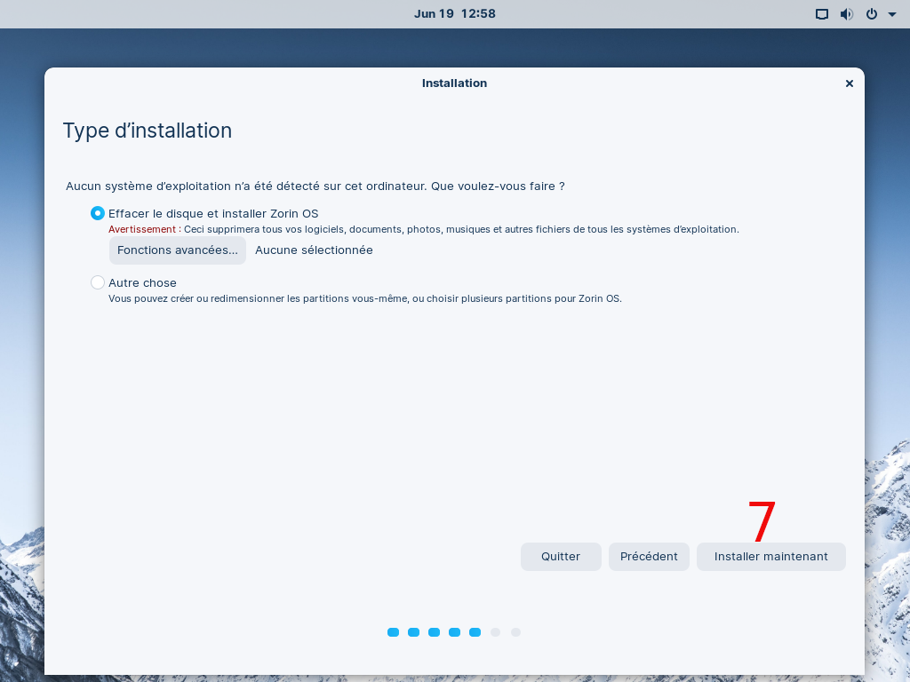{.align-center}
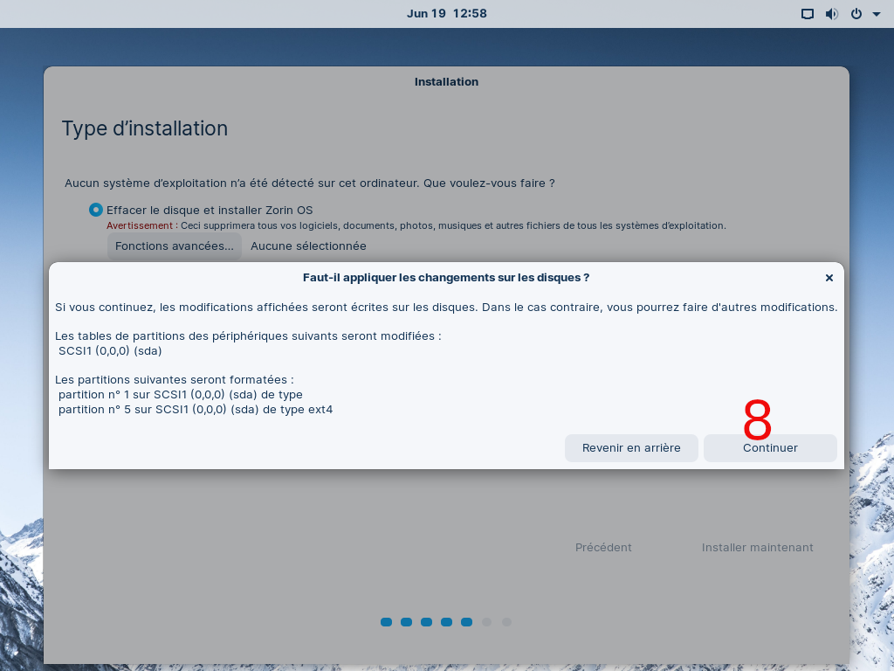{.align-center}
{.align-center}
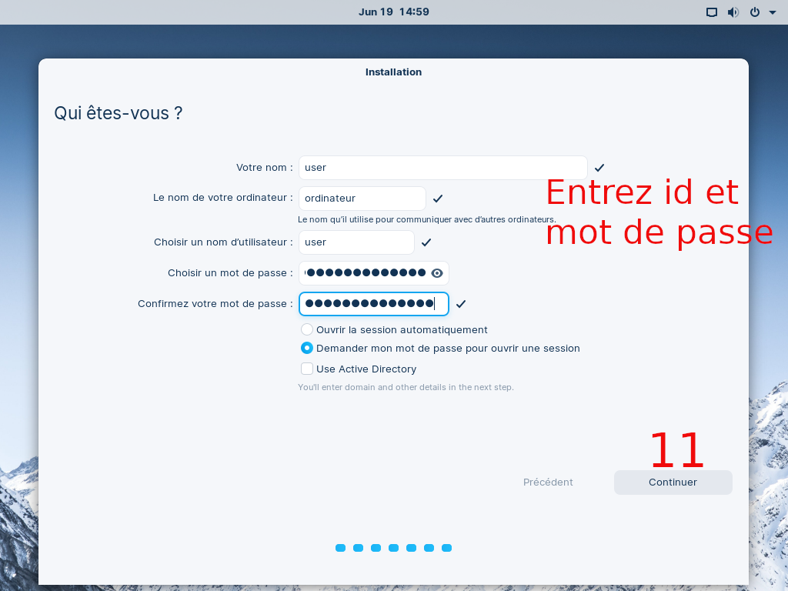{.align-center}
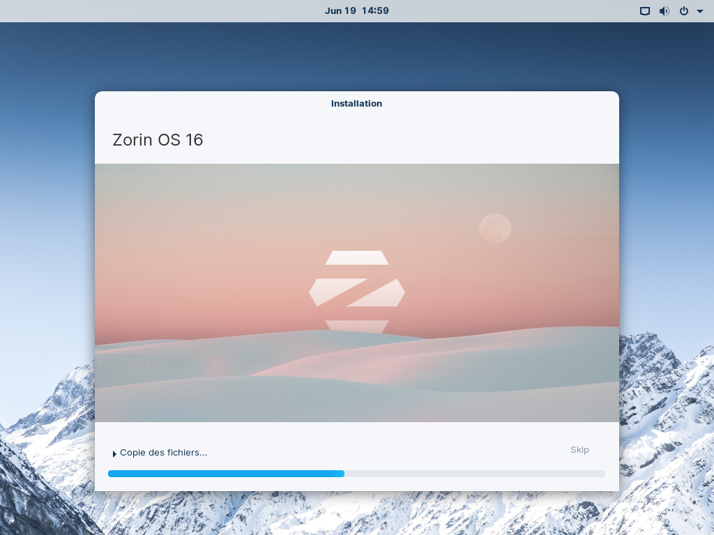{.align-center}
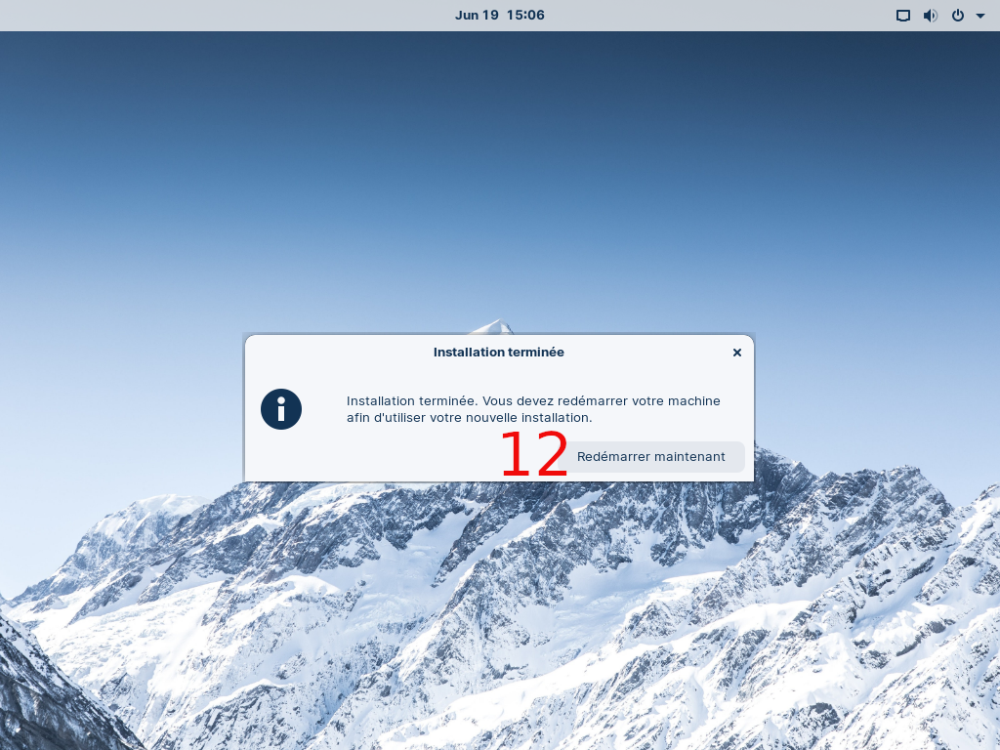{.align-center}

> Débranchez votre clé USB puis appuyez sur <kbd>ENTREE</kbd>.
{.is-info}

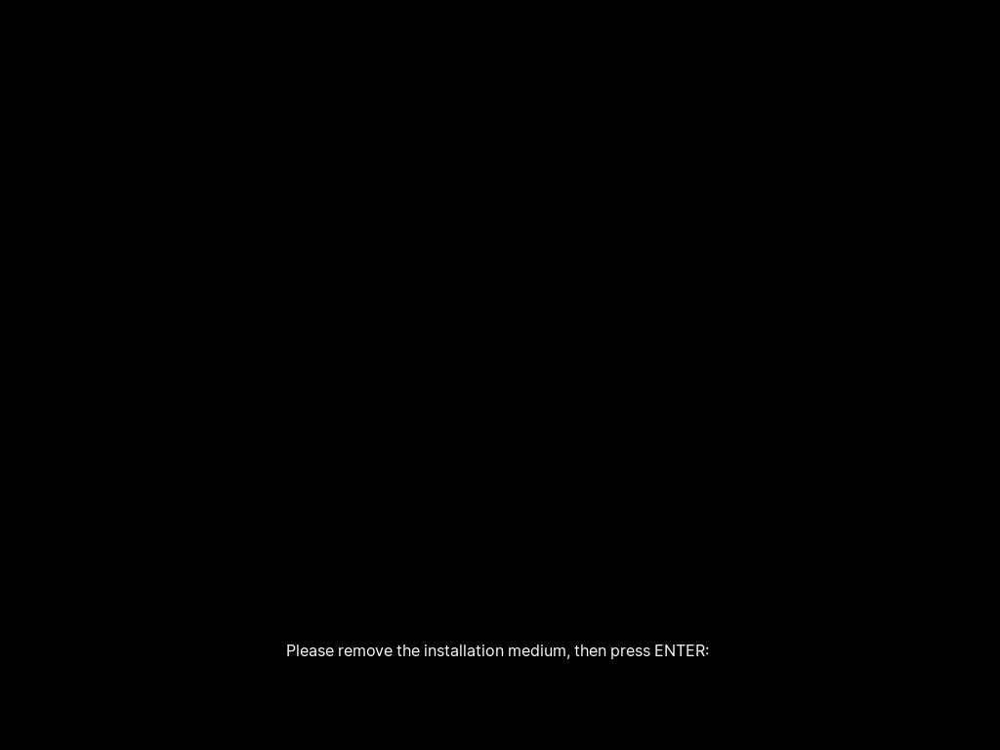{.align-center}
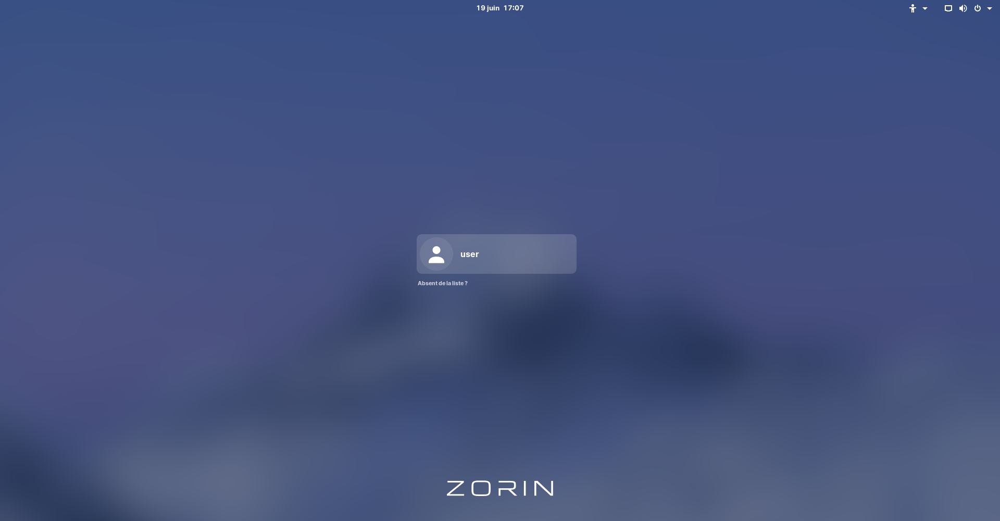{.align-center}

Voilà, votre distribution Zorin tout neuve est maintenant prête.

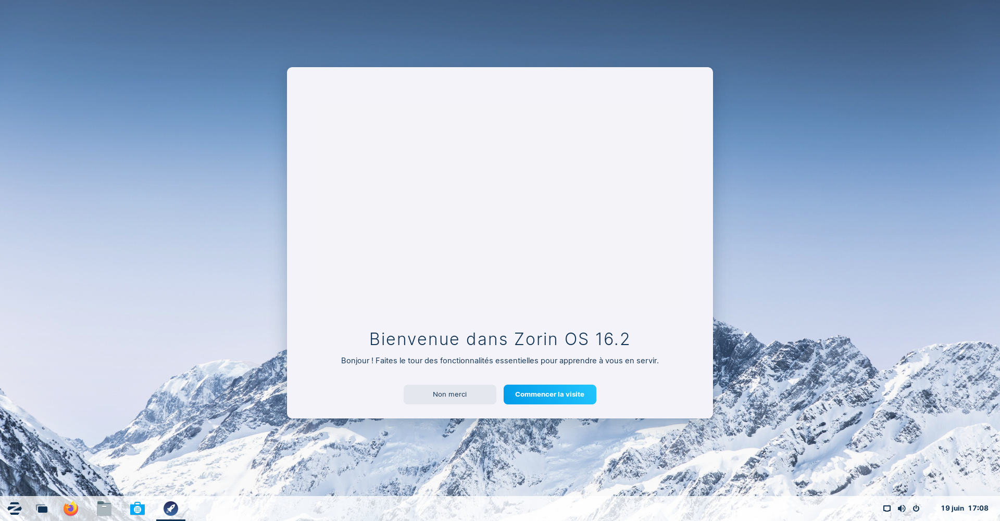{.align-center}

**Vous pouvez cliquer sur 'Commencez la visite' si vous souhaitez être guidé dans la configuration de votre distro (aspect, couleurs, pilotes additionnels, etc.).**

---
{.align-right} *Contributeur(s): Ayo, Nemtech*